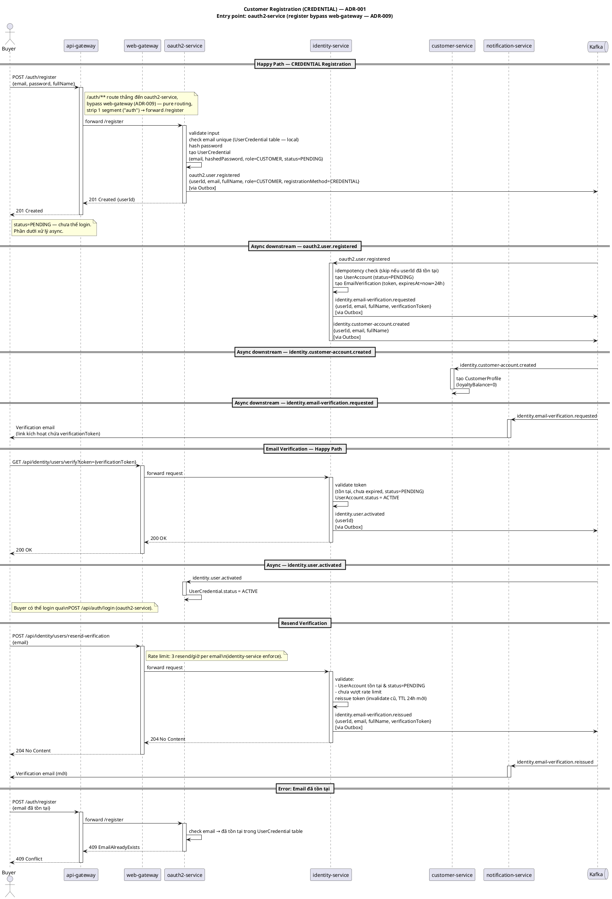
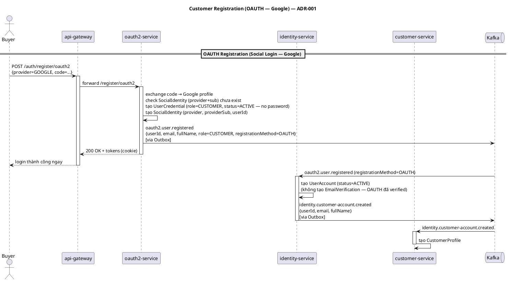

# Design: Customer Registration

**Status**: Draft
**Deferred items**: [`deferred.md`](deferred.md)

---

## Services liên quan

| Service                | Vai trò                                                                                          | Loại tham gia               |
|------------------------|--------------------------------------------------------------------------------------------------|-----------------------------|
| `api-gateway`          | Edge layer thuần — route `/auth/register` thẳng đến oauth2-service, bypass web-gateway (ADR-009) | Entry point (register)      |
| `web-gateway`          | BFF — nhận request verify-email / resend-verification, forward đến identity-service              | Entry point (verify/resend) |
| `oauth2-service`       | Validate input, hash password, tạo UserCredential, publish event                                 | Sync + Event publisher      |
| `identity-service`     | Tạo UserAccount + EmailVerification, publish events downstream                                   | Async + Event publisher     |
| `customer-service`     | Tạo CustomerProfile khi nhận CustomerAccountCreated                                              | Async consumer              |
| `notification-service` | Gửi verification email khi nhận VerificationEmailRequested                                       | Async consumer              |

> Register **không** đi qua `web-gateway` — `api-gateway` route `/auth/**` thẳng đến `oauth2-service`
> (bypass cả web-gateway lẫn mobile-gateway), đối xứng với login form/MFA/OIDC-logout. Xem `api-gateway`
> `RouteConfiguration` + `adr/009-mobile-gateway.md`. Verify-email và resend-verification vẫn là business
> API bình thường nên tiếp tục đi qua `web-gateway` như các flow khác.

---

## Happy Path — CREDENTIAL

```
Buyer → POST /auth/register {email, password, fullName}   [api-gateway → oauth2-service thẳng, bypass web-gateway]
  → oauth2-service: tạo UserCredential (role=CUSTOMER, status=PENDING)
  → publish oauth2.user.registered {userId, email, fullName, role=CUSTOMER, registrationMethod=CREDENTIAL}

  [async] identity-service:
    → tạo UserAccount (status=PENDING) + EmailVerification (TTL 24h)
    → publish identity.email-verification.requested
    → publish identity.customer-account.created

  [async] customer-service ← identity.customer-account.created:
    → tạo CustomerProfile (loyaltyBalance=0)

  [async] notification-service ← identity.email-verification.requested:
    → gửi verification email

-- Buyer click link trong email --
  → GET /api/identity/users/verify?token={token}
  → identity-service: UserAccount.status = ACTIVE
  → publish identity.user.activated

  [async] oauth2-service ← identity.user.activated:
    → UserCredential.status = ACTIVE
    → Buyer có thể login
```



## Happy Path — OAUTH (Google)

> Chưa implement (không có controller nào trong oauth2-service tính đến thời điểm viết doc này).
> Khi implement, áp dụng cùng routing model với CREDENTIAL ở trên: bypass web-gateway qua `api-gateway`
> `/auth/**` (ADR-009), không phải forward qua web-gateway như diagram cũ.

```
Buyer → POST /auth/register/oauth2 {provider=GOOGLE, code=...}   [api-gateway → oauth2-service thẳng]
  → oauth2-service: exchange code → Google profile
    tạo UserCredential (role=CUSTOMER, status=ACTIVE)
    tạo SocialIdentity
  → publish oauth2.user.registered {registrationMethod=OAUTH}
  → trả về tokens ngay (login thành công)

  [async] identity-service:
    → tạo UserAccount (status=ACTIVE, không có EmailVerification)
    → publish identity.customer-account.created

  [async] customer-service ← identity.customer-account.created:
    → tạo CustomerProfile
```



---

## Error Cases

| Lỗi                                      | Nơi xử lý               | Response                |
|------------------------------------------|-------------------------|-------------------------|
| Email đã tồn tại (kể cả race concurrent) | oauth2-service (sync)   | 409 Conflict            |
| Vượt 5 lần đăng ký/giờ per IP            | oauth2-service (sync)   | 429 Too Many Requests   |
| oauth2-service down                      | api-gateway             | 503 Service Unavailable |
| Token không tồn tại                      | identity-service (sync) | 404                     |
| Token hết hạn                            | identity-service (sync) | 410                     |
| Email đã verified                        | identity-service (sync) | 409                     |
| Resend vượt 3 lần/giờ per email          | identity-service (sync) | 429 Too Many Requests   |
| customer-service chậm xử lý              | Kafka retry tự động     | —                       |

Không có compensating saga — critical path là sync, downstream là fire-and-forget.

---

## Technical Constraints

| Concern                | Giải pháp                                                                                                                                                                                                                                                                                                                                                                                                                                                                                                                                                         |
|------------------------|-------------------------------------------------------------------------------------------------------------------------------------------------------------------------------------------------------------------------------------------------------------------------------------------------------------------------------------------------------------------------------------------------------------------------------------------------------------------------------------------------------------------------------------------------------------------|
| Idempotency            | UserAccount + EmailVerification (identity-service): cả 2 dùng `createIfAbsent()` (`ON CONFLICT DO NOTHING`, ai đến trước thắng — không merge) tại lần tạo mới, chỉ dispatch domain event (`CustomerAccountCreatedEvent`/`PasswordSetupEmailRequested`/`VerificationEmailRequested`) khi insert thật xảy ra — tránh gửi trùng email khi 2 lần xử lý cùng userId race nhau. `save()` (upsert, ghi đè) chỉ dùng cho update trên account đã tồn tại (`VerifyEmail`, `UpdateUserProfile`, `UploadAvatar`). customer-service: `ON CONFLICT (user_id) DO NOTHING` tại DB |
| Duplicate email (race) | oauth2-service: `findByEmail` check trước (happy path) + `UNIQUE(email)` tại DB là chốt chặn cuối cho concurrent request — catch `DataIntegrityViolationException` → trả 409 domain-meaningful thay vì 500                                                                                                                                                                                                                                                                                                                                                        |
| Rate limit             | `@RateLimit` (annotation + AOP, `rate-limiter-starter`) trên `handle()`: 5 lần đăng ký/giờ per IP (oauth2-service) + 3 lần resend/giờ per email (identity-service) — cần thiết dù đã có 2 lớp rate-limit ở gateway, cơ chế + lý do: `3.technical/rate-limiting-layers.md`                                                                                                                                                                                                                                                                                         |
| Event delivery         | Outbox Pattern + CDC tại oauth2-service và identity-service                                                                                                                                                                                                                                                                                                                                                                                                                                                                                                       |
| Password               | BCrypt (cost 10) hash tại oauth2-service — identity-service không biết password                                                                                                                                                                                                                                                                                                                                                                                                                                                                                   |
| Email verification     | Chỉ áp dụng cho `registrationMethod=CREDENTIAL`, không áp dụng cho OAUTH                                                                                                                                                                                                                                                                                                                                                                                                                                                                                          |
| Token                  | Opaque 32-byte random, Base64URL, TTL 24h, rotate khi reissue                                                                                                                                                                                                                                                                                                                                                                                                                                                                                                     |
| CustomerProfile timing | Tạo async sau UserAccount — eventual consistency chấp nhận được                                                                                                                                                                                                                                                                                                                                                                                                                                                                                                   |
