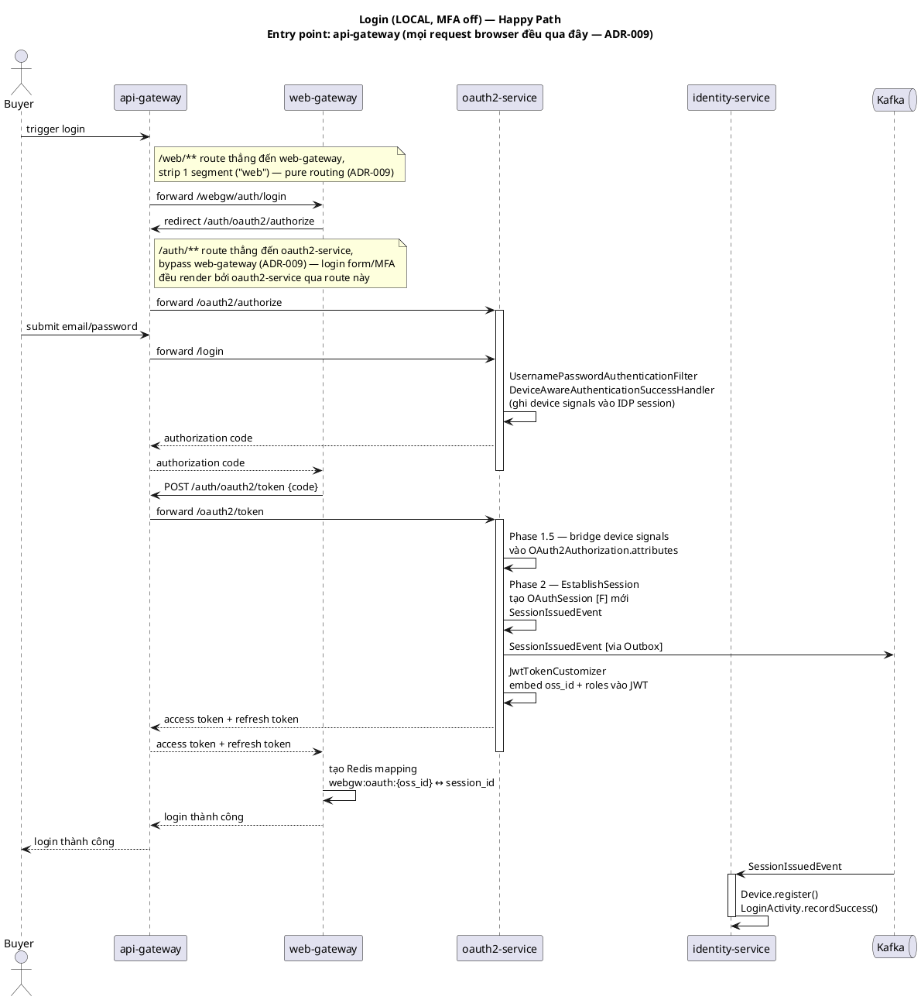
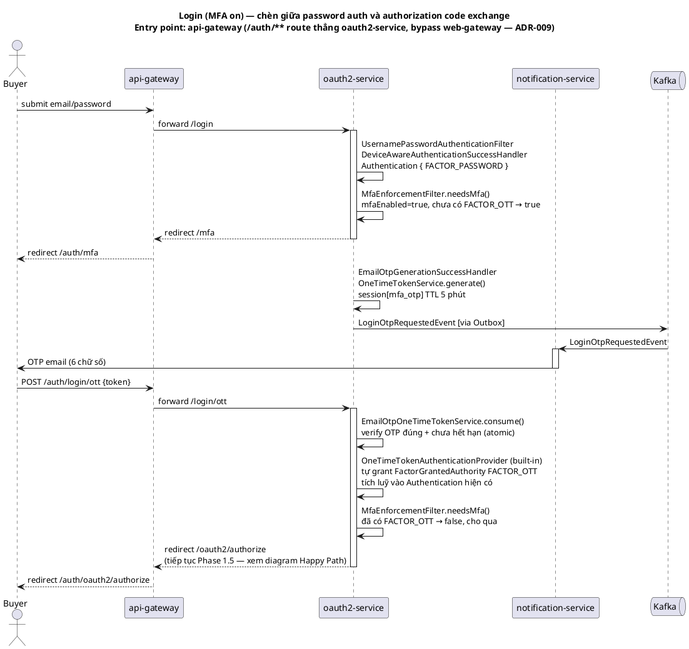

# Design: Login & MFA

**Status**: Done
**Implementation chi tiết**: [`login-impl.md`](implementation)
**Pending items**: [`deferred.md`](deferred.md)
**Session domain model**: [`service/oauth2-service/session.md`](../../service/oauth2-service/session.md)
**Framework reference**: [`3.technical/spring-security-login-mfa-bff.md`](../../global/3.technical/spring-security-login-mfa-bff.md)

> Tách ra từ feature `user-auth` gộp trước đây (login + logout + registration chung 1 folder) — logout tách riêng ở [`03-logout`](../03-logout/design.md). Sub-feature Registration của `user-auth` cũ không thuộc file này — xem [`01-customer-registration`](../01-customer-registration/design.md).

---

## Actors

| Actor | Role |
|---|---|
| Buyer/User | Đăng nhập bằng LOCAL credential (email + password) hoặc GOOGLE OAuth, có thể cần qua MFA (OTP email) nếu opt-in |

---

## Services tham gia

| Service                | Vai trò                                                       | Loại tham gia           |
|-------------------------|----------------------------------------------------------------|---------------------------|
| `web-gateway`           | BFF — OAuth2 Client, quản lý httpOnly cookie/session store    | Entry point               |
| `oauth2-service`        | Authorization Server — xác thực, MFA, session establishment   | Sync + Event publisher    |
| `identity-service`      | Ghi nhận `Device` + `LoginActivity` khi có login session mới  | Async consumer            |
| `notification-service`  | Gửi OTP email khi MFA bật                                      | Async consumer            |

---

## Happy Path

```
Buyer → web-gateway (OAuth2 Client) → redirect /oauth2/authorize tại oauth2-service
  → LOCAL: nhập email/password → UsernamePasswordAuthenticationFilter xác thực
    (hoặc GOOGLE: OAuth2LoginAuthenticationFilter qua Google OIDC)
  → DeviceAwareAuthenticationSuccessHandler: ghi device signals vào IDP HTTP session

  -- Nếu MFA opt-in (mfaEnabled = true) --
  → MfaEnforcementFilter chặn, redirect /mfa
  → EmailOtpGenerationSuccessHandler: generate OTP, publish LoginOtpRequestedEvent
    → notification-service gửi OTP email
  → Buyer submit OTP → EmailOtpOneTimeTokenService.consume() atomic
    → OneTimeTokenAuthenticationProvider (Spring Security 7 built-in) tự grant FactorGrantedAuthority FACTOR_OTT
      lên Authentication hiện có (tích luỹ cùng FACTOR_PASSWORD/FACTOR_X, không replace) — MfaEnforcementFilter cho qua

  -- Authorization code issued (Phase 1.5) --
  → SessionEstablishingAuthorizationService: bridge device signals vào OAuth2Authorization.attributes

  web-gateway exchange code → POST /oauth2/token

  -- Access token issued (Phase 2) --
  → EstablishSession: tạo OAuthSession [F] mới (fresh login) hoặc reuse (silent SSO)
    → SessionIssuedEvent (chỉ fresh login) → identity-service: Device.register() + LoginActivity.recordSuccess()

  → JwtTokenCustomizer: embed oss_id + roles vào JWT
  → web-gateway: tạo Redis mapping [A1]/[A2] từ oss_id
  → Buyer đã login, session BFF thiết lập
```

Chi tiết từng hook, 3 kịch bản cụ thể (Fresh Login / Refresh Token / Silent SSO), session attribute lifecycle, event payload đầy đủ → [`login-impl.md`](implementation).



### Nhánh MFA — thêm bước OTP giữa password auth và authorization code



---

## Failure Scenarios

| Điểm thất bại | Xử lý | Kết quả cuối |
|---|---|---|
| Sai password / OTP sai | Spring Security auth failure handler | 401, không tạo session nào |
| Login khi `UserCredential.status=PENDING` (chưa verify email) | Spring Security `DisabledException` (khác `LockedException` — tách theo `enabled` vs `accountNonLocked` field, xem `OAuth2UserDetailsService.mapToUserDetails()`) | Redirect `/login?unverified&email=...` — hiện nút "Bấm vào đây để gửi lại". Nút gọi thẳng `fetch()` (JS đã có sẵn trong `login.html` cho device fingerprinting) tới `identity-service` `ResendVerification` — **same-origin qua api-gateway** (`/web/api/identity/users/resend-verification`, đã `permitAll` — xem `web-gateway` `SecurityConfiguration`), **không** cần bridge server-to-server nào ở oauth2-service, vì trang login đang được browser render qua cùng gateway host. Đã rate-limit 3 lần/giờ per email ở chính `ResendVerification.handle()`. Resend xong luôn im lặng redirect về `/login` (bỏ query param) — không có state riêng phân biệt thành công/thất bại (rate limit, email không tồn tại...), tránh lộ thông tin account. **Không** gộp chung message với account bị khóa thật (`?locked`) — user tự xử lý được (verify email), không cần liên hệ hỗ trợ. `LoginActivity.result = EMAIL_NOT_VERIFIED` (tách khỏi `ACCOUNT_LOCKED`, xem `service/oauth2-service/session.md` / migration `V12` identity-service) |
| MFA OTP hết hạn (TTL 5 phút) | `EmailOtpOneTimeTokenService` reject | Buyer phải trigger lại OTP |
| Vượt 10 lần login (đúng+sai) / 15 phút cho 1 email | `LoginRateLimitFilter` — chặn trước `UsernamePasswordAuthenticationFilter`, trước cả BCrypt compare | Redirect `/login?locked`, không chạm password/DB |
| Vượt 5 lần verify OTP sai / 5 phút | `EmailOtpOneTimeTokenService.consume()` — `RateLimiter` check, invalidate session OTP nếu vượt | Buyer phải bấm "Gửi lại OTP" lấy mã mới |
| Refresh token race (2 request cùng lúc) | `EstablishSession` guard `oldAuthId == newAuthId` → early return | Idempotent, không tạo duplicate session |
| Multi-tab OTP generate | `hasActiveToken()` giảm duplicate; nếu race → 2 email, last write wins | UX noise, không phải security issue — xem `deferred.md` #1 |
| `SessionIssuedEvent` bị Kafka redeliver | `RecordLoginSession` (identity-service) — `LoginActivity` insert `ON CONFLICT (session_id) DO NOTHING`, `Device.lastHistoryId` chỉ update khi insert thật xảy ra | Idempotent, không duplicate `LoginActivity`, không dangling reference |

---

## Device Management & Login History (self-service, post-login)

Sau khi login, `identity-service` expose REST APIs đọc dữ liệu được ghi nhận bởi hook login (`Device.register()`, `LoginActivity.recordSuccess()`):

| Endpoint | Mô tả |
|---|---|
| `GET /api/v1/identity/me/devices` | Danh sách device ACTIVE |
| `DELETE /api/v1/identity/me/devices/{deviceId}` | Revoke 1 device |
| `GET /api/v1/identity/me/login-activity` | Lịch sử login (offset/limit) |

Không tách thành feature riêng — data hoàn toàn phụ thuộc vào hook đã chạy trong login flow (`DeviceAwareAuthorizationRequestResolver`, `DeviceAwareAuthenticationSuccessHandler`, xem `login-impl.md`), tách ra sẽ chỉ tạo thêm 1 feature rất mỏng không đáng.

---

## Business Rules

- MFA là per-user opt-in (default `false`).
- Silent SSO không publish event, không tạo `LoginActivity` mới — `OAuthSession` được reuse.
- 1 IDP session + 1 client → chỉ 1 `OAuthSession` active (invariant, xem `service/oauth2-service/session.md` mục 3).
- Rate limit brute-force: password login 10 lần/15 phút per email (`LoginRateLimitFilter`, chặn trước `UsernamePasswordAuthenticationFilter`), MFA OTP verify 5 lần/5 phút per email (`EmailOtpOneTimeTokenService.consume()`) — cả 2 dùng `RateLimiter` (`rate-limiter-starter`, Redis sliding window) gọi trực tiếp, không phải `@RateLimit` annotation (annotation đó chỉ hook được `CommandHandler.handle()`, login/MFA đi qua Spring Security filter chain/SPI, không phải CQRS command). Cố ý không đặt rate-limit trong `OAuth2UserDetailsService.loadUserByUsername()` dù cùng mục đích — method đó bị OTT provider gọi lại sau khi verify OTP đúng, sẽ tính trùng quota cho 1 lần login MFA.
- `LoginActivity` idempotent theo `session_id` (= `oauthSessionId`) — Kafka redeliver `SessionIssuedEvent` không tạo duplicate.
- Login khi email chưa verify (`status=PENDING`) là case **self-service**, không phải account bị khóa — luôn tách message + `LoginResult` riêng khỏi `ACCOUNT_LOCKED`, không gộp chung dù cùng cơ chế chặn ở tầng Spring Security (`enabled=false` vs `accountNonLocked=false`).
