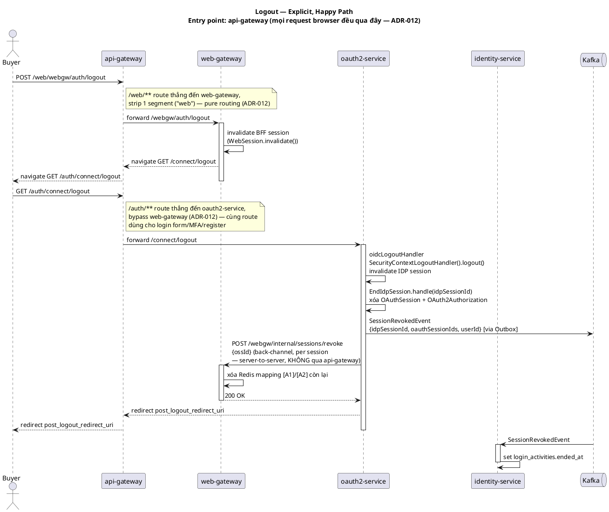

# Design: Logout & Remote Revocation

**Status**: Done
**Implementation chi tiết**: [`logout-impl.md`](implementation)
**Pending items**: [`deferred.md`](deferred.md)
**Session domain model**: [`service/oauth2-service/session.md`](../../service/oauth2-service/session.md)
**Framework reference**: [`3.technical/spring-security-logout-bff.md`](../../global/3.technical/spring-security-logout-bff.md)

> Tách ra từ feature `user-auth` gộp trước đây — login tách riêng ở [`02-login`](../02-login/design.md).

---

## Actors

| Actor | Role |
|---|---|
| Buyer/User | Chủ động logout, hoặc session tự expire (idle timeout) |

---

## Services tham gia

| Service           | Vai trò                                                              | Loại tham gia         |
|--------------------|-------------------------------------------------------------------------|--------------------------|
| `api-gateway`     | Entry point duy nhất — routing thuần `/web/**` → web-gateway, `/auth/**` → oauth2-service (ADR-012) | Entry point            |
| `web-gateway`     | BFF — invalidate session, cleanup Redis mapping, nhận back-channel revoke | Callee                 |
| `oauth2-service`  | AS — invalidate IDP session, cleanup `OAuthSession`/`OAuth2Authorization`, gọi back-channel revoke | Sync + Event publisher |
| `identity-service`| Cập nhật `login_activities.ended_at` khi nhận session revoked/expired    | Async consumer          |

---

## Happy Path — Explicit Logout

```
Buyer → POST /webgw/auth/logout (web-gateway)
  → web-gateway invalidate BFF session, navigate sang GET /connect/logout (oauth2-service)
  → oidcLogoutHandler: SecurityContextLogoutHandler().logout() — invalidate IDP session
  → EndIdpSession.handle(idpSessionId):
      → tìm tất cả OAuthSession active theo idpSessionId
      → xóa OAuthSession + OAuth2Authorization tương ứng
      → publish SessionRevokedEvent {idpSessionId, oauthSessionIds, userId}
  → WebGatewayRevocationClient: back-channel POST /webgw/internal/sessions/revoke (per ossId)
      → web-gateway: xóa Redis mapping [A1]/[A2] còn lại — fallback nếu bước trên (đã tự cleanup ở bước đầu) fail
  → oauth2-service redirect về post_logout_redirect_uri

  [async] identity-service ← SessionRevokedEvent:
    → set login_activities.ended_at cho các session_id trong list
```



---

## Happy Path — Session Expire (idle timeout, không phải explicit logout)

```
web-gateway Spring Session [A] expire (idle timeout) → Redis keyspace "expired" event
  → SessionMappingCleanupListener (web-gateway): Lua script atomic GET+DEL Redis mapping [A1]/[A2]
  → Không gọi tới oauth2-service — [B]/[F] vẫn sống cho tới khi tự expire hoặc bị cleanup job dọn (deferred)
```

Đây là lý do tồn tại `deferred.md` #1 — orphaned `OAuthSession` [F] tích luỹ khi chỉ [A] expire mà [B] chưa expire theo (lệch TTL), cần scheduled cleanup job.

---

## Failure Scenarios

| Điểm thất bại | Xử lý | Kết quả cuối |
|---|---|---|
| Back-channel revoke tới web-gateway fail (`WebGatewayRevocationClient`) | Exception bị swallow (`log.warn`), không abort logout flow | Logout vẫn thành công phía user; Redis mapping `[A1]/[A2]` orphan tối đa tới TTL 24h |
| `SessionMappingCleanupListener` không fire (Redis thiếu `notify-keyspace-events Kx`) | Không cleanup được khi session tự expire | Mapping orphan tới TTL 24h — không ảnh hưởng correctness, chỉ chiếm Redis tạm thời |
| `[B]` IDP session expire trước cleanup job chạy | `OAuthSession` [F] orphaned, không có event nào fire | Orphan tích luỹ tới khi cleanup job chạy — xem `deferred.md` #1 |

Không có compensating saga — best-effort back-channel + TTL tự nhiên là đủ, vì hệ quả của orphan tối đa là 1 record thừa trong Redis/DB tới khi TTL/cleanup job dọn, không phải security issue (session vẫn bị invalidate ở phía user ngay).

---

## Business Rules

- Explicit logout luôn cleanup `OAuthSession` [F] + `OAuth2Authorization` [C] ngay lập tức (không chờ TTL).
- `SessionRevokedEvent` (explicit) và `SessionsBulkExpiredEvent` (natural timeout, cleanup job) là 2 event tách biệt — intentional action vs timeout là 2 domain fact khác nhau (audit trail cần phân biệt được).
- Back-channel revoke là best-effort — Redis TTL 24h trên `[A1]/[A2]` là fallback cuối cùng nếu back-channel fail hoàn toàn.
