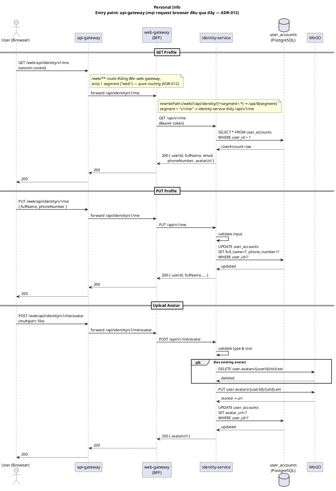

# Design: Personal Info

**Status**: Done

---

## Context

Màn hình "Thông tin cá nhân" trong tab đầu tiên của `AccountProfileComponent` — dùng chung cho Customer, Seller, Admin. User xem và cập nhật thông tin cơ bản của `UserAccount` trong identity-service.

---

## DB Changes

Bổ sung 1 cột vào `user_accounts`:

```sql
ALTER TABLE users
    ADD COLUMN avatar_url VARCHAR(512);
```

---

## Services liên quan

| Service            | Vai trò                                                | Loại tham gia |
|--------------------|--------------------------------------------------------|---------------|
| `api-gateway`      | Entry point duy nhất — routing thuần `/web/**` → web-gateway (ADR-012) | Entry point |
| `web-gateway`      | BFF — validate session, relay request với Bearer token | Callee        |
| `identity-service` | Source of truth `UserAccount` — read + update          | Sync only     |
| MinIO              | Object storage — lưu file avatar                       | Storage       |

Không có event — thay đổi `UserAccount` không trigger downstream consumer nào trong scope hiện tại.

---

## Sequence Diagram



---

## Operations

### GET /api/v1/me

Trả về thông tin `UserAccount` của user đang đăng nhập. Path FE-facing qua gateway: `/api/identity/v1/me` (web-gateway rewrite `(/web)?/api/identity/(?<segment>.*)` → `/api/${segment}` — segment phải gồm `v1/me` mới khớp đúng mapping controller).

```
Angular → GET /api/identity/v1/me
  → web-gateway: extract userId từ session, relay với Bearer token
  → identity-service: load UserAccount by userId
  → return { userId, fullName, email, phoneNumber, avatarUrl }
```

**Response:**
```json
{
  "userId": "01J...",
  "fullName": "Nguyễn Văn A",
  "email": "user@example.com",
  "phoneNumber": "0901234567",
  "avatarUrl": "http://minio/user-avatars/01J.../avatar.jpg"
}
```

---

### PUT /api/v1/me

Cập nhật `fullName` và `phoneNumber`. Email không cho phép thay đổi qua endpoint này.

```
Angular → PUT /api/identity/v1/me { fullName, phoneNumber }
  → web-gateway: relay
  → identity-service:
      validate input
      UPDATE user_accounts SET full_name=?, phone_number=? WHERE user_id=?
      return updated UserAccount
```

---

### POST /api/v1/me/avatar

Upload avatar mới. identity-service xử lý file, upload lên MinIO, cập nhật `avatar_url`.

```
Angular → POST /api/identity/v1/me/avatar (multipart/form-data, field: "file")
  → web-gateway: relay
  → identity-service:
      validate file (type, size)
      if avatarUrl != null → delete old file từ MinIO
      upload file mới lên MinIO → path: user-avatars/{userId}/{ulid}.{ext}
      UPDATE user_accounts SET avatar_url=? WHERE user_id=?
      return { avatarUrl }
```

---

## Error Cases

| Lỗi                       | Nơi xử lý        | HTTP |
|---------------------------|------------------|------|
| `fullName` blank          | identity-service | 400  |
| `phoneNumber` sai format  | identity-service | 400  |
| File size > 5MB           | identity-service | 413  |
| File type không hợp lệ    | identity-service | 415  |
| MinIO unavailable         | identity-service | 503  |
| User không tồn tại (edge) | identity-service | 404  |

**File types hợp lệ:** `image/jpeg`, `image/png`, `image/webp`

---

## Technical Constraints

| Concern          | Giải pháp                                                                   |
|------------------|-----------------------------------------------------------------------------|
| Authorization    | userId lấy từ JWT claims — user chỉ update được chính mình, không có param  |
| Phone uniqueness | Không enforce — cùng SĐT có thể dùng ở nhiều account (thực tế VN phổ biến)  |
| Avatar cleanup   | Xóa file cũ trên MinIO khi upload mới để tránh orphaned files               |
| Avatar path      | `user-avatars/{userId}/{ulid}.{ext}` — ulid tránh cache hit khi replace     |
| No events        | Downstream services không consume UserAccount change events trong scope này |

---

## NFR Assessment

Feature này tần suất gọi thấp (`GET /me` chỉ load khi mở tab, `PUT /me` chỉ khi user chủ động sửa) —
không phải hot path so với baseline traffic (`project_nfr`: ~8,000 req/s read tổng hệ thống). Rủi ro
NFR thật sự nằm ở **avatar upload**, không nằm ở 2 endpoint GET/PUT.

> **Cập nhật:** backend (`identity-service`) thực tế đã implement đầy đủ (`MeController`, `UploadAvatar`,
> `MinioAvatarStorage`, migration `V9`) dù `implementation.md` vẫn đang để status TODO — đánh giá dưới
> đây verify trực tiếp trên code thật, không còn là suy đoán từ thiết kế trên giấy.

| Rủi ro | Vì sao | Đề xuất |
|---|---|---|
| **Không rate-limit avatar upload** — *xác nhận đúng trên code* | `MeController.uploadAvatar()` không có `@RateLimit` nào — endpoint I/O nặng nhất feature (network transfer + ghi MinIO) hoàn toàn mở, user hợp lệ gần như không bao giờ cần quá 1-2 lần/phiên | Thêm `@RateLimit` (`rate-limiter-starter`, cùng lib đã dùng cho register/resend-verification) trên `UploadAvatar.handle()` — VD 5 lần/giờ per userId |
| **Không giới hạn size ở tầng edge** — *xác nhận đúng trên code* | Validate 5MB nằm trong `MeController.uploadAvatar()` (identity-service) — file quá khổ vẫn đi hết `browser → api-gateway → web-gateway → identity-service` rồi mới bị 413, tốn băng thông + thread 2 tầng gateway vô ích | Cấu hình giới hạn `max-request-size`/`multipart` sớm hơn — tối thiểu ở `web-gateway`, lý tưởng cả `api-gateway` |
| **MinIO client không có timeout tường minh** — *xác nhận đúng trên code* | `MinioConfig.minioClient()` chỉ set `endpoint` + `credentials`, không `.httpClient(...)` custom nào — dùng default timeout của SDK. Cùng loại rủi ro đã gặp ở `WebGatewayRevocationClient` (`03-logout`): call blocking trong request thread, MinIO chậm/treo sẽ giữ thread vô thời hạn | Set connect/read/write timeout tường minh qua custom `OkHttpClient` khi build `MinioClient` bean |
| **`AvatarStorageException` trả 500, không phải 503 như design mô tả** — *gap mới phát hiện, không có trong bản NFR trước* | `AvatarStorageException extends RuntimeException` (không extend `DomainException`, không có `@ExceptionHandler` riêng nào trong toàn codebase) → rơi vào fallback `@ExceptionHandler(Exception.class)` của `GlobalExceptionHandler` → 500. Bảng Error Cases ở trên ghi "MinIO unavailable → 503" nhưng thực tế client luôn nhận 500 khi MinIO down — sai lệch giữa doc và hành vi thật, ảnh hưởng cách FE phân biệt lỗi tạm thời (retry được) và lỗi thật | Thêm `@ExceptionHandler(AvatarStorageException.class)` map 503 trong `GlobalExceptionHandler` hoặc 1 handler cục bộ ở `identity-service`, khớp đúng contract đã document |
| **MinIO single instance (docker-compose hiện tại)** | Không có replication — SPOF cho toàn bộ avatar storage nếu container down | Chấp nhận được ở giai đoạn hiện tại (`project_nfr`: NFR là bài toán showcase pattern, không phải production target) — chỉ note lại |
| **Multipart relay qua web-gateway (reactive/WebFlux)** | Route `identity-service` ở `web-gateway` chỉ có `tokenRelay()`, `saveSession()`, `rewritePath()`, `dedupeResponseHeader()` — không filter nào đọc/transform body, nên Spring Cloud Gateway stream body thay vì buffer toàn bộ vào memory. Đúng lý thuyết, nhưng đáng verify bằng test tải thật (nhiều upload đồng thời) vì đây là request payload lớn nhất hệ thống hiện tại (5MB) | Không phải sửa thiết kế — test tải khi Phase 4 xong, xem có spike memory bất thường ở `web-gateway` không |

Không cần thêm gì cho `GET`/`PUT /me` — 2 endpoint này rẻ, tần suất thấp, không có input lớn, không
đáng để thêm rate-limit hay tối ưu riêng ở giai đoạn này.

---

## Frontend

**Component:** `PersonalInfoTabComponent` trong `libs/shared/ui/account-profile/`

**Behavior:**
- Load `GET /me` khi tab active (không load trước)
- Avatar: click vào ảnh → native file input → preview local trước khi upload → `POST /me/avatar` ngay khi chọn file (không cần bấm Save)
- Form (fullName, phoneNumber): dirty check — chỉ enable nút Save khi có thay đổi
- Save thành công → MatSnackBar 3s "Đã lưu thay đổi"
- Email field: `mat-form-field` disabled, suffix icon info tooltip "Email không thể thay đổi"
