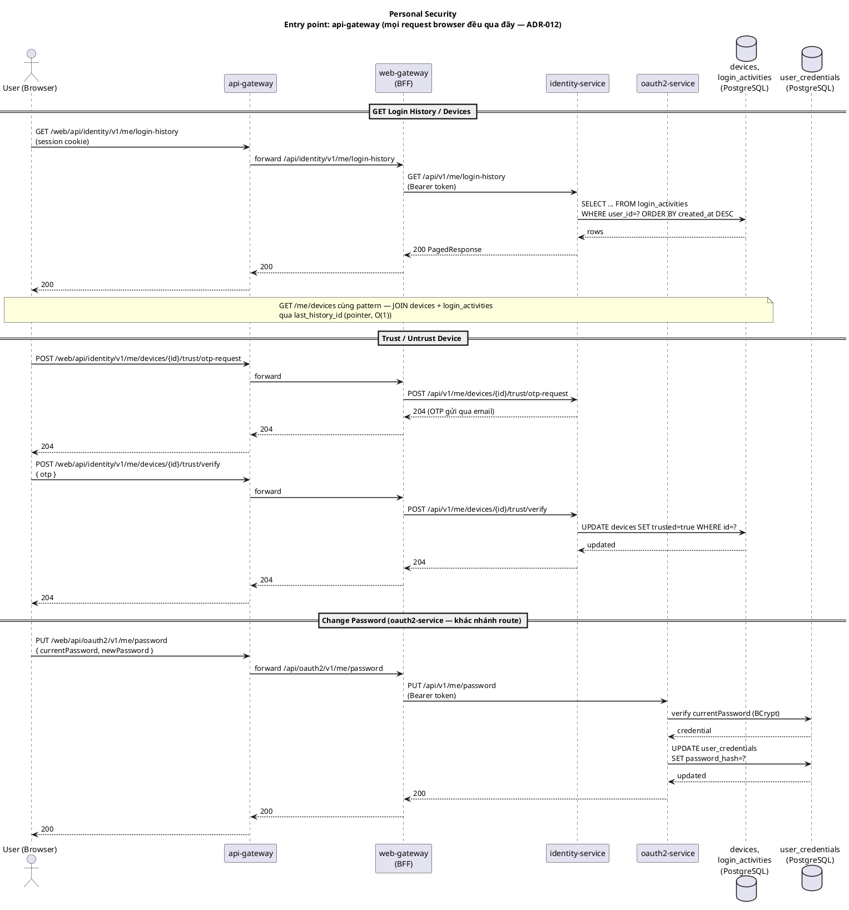

# Design: Personal Security

**Status**: Draft

---

## Context

Tab **Bảo mật** trong `AccountProfileComponent` — cho phép user quản lý bảo mật tài khoản gồm 3 nhóm chức năng: đổi mật khẩu, xem lịch sử đăng nhập, quản lý thiết bị đã từng đăng nhập.

**UI structure:**
```
Tab: Bảo mật
├── [Section] Đổi mật khẩu
└── [mat-tab-group]
    ├── Lịch sử đăng nhập   — per-user audit log, chronological
    └── Thiết bị            — device list + trạng thái từ lần login cuối
```

---

## DB Changes

### Bảng `login_history`

```sql
CREATE TABLE login_history (
    id          VARCHAR(26)  PRIMARY KEY,         -- ULID
    user_id     VARCHAR(26)  NOT NULL,
    device_id   VARCHAR(26),                      -- nullable: login không có fingerprint vẫn ghi được
    action      VARCHAR(20)  NOT NULL,            -- LOGIN | LOGOUT | PASSWORD_CHANGED
    ip          VARCHAR(45),
    user_agent  VARCHAR(512),
    created_at  TIMESTAMP    NOT NULL DEFAULT NOW(),

    CONSTRAINT fk_lh_user   FOREIGN KEY (user_id)   REFERENCES user_accounts(id),
    CONSTRAINT fk_lh_device FOREIGN KEY (device_id) REFERENCES user_device(id)
);

CREATE INDEX idx_lh_user_time ON login_history (user_id, created_at DESC);
```

Retention: giữ tối đa 90 ngày hoặc 200 record gần nhất / user.

### Bảng `user_device`

```sql
CREATE TABLE user_device (
    id               VARCHAR(26)  PRIMARY KEY,    -- ULID
    user_id          VARCHAR(26)  NOT NULL,
    fingerprint      VARCHAR(64)  NOT NULL,       -- hash(user_agent + ip), MVP
    display_name     VARCHAR(128),                -- "Chrome trên Windows"
    browser          VARCHAR(64),
    os               VARCHAR(64),
    last_history_id  VARCHAR(26),                 -- pointer đến login_history record cuối
    is_trusted       BOOLEAN      NOT NULL DEFAULT FALSE,
    created_at       TIMESTAMP    NOT NULL DEFAULT NOW(),

    CONSTRAINT fk_ud_user    FOREIGN KEY (user_id)         REFERENCES user_accounts(id),
    CONSTRAINT fk_ud_history FOREIGN KEY (last_history_id) REFERENCES login_history(id),
    CONSTRAINT uq_ud_fingerprint UNIQUE (user_id, fingerprint)
);

CREATE INDEX idx_ud_user ON user_device (user_id);
```

> `last_history_id` là pointer đến record cuối trong `login_history` — JOIN by primary key (O(1)), không copy field. Tránh inconsistency nếu một code path bỏ sót update.

---

## Services liên quan

| Service            | Vai trò                                                                 | Loại tham gia |
|---------------------|--------------------------------------------------------------------------|---------------|
| `api-gateway`      | Entry point duy nhất — routing thuần `/web/**` → web-gateway (ADR-012) | Entry point   |
| `web-gateway`      | BFF — validate session, relay request với Bearer token                 | Callee        |
| `identity-service` | Source of truth — `devices`, `login_activities` (đọc), avatar/profile  | Sync only     |
| `oauth2-service`   | Source of truth — `UserCredential.password` (đổi mật khẩu xử lý ở đây, **không phải** identity-service) | Sync only |

⚠️ **Sửa lại phân công service so với bản gốc** — bản gốc gộp đổi mật khẩu vào `identity-service` (`UPDATE user_accounts SET password_hash=?`). Sai theo kiến trúc đã chốt (ADR-001): `identity-service.UserAccount` **không có field password** — "Account không cần biết password — password owned by oauth2-service" (`identity-service/service.md` > Business Rules). Đổi mật khẩu thật sự chạy ở `oauth2-service.UserCredential` qua `ChangePassword` command handler (đã implement, xem `MeController` của `oauth2-service`, route `PUT /api/v1/me/password`) — route qua `web-gateway` khác nhánh (`/api/oauth2/**`) so với 3 API còn lại của feature này (`/api/identity/**`).

Không có Kafka event publish mới từ feature này. Riêng phần capture login/logout (device + login history) đã chạy sẵn qua consumer `oauth2.session.issued` có từ trước (không phải hook đồng bộ trong request login như mô tả gốc — xem ghi chú ở mục "Capture on login / logout").

---

## Capture on login / logout

⚠️ **Đã implement từ trước, khác cơ chế mô tả gốc dưới đây** — không phải "hook đồng bộ trong login request", mà là Kafka consumer bất đồng bộ tại `identity-service`, lắng nghe `oauth2.session.issued` (produce bởi `oauth2-service` sau khi `OAuthSession.issue()`). Bảng thật tên `devices`/`login_activities` (không phải `user_device`/`login_history`), cột tương đương `last_history_id` (không phải action LOGIN/LOGOUT — `login_activities.result` chỉ ghi *kết quả login attempt*: `SUCCESS`/`WRONG_PASSWORD`/`ACCOUNT_LOCKED`/`MFA_FAILED`/`EMAIL_NOT_VERIFIED`, không có action LOGOUT hay PASSWORD_CHANGED). Logic thật nằm ở `identity-service`'s `RecordLoginSession` (qua `SessionIssuedConsumer`) — đã document đầy đủ ở `identity-service/service.md` > Events Consumed.

Mô tả gốc bên dưới giữ lại để tham khảo ý tưởng — không khớp implementation thật:

```
Login thành công:
  1. Parse User-Agent → browser, os, display_name
  2. fingerprint = SHA-256(user_agent + ip)
  3. UPSERT user_device ON CONFLICT (user_id, fingerprint) → giữ nguyên row, chỉ cần device_id
  4. INSERT login_history (user_id, device_id, action=LOGIN, ip, user_agent) → lấy id mới
  5. UPDATE user_device SET last_history_id = <id mới> WHERE id = <device_id>
  → bước 3, 4, 5 trong 1 transaction

Logout:
  1. INSERT login_history (user_id, device_id, action=LOGOUT)
  2. UPDATE user_device SET last_history_id = <id mới> WHERE id = <device_id>
  → cả 2 trong 1 transaction
```

---

## Sequence Diagram



---

## Operations

### GET /api/v1/identity/me/login-history

Lịch sử đăng nhập của user hiện tại, phân trang.

```
Angular → GET /api/identity/me/login-history?page=0&size=20
  → web-gateway: relay với Bearer token
  → identity-service:
      SELECT * FROM login_history WHERE user_id=? ORDER BY created_at DESC LIMIT ? OFFSET ?
      return PagedResponse<LoginHistoryItem>
```

**Response item:**
```json
{
  "action": "LOGIN",
  "ip": "1.2.3.4",
  "browser": "Chrome 124",
  "os": "Windows 11",
  "createdAt": "2026-06-09T14:32:00Z"
}
```

---

### GET /api/v1/identity/me/devices

Danh sách thiết bị đã đăng nhập.

```
Angular → GET /api/identity/me/devices
  → web-gateway: relay + truyền fingerprint request hiện tại
  → identity-service:
      SELECT d.*, h.action, h.created_at
      FROM user_device d
      LEFT JOIN login_history h ON h.id = d.last_history_id
      WHERE d.user_id = ?
      đánh dấu isCurrent nếu fingerprint khớp request
      return List<DeviceItem>
```

**Response item:**
```json
{
  "deviceId": "01J...",
  "displayName": "Chrome trên Windows",
  "browser": "Chrome 124",
  "os": "Windows 11",
  "lastSeenAt": "2026-06-09T14:32:00Z",
  "lastAction": "LOGIN",
  "isCurrent": true,
  "isTrusted": false
}
```

`isCurrent` = `true` → ẩn nút Thu hồi trên frontend.

---

### DELETE /api/v1/identity/me/devices/{deviceId}

Thu hồi thiết bị. Không cho phép revoke thiết bị hiện tại.

```
Angular → DELETE /api/identity/me/devices/{deviceId}
  → web-gateway: relay
  → identity-service:
      verify deviceId thuộc user hiện tại
      verify deviceId ≠ thiết bị của request hiện tại
      DELETE user_device WHERE id=?
      xóa BFF session liên quan nếu lưu session_id ↔ device_id (future)
```

---

### PUT /api/v1/me/password ⚠️ chạy ở `oauth2-service`, không phải `identity-service`

Đổi mật khẩu. Yêu cầu xác nhận mật khẩu hiện tại. `UserCredential.password` owned bởi `oauth2-service` (ADR-001) — route qua `web-gateway` nhánh `/api/oauth2/**`, khác nhánh `/api/identity/**` của 3 API còn lại trong feature này.

```
Angular → PUT /api/oauth2/v1/me/password { currentPassword, newPassword }
  → web-gateway: relay (route oauth2-service, không phải identity-service)
  → oauth2-service:
      load UserCredential by userId
      BCrypt.verify(currentPassword, storedHash) — nếu sai → 400
      BCrypt.hash(newPassword) → UPDATE user_credentials SET password_hash=?
```

⚠️ Code thật (`oauth2-service.ChangePassword`) **không** insert audit trail nào sau khi đổi mật khẩu thành công — dòng "INSERT login_history (action=PASSWORD_CHANGED)" trong bản gốc chỉ là ý tưởng thiết kế, chưa có cơ chế nào implement (không có action-based table nào tồn tại — `login_activities` thật chỉ ghi login attempt result, không phải action log đa dụng).

---

## Error Cases

| Lỗi                              | Nơi xử lý        | HTTP |
|----------------------------------|------------------|------|
| `currentPassword` sai            | oauth2-service   | 400  |
| `newPassword` trùng current      | oauth2-service   | 400  |
| `deviceId` không thuộc user      | identity-service | 403  |
| `deviceId` không tồn tại         | identity-service | 404  |
| User chưa có password (OAuth only)| oauth2-service  | 409  |

⚠️ Bỏ dòng "Revoke thiết bị hiện tại" — model thật là **trust/untrust** (`POST .../trust/otp-request`, `POST .../trust/verify`, `DELETE .../trust`), không phải xoá hẳn device record như bản gốc mô tả. Không có "device hiện tại không thể revoke" invariant trong code thật vì không có thao tác xoá device nào cả.

---

## Technical Constraints

| Concern              | Giải pháp                                                                              |
|----------------------|----------------------------------------------------------------------------------------|
| Authorization        | userId từ JWT claims — user chỉ xem/thao tác được dữ liệu của chính mình              |
| Device fingerprint   | Hash(user_agent + ip) — không chính xác 100% nhưng đủ cho MVP, không cần browser SDK  |
| Device last activity | `last_history_id` pointer — JOIN by PK (O(1)), không copy field, không có inconsistency risk |
| Retention            | login_history giữ 90 ngày / 200 record gần nhất để tránh table bloat                 |
| OAuth-only account   | User đăng nhập bằng Google chưa có password → `PUT /password` (oauth2-service) trả 409, FE hiển thị hướng dẫn set password qua email |
| Trust device          | ⚠️ **Đã implement**, không phải "reserved cho phase sau" như bản gốc — flow email OTP verify trước khi `trusted=true` đã có sẵn (`RequestDeviceTrustOtp`, `TrustDevice`, `UntrustDevice` trong `identity-service`) |

---

## NFR Assessment

Toàn bộ endpoint feature này (login-history, devices, trust/untrust, change-password) là **user-initiated, tần suất thấp** — không phải hot path so với baseline traffic (`project_nfr`: ~8,000 req/s read tổng hệ thống). Không endpoint nào trong nhóm này có input lớn (không upload file) hay side-effect tốn tài nguyên bên thứ 3 ngoại trừ gửi OTP email.

| Rủi ro | Vì sao | Đề xuất |
|---|---|---|
| **`POST /devices/{id}/trust/otp-request` — rate limit đổi sang `@RateLimit` declarative** | ✅ **Đã sửa.** `RequestDeviceTrustOtp.handle()` trước đây inject `RateLimiter` thủ công + `DeviceException.rateLimitExceeded()` extend `DomainException` (vi phạm nguyên tắc `rate-limiting-layers.md` tự nêu). Đổi sang `@RateLimit(key = "'trust_device_otp_rate:' + #command.userId()", limit = 3, windowSeconds = 300)` — bỏ inject `RateLimiter`, bỏ `DEVICE_TRUST_OTP_RATE_LIMITED` khỏi `DeviceErrorCode`, lỗi giờ ném `RateLimitExceededException` chuẩn (tự map 429, không lẫn với business invariant). Bonus: `RateLimitAspect` chạy trước `@Transactional` (`HIGHEST_PRECEDENCE`) — request bị chặn không mở transaction/tốn connection nữa, khác cách cũ (check nằm trong thân method đã `@Transactional`) | — |
| **`PUT /me/password` (oauth2-service) — không có rate limit** | *Xác nhận đúng, verify lại bằng cách đọc trực tiếp `ChangePassword.java`* — không có `@RateLimit`, không gọi `RateLimiter` nào. Endpoint đổi mật khẩu là target brute-force kinh điển (thử nhiều `currentPassword`) | Thêm `@RateLimit` trên `ChangePassword.handle()`, key theo `userId` |
| **`GET /me/login-history` — `size` không có upper bound** | *Xác nhận đúng* — `MeController.getLoginHistory()`: `@RequestParam(defaultValue = "5") int size`, không có `@Max`. Client gửi `size=999999` vẫn query hết, dù có index `(user_id, created_at DESC)` hỗ trợ | Thêm `@Max(100)` (hoặc tương đương) trên param `size` |
| **`GET /me/devices` — không phân trang, nhưng rủi ro thấp hơn login-history** | *Điều chỉnh lại — 2 endpoint không cùng mức rủi ro như bản trước gộp chung.* `GetDevices` trả `List` không giới hạn, nhưng số device/user tự nhiên đã bị chặn trên bởi hành vi thật (không ai login từ hàng nghìn thiết bị) — khác `login-history` là log tích luỹ vô hạn theo thời gian | Không cần fix ngay — theo dõi nếu sau này có giới hạn số device/user thì càng chắc chắn không cần |
| **Retention job (90 ngày / 200 record) — xác nhận không tồn tại** | *Xác nhận đúng, không còn "chưa rõ"* — `grep "@Scheduled"` toàn bộ `identity-service`: 0 kết quả. `login_activities` phình vô hạn theo thời gian, ảnh hưởng dần hiệu năng chính 2 query GET ở trên dù có index | Cần 1 Phase riêng (scheduled job hoặc DB-level partition/TTL) — ngoài phạm vi 4 API hiện tại của feature này |
| **Trust-device OTP là cơ chế độc lập với MFA login OTP** | *Xác nhận đúng, không còn là câu hỏi mở.* `RedisDeviceTrustOtpStore` (identity-service, TTL 5 phút, key `trust_device_otp:{userId}:{deviceId}`) hoàn toàn tách biệt `EmailOtpOneTimeTokenService` (oauth2-service, TTL 5 phút, session-scoped) — trùng TTL là ngẫu nhiên, không phải dùng chung code | Không phải NFR blocker — 2 OTP flow độc lập là chấp nhận được (khác bounded context: login vs device management), chỉ cần đảm bảo UX nhất quán ở FE |

Không cần thêm gì cho phần JOIN `devices` + `login_activities` qua `last_history_id` — pattern pointer O(1) đã đúng, không phải N+1.

---

## Frontend

**Component tree** trong `libs/storefront/feature-profile/`:

```
security-tab/
  change-password/       — form 3 field, validate confirm match
  login-history/         — paginated list, relative time
  device-list/           — device cards, revoke action
```

**Behavior:**
- Data của login-history và device-list chỉ load khi sub-tab tương ứng được chọn
- Device list: refresh sau khi revoke thành công
- Đổi mật khẩu thành công → reset form, snackbar 3s
- User chưa có password (409) → hiển thị inline message thay form
