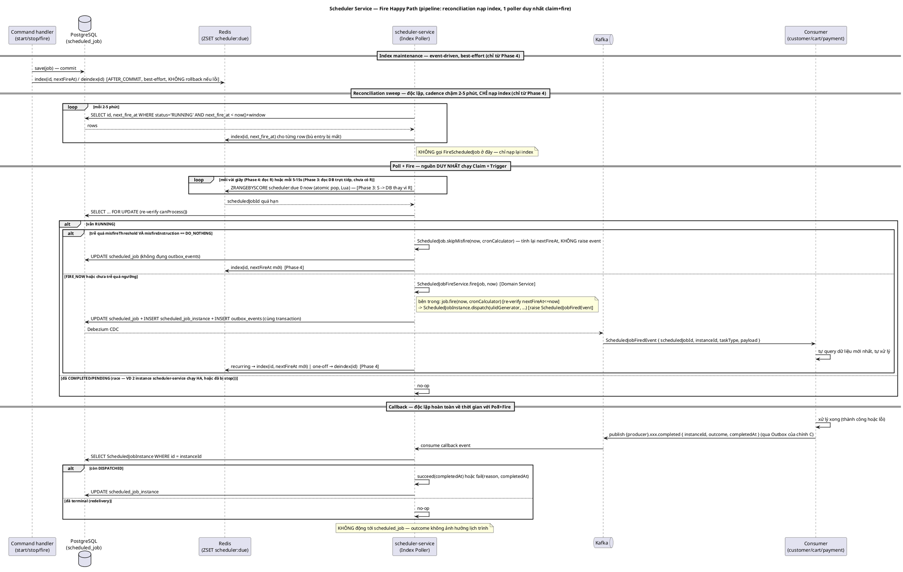

# Design: Scheduler Service

**Service doc**: [`service/scheduler-service/service.md`](../../service/scheduler-service/service.md) — domain model đầy đủ, file này chỉ mô tả flow trigger xuyên service.

**Status**: Draft — chưa implement.

---

## Mục tiêu

Có 1 cơ chế trigger job định kỳ dùng chung cho nhiều domain (loyalty point expiry, cart cleanup, seller payout, outbox cleanup) — thay vì mỗi service tự viết `@Scheduled`/cron riêng, rải rác logic tương tự nhau. Scheduler chỉ quyết định **khi nào**; domain service tiêu thụ tự quyết **làm gì**, tự query dữ liệu mới nhất của chính nó — giữ đúng nguyên tắc DB isolation và async-by-default đã chốt cho toàn hệ thống.

---

## Actors

| Actor       | Role                                                                                                                                                                                                |
|-------------|-----------------------------------------------------------------------------------------------------------------------------------------------------------------------------------------------------|
| `Scheduler` | Internal — tự trigger theo lịch cấu hình sẵn, không cần actor người dùng cho flow Fire                                                                                                              |
| `Admin`     | **Bổ sung sau khi rà lại nghiệp vụ quản trị** — Create/List/Detail/Start/Stop/Edit job qua REST API. Đảo ngược quyết định "không actor người dùng trực tiếp" trước đây — xem `service.md` §Commands |

---

## Services tham gia

| Service             | Role                                                                |
|---------------------|---------------------------------------------------------------------|
| `scheduler-service` | Coordinator — quyết định khi nào, publish tín hiệu trigger tối giản |
| `customer-service`  | Consumer — loyalty point expiry                                     |
| `cart-service`      | Consumer — cleanup giỏ hàng bỏ quên                                 |
| `payment-service`   | Consumer — batch payout cho seller                                  |

Consumer cụ thể (`customer-service`/`cart-service`/`payment-service`) **chưa implement phần tiêu thụ, kể cả phần publish callback** — scope hiện tại (`implementation.md`) chỉ dừng ở việc `scheduler-service` publish đúng, đủ tin cậy, và tự implement phía consume callback (chưa có ai publish thật để test end-to-end). Flow dưới đây mô tả tổng quát, generic theo `taskType`, không đặc thù riêng cho 1 consumer.

---

## Happy Path

**Ghi chú kiến trúc (2026-09-05)**: `DueItemFinder` (Redis ZSET) là lớp tăng tốc **tuỳ chọn**, không phải core model — xem NFR Assessment. Trước khi có Redis, Poller đọc thẳng `ScheduleStore` (`ScheduledJobRepository.findDueBefore`) — đây chính là model lõi tier-agnostic, khớp shape Mayil Bayramov dùng ở scale 50 triệu task/ngày (không dùng finder nào). Khi thêm Redis, thiết kế đi theo đúng shape **pipeline** của Aniket Yadav (Knowledge base `distributed-systems/components/job-scheduling/7. profile-distributed-poll.md`): **Postgres chỉ nạp lại index (reconciliation sweep), không tự fire song song** — khác hẳn phương án "2 loop độc lập cùng chạy Claim+Trigger" đã cân nhắc và bỏ (lý do: tránh trùng lặp business flow "poll+fire", xem Session Log `implementation.md`).

```
1. scheduled_job đã tồn tại sẵn (bootstrap lúc deploy — không có bước "đăng ký" động qua API/event ở scope này)
2. Index Poller tìm thấy scheduledJobId quá hạn — đọc DueItemFinder nếu đã có Redis (Phase 4), hoặc đọc thẳng
   ScheduleStore nếu chưa (Phase 3). Đây là nguồn DUY NHẤT chạy Claim + Trigger, bất kể đang ở phase nào.
3. FireScheduledJob.handle(id):
   - Load lại ScheduledJob từ Postgres (SELECT ... FOR UPDATE) — không tin trạng thái lúc tìm thấy
   - canProcess() == false → no-op (job đã bị xử lý ở lượt khác, hoặc đã stop())
   - canProcess() == true:
     - now - nextFireAt > misfireThreshold VÀ misfireInstruction == DO_NOTHING?
         có  → ScheduledJob.skipMisfire(now, cronCalculator) — tính lại nextFireAt, status giữ RUNNING,
               KHÔNG raise event, KHÔNG tạo ScheduledJobInstance, DỪNG (không qua bước 4-6)
         không (hoặc FIRE_NOW) → instance = ScheduledJobFireService.fire(job, now)  [Domain Service]
             (bên trong: job.fire(now, cronCalculator) [re-verify nextFireAt<=now] →
              ScheduledJobInstance.dispatch(ulidGenerator, ...) [raise ScheduledJobFiredEvent
              { scheduledJobId, instanceId, taskType, payload }])
   - Save (atomic với outbox — cùng transaction — ScheduledJob + ScheduledJobInstance + outbox_events,
     chỉ áp dụng cho nhánh fire())
   - recurring vừa fire hoặc skipMisfire → mirror lại DueItemFinder.index(id, nextFireAt) (AFTER_COMMIT,
     best-effort); one-off vừa COMPLETED → DueItemFinder.deindex(id) — chỉ áp dụng khi đã có Redis (Phase 4)
4. Debezium CDC đọc outbox_events → publish Kafka topic scheduler.job.fired
5. Consumer (customer-service/cart-service/payment-service) nhận event, lọc theo taskType,
   tự query dữ liệu mới nhất của chính nó, tự xử lý — KHÔNG tin payload mang theo là dữ liệu
   nghiệp vụ đầy đủ, chỉ coi là tín hiệu "tới giờ rồi"
6. Consumer xử lý xong (thành công hoặc lỗi) → publish event callback riêng (qua Outbox của chính
   consumer, topic do consumer tự đặt tên — chưa chốt, xem event-catalog.md) mang instanceId + outcome +
   completedAt
7. scheduler-service consume event đó → CompleteScheduledJobInstance.handle(instanceId, outcome):
   - Load ScheduledJobInstance theo instanceId
   - outcome=SUCCEEDED → ScheduledJobInstance.succeed(completedAt)
   - outcome=FAILED    → ScheduledJobInstance.fail(reason, completedAt)
   - Idempotent no-op nếu đã terminal (redelivery) — KHÔNG động tới ScheduledJob (status không mang
     outcome, xem service.md §Callback)
```

## Reconciliation — Postgres không tự fire, chỉ nạp lại index (chỉ áp dụng từ Phase 4, khi đã có Redis)

```
Chạy độc lập, cadence chậm (2-5 phút):
  SELECT id, next_fire_at FROM scheduled_job WHERE status='RUNNING' AND next_fire_at < now() + lookahead_window
  → với mỗi row: DueItemFinder.index(id, next_fire_at) — CHỈ ghi lại index, KHÔNG gọi FireScheduledJob.handle()
```

Mục đích: bù drift khi `index()`/`deindex()` (event-driven, best-effort) bị lỗi hoặc Redis mất entry. Đây chính là "≥1 poller dùng `ScheduleStore` song song" mà Knowledge base `5. core-components.md` (Flow B) yêu cầu — chỉ khác là ở đây "dùng `ScheduleStore`" nghĩa là nạp lại index định kỳ, không phải tự chạy Claim+Trigger trực tiếp trên nó. **Trước khi có Redis (Phase 3)**, không có bước reconciliation này — Index Poller ở bước 2 của Happy Path đọc thẳng `ScheduleStore.findDueBefore()`, tự nó đã là "poller dùng ScheduleStore", nên nguyên tắc trên tự động thoả mà không cần thêm gì.



---

## Failure Scenarios

| Điểm thất bại                                              | Compensating action                                                        | Kết quả cuối                     | Ghi chú                                                                 |
|---------------------------------------------------------------|-------------------------------------------------------------------------------|-------------------------------------|----------------------------------------------------------------------------|
| Redis mất 1 entry (ZADD lỗi lúc `index()` best-effort, hoặc entry bị evict) | Không cần compensate — Reconciliation sweep tự nạp lại trong tối đa 1 chu kỳ quét (2-5 phút) | Job vẫn fire đúng, chỉ chậm hơn      | Redis không cần config durable đặc biệt. Sweep chỉ nạp index, không tự fire — Index Poller vẫn là nơi duy nhất thực sự claim+fire |
| Redis down **hoàn toàn** (không chỉ mất 1 entry) | Không có compensating action ở scope hiện tại — rủi ro chấp nhận | Fire dừng hẳn tới khi Redis phục hồi (reconciliation sweep vẫn chạy nhưng ghi vào index rỗng, không có gì đọc) | Đánh đổi có chủ đích so với phương án "2 loop độc lập cùng fire" đã cân nhắc và bỏ (ở đó DB tự fire được kể cả khi Redis chết hẳn). Chấp nhận được ở cardinality hiện tại (jitter phút, Redis outage hiếm/ngắn). Production thật cần thêm circuit-breaker fallback về poll `ScheduleStore` trực tiếp khi Redis lỗi liên tục — chưa làm, xem `deferred.md` |
| 2 nguồn cùng tìm ra 1 job gần như đồng thời (VD 2 instance `scheduler-service` chạy HA, hoặc job vừa được reconciliation sweep nạp lại đúng lúc Index Poller đang xử lý) | `canProcess()` + `SELECT...FOR UPDATE` + optimistic lock (`@Version`) tại `ScheduledJob.fire()` | Fire đúng 1 lần | Không cần các nguồn "biết nhau" — race chặn ở tầng aggregate, không phải tầng poll |
| Publish outbox thành công nhưng update status thất bại (hoặc ngược lại) | Không xảy ra được — 2 việc cùng 1 transaction DB (Outbox Pattern, ADR-005)   | N/A                                  | Đây là lý do bắt buộc dùng Outbox, không publish Kafka trực tiếp từ code    |
| Consumer down lúc event publish                              | Không cần — Kafka giữ message, consumer tự catch up khi lên lại               | Consumer xử lý trễ, không mất event | Consumer bắt buộc tự idempotent (dedup theo `eventId`)                      |
| Hệ thống downtime dài (deploy sự cố...), job trễ quá `misfireThreshold` khi Index Poller phát hiện lại | `ScheduledJob.skipMisfire(now, cronCalculator)` nếu `misfireInstruction=DO_NOTHING` — dời lịch, không fire bù | Job bị bỏ qua lần trễ này, chờ đúng chu kỳ kế tiếp | Không phát `ScheduledJobFiredEvent` — silent internal transition, không cần cập nhật `event-catalog.md`. Với `misfireInstruction=FIRE_NOW` (default cả 4 job hiện tại), hành vi không đổi — vẫn fire bù như trước |

---

## Business Rules

- Scheduler không diễn giải nội dung `payload` — chỉ lưu và giao lại nguyên vẹn.
- Không tier nào đạt exactly-once ở tầng trigger — trách nhiệm chống chạy-trùng luôn nằm ở consumer.
- Không có sync call nào từ/tới `scheduler-service` — vi phạm sẽ phá nguyên tắc "chỉ 4 cặp sync đã duyệt" (`4. communication.md`). Callback outcome cũng đi qua Kafka (async), không phải REST/gRPC — không tạo cặp sync mới, không cần ADR.
- Outcome của `ScheduledJobInstance` (SUCCEEDED/FAILED) **không bao giờ** ảnh hưởng `ScheduledJob.status`/`nextFireAt` — 2 khái niệm tách bạch hoàn toàn ("status không mang outcome"). Retry-khi-fail cố tình để ngỏ, chưa triển khai.

---

## NFR Assessment

Cardinality hiện tại cực thấp (4 job cố định: loyalty expiry, cart cleanup, payout, outbox cleanup) — không có rủi ro throughput nào cần xử lý ở scope này. Model lõi tier-agnostic (Poller đọc thẳng `ScheduleStore`, không cần `DueItemFinder` — điều kiện tồn tại của `DueItemFinder` theo Knowledge base `5. core-components.md` §3.3 là "query trực tiếp `ScheduleStore` trở thành bottleneck cho `poll_time`", chưa từng xảy ra ở đây) đã đủ đúng và đủ nhanh — đây chính là shape Mayil Bayramov dùng ở scale 50 triệu task/ngày mà không cần finder nào.

`DueItemFinder` (Redis ZSET) được thêm vào **có chủ đích** để rehearse pattern Profile 2 cho mục đích học tập/portfolio (quyết định 2026-09-05), không phải nhu cầu performance thật ở cardinality hiện tại — và triển khai theo đúng shape pipeline của Aniket Yadav (reconciliation sweep chỉ nạp index, Index Poller là nơi duy nhất fire), không phải 2 loop độc lập cùng fire. Xem `deferred.md` cho các mở rộng Profile 2 khác đã cân nhắc nhưng không build (time-bucket + segment sharding, circuit-breaker fallback...).

| Rủi ro                                                | Vì sao                                                                                  | Đề xuất                                                                 |
|----------------------------------------------------------|--------------------------------------------------------------------------------------------|------------------------------------------------------------------------|
| Chưa có consumer thật nào tiêu thụ `scheduler.job.fired` | `customer-service`/`cart-service`/`payment-service` chưa implement handler — chỉ xác nhận trên code, chưa verify | Không block việc build phần publish — verify bằng console consumer thủ công, ghi rõ trong `implementation.md` |
| `CreateScheduledJob` chưa có REST/quản trị              | Scope hiện tại chỉ seed qua migration — nếu cần sửa lịch phải deploy lại                     | Chấp nhận được ở scope hiện tại (4 job cố định), note lại là gap cần Phase sau (xem Knowledge base file 7: Định nghĩa/Quản trị/Extensibility) |
