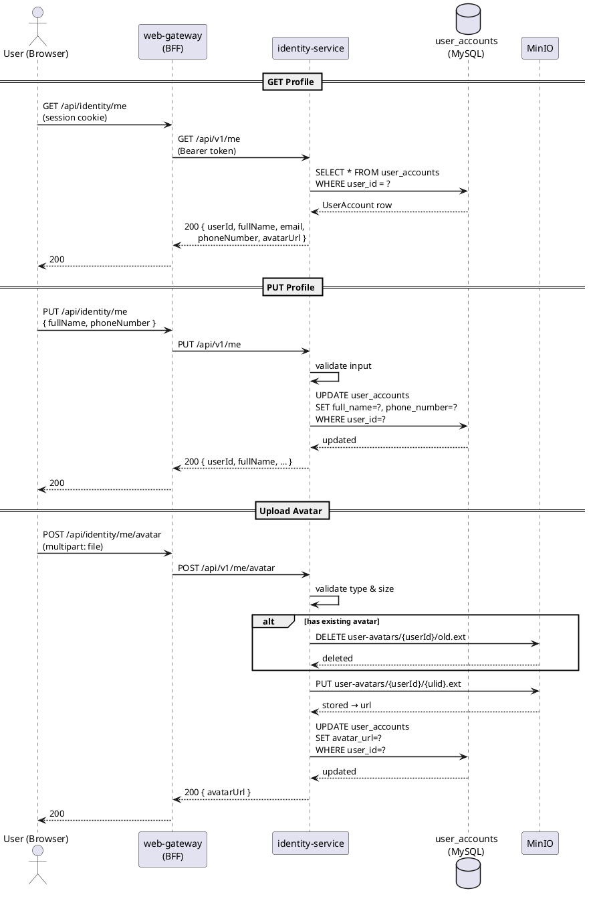

# Design: Personal Info

**Status**: Draft

---

## Context

Màn hình "Thông tin cá nhân" trong tab đầu tiên của `AccountProfileComponent` — dùng chung cho Customer, Seller, Admin. User xem và cập nhật thông tin cơ bản của `UserAccount` trong identity-service.

---

## DB Changes

Bổ sung 1 cột vào `user_accounts`:

```sql
ALTER TABLE users
    ADD COLUMN avatar_url VARCHAR(512);
```

---

## Services liên quan

| Service            | Vai trò                                                | Loại tham gia |
|--------------------|--------------------------------------------------------|---------------|
| `web-gateway`      | BFF — validate session, relay request với Bearer token | Entry point   |
| `identity-service` | Source of truth `UserAccount` — read + update          | Sync only     |
| MinIO              | Object storage — lưu file avatar                       | Storage       |

Không có event — thay đổi `UserAccount` không trigger downstream consumer nào trong scope hiện tại.

---

## Sequence Diagram



---

## Operations

### GET /api/v1/identity/me

Trả về thông tin `UserAccount` của user đang đăng nhập.

```
Angular → GET /api/identity/me
  → web-gateway: extract userId từ session, relay với Bearer token
  → identity-service: load UserAccount by userId
  → return { userId, fullName, email, phoneNumber, avatarUrl }
```

**Response:**
```json
{
  "userId": "01J...",
  "fullName": "Nguyễn Văn A",
  "email": "user@example.com",
  "phoneNumber": "0901234567",
  "avatarUrl": "http://minio/user-avatars/01J.../avatar.jpg"
}
```

---

### PUT /api/v1/identity/me

Cập nhật `fullName` và `phoneNumber`. Email không cho phép thay đổi qua endpoint này.

```
Angular → PUT /api/identity/me { fullName, phoneNumber }
  → web-gateway: relay
  → identity-service:
      validate input
      UPDATE user_accounts SET full_name=?, phone_number=? WHERE user_id=?
      return updated UserAccount
```

---

### POST /api/v1/identity/me/avatar

Upload avatar mới. identity-service xử lý file, upload lên MinIO, cập nhật `avatar_url`.

```
Angular → POST /api/identity/me/avatar (multipart/form-data, field: "file")
  → web-gateway: relay
  → identity-service:
      validate file (type, size)
      if avatarUrl != null → delete old file từ MinIO
      upload file mới lên MinIO → path: user-avatars/{userId}/{ulid}.{ext}
      UPDATE user_accounts SET avatar_url=? WHERE user_id=?
      return { avatarUrl }
```

---

## Error Cases

| Lỗi                       | Nơi xử lý        | HTTP |
|---------------------------|------------------|------|
| `fullName` blank          | identity-service | 400  |
| `phoneNumber` sai format  | identity-service | 400  |
| File size > 5MB           | identity-service | 413  |
| File type không hợp lệ    | identity-service | 415  |
| MinIO unavailable         | identity-service | 503  |
| User không tồn tại (edge) | identity-service | 404  |

**File types hợp lệ:** `image/jpeg`, `image/png`, `image/webp`

---

## Technical Constraints

| Concern          | Giải pháp                                                                   |
|------------------|-----------------------------------------------------------------------------|
| Authorization    | userId lấy từ JWT claims — user chỉ update được chính mình, không có param  |
| Phone uniqueness | Không enforce — cùng SĐT có thể dùng ở nhiều account (thực tế VN phổ biến)  |
| Avatar cleanup   | Xóa file cũ trên MinIO khi upload mới để tránh orphaned files               |
| Avatar path      | `user-avatars/{userId}/{ulid}.{ext}` — ulid tránh cache hit khi replace     |
| No events        | Downstream services không consume UserAccount change events trong scope này |

---

## Frontend

**Component:** `PersonalInfoTabComponent` trong `libs/shared/ui/account-profile/`

**Behavior:**
- Load `GET /me` khi tab active (không load trước)
- Avatar: click vào ảnh → native file input → preview local trước khi upload → `POST /me/avatar` ngay khi chọn file (không cần bấm Save)
- Form (fullName, phoneNumber): dirty check — chỉ enable nút Save khi có thay đổi
- Save thành công → MatSnackBar 3s "Đã lưu thay đổi"
- Email field: `mat-form-field` disabled, suffix icon info tooltip "Email không thể thay đổi"
