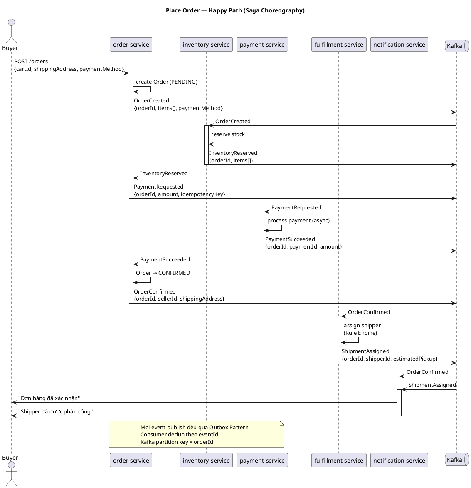
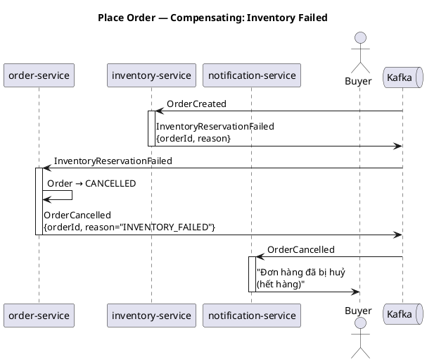
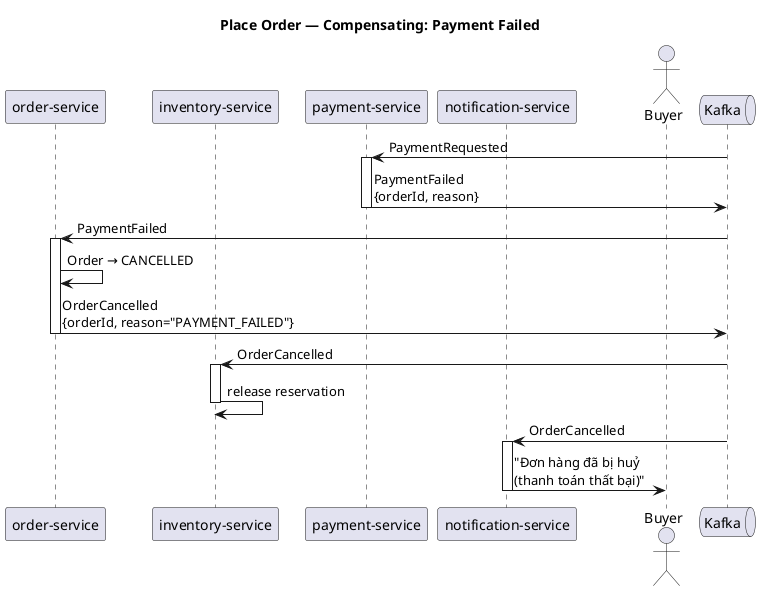

# Design: Place Order

**UC gốc**: Buyer đặt hàng (`../../global/1.requirement/requirement.md`)
**Implementation plan**: [`implementation.md`](implementation.md)
**Status**: Draft

---

## Services liên quan

| Service                | Vai trò                                         | Loại tham gia                     |
|------------------------|-------------------------------------------------|-----------------------------------|
| `order-service`        | Saga coordinator — nhận request, điều phối flow | Command handler + Event publisher |
| `inventory-service`    | Giữ tồn kho cho order                           | Saga participant                  |
| `payment-service`      | Thu tiền                                        | Saga participant                  |
| `fulfillment-service`  | Phân công shipper                               | Saga participant                  |
| `notification-service` | Thông báo buyer + seller                        | Event consumer (Notify)           |

---

## Pre-conditions

- Buyer đã login
- Cart không rỗng, tất cả items thuộc cùng 1 seller
- Địa chỉ giao hàng đã có

---

## Happy Path

```
Buyer
  → POST /orders  (order-service)
  → order-service tạo Order (PENDING), publish OrderCreated
        ↓ Kafka
  → inventory-service nhận OrderCreated, reserve stock
  → inventory-service publish InventoryReserved
        ↓ Kafka
  → order-service nhận InventoryReserved, publish PaymentRequested
        ↓ Kafka
  → payment-service nhận PaymentRequested, xử lý thanh toán async
  → payment-service publish PaymentSucceeded
        ↓ Kafka
  → order-service nhận PaymentSucceeded
    → cập nhật Order → CONFIRMED
    → publish OrderConfirmed
        ↓ Kafka
  → fulfillment-service nhận OrderConfirmed, assign shipper (Rule Engine)
  → fulfillment-service publish ShipmentAssigned
        ↓ Kafka
  → notification-service nhận OrderConfirmed + ShipmentAssigned → gửi thông báo
```



---

## Compensating Paths

### Inventory thất bại

```
inventory-service publish InventoryReservationFailed
  → order-service nhận → Order → CANCELLED
  → publish OrderCancelled
  → payment-service KHÔNG được trigger
  → notification-service gửi thông báo huỷ
```



### Payment thất bại

```
payment-service publish PaymentFailed
  → order-service nhận → Order → CANCELLED
  → publish OrderCancelled
        ↓ Kafka (fan-out)
  → inventory-service nhận OrderCancelled → release reservation
  → notification-service gửi thông báo huỷ
```



---

## Yêu cầu kỹ thuật

| Concern                | Giải pháp                                                   |
|------------------------|-------------------------------------------------------------|
| Kafka ordering         | Partition key = `orderId`                                   |
| At-least-once delivery | Outbox Pattern tại mỗi event publish                        |
| Deduplication          | Consumer dedup theo `eventId`, lưu `processed_event_id`     |
| Payment idempotency    | `idempotencyKey` trong `PaymentRequested` = `orderId`       |
| Timeout                | Nếu không nhận reply sau X phút → Temporal scheduled cancel |

---

## ADR liên quan

- [`adr/004-saga-choreography.md`](../../global/2.architecture/adr/004-saga-choreography.md)
- [`adr/005-outbox-pattern.md`](../../global/2.architecture/adr/005-outbox-pattern.md)
