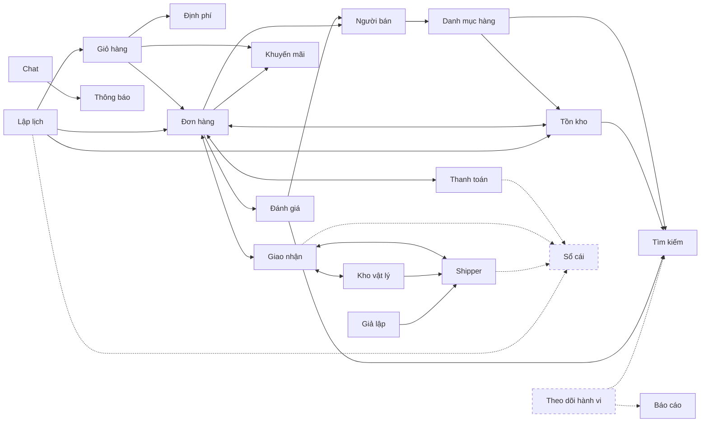

# Chia bounded context và bản đồ quan hệ

## 1. Cách đọc

- **Mức tên:** chỉ nêu tên nghiệp vụ, trạng thái và lý do chọn. Chi tiết (sáu câu khép kín, ràng buộc đầy đủ, feature)
  làm ở giai đoạn theo bước, khi tới BC đó.
- **Trạng thái:** **Trong** (kèm "tối giản" nếu chỉ cần phần đóng đơn giản) · **Cắt tạm** (đã phân tích, hoãn, có điểm nối)
  · **Ngoài** (không làm).
- **Gốc điểm sâu:** *đòi hỏi* (cách đơn giản sụp ở quy mô) hoặc *chủ động chọn* (học kỹ thuật; nêu chung, chưa chọn công
  nghệ cụ thể). Kèm chiều quy mô: *dữ liệu lớn* hoặc *đồng thời cao*.
- **BC khác thành phần hạ tầng:** BC có ngôn ngữ và ràng buộc nghiệp vụ riêng. Cổng API, giám sát, giới hạn truy cập,
  bus sự kiện là thành phần hạ tầng, không phải BC (mục 9.4).

## 2. Đánh giá bên tham gia

| Bên                    | Là ai                                                                | Cần gì từ nền tảng                                                                               | BC phục vụ chính                                                                     |
|------------------------|----------------------------------------------------------------------|--------------------------------------------------------------------------------------------------|--------------------------------------------------------------------------------------|
| **Khách vãng lai**     | Chưa đăng nhập                                                       | Xem, tìm, giữ giỏ tạm                                                                            | Tìm kiếm, Danh mục hàng, Giỏ hàng                                                    |
| **Người mua**          | Tài khoản vai Người dùng (người bán và shipper cũng mua được)         | Mua, trả tiền, theo dõi giao, hậu mãi, đánh giá                                                  | Giỏ hàng, Đơn hàng, Thanh toán, Giao nhận, Đánh giá, Khách hàng                      |
| **Người bán**          | Tài khoản có hồ sơ Người bán đã duyệt                                | Niêm yết, quản lý tồn, xử lý đơn, nhận tiền, xem hiệu quả bán                                    | Người bán, Danh mục hàng, Tồn kho, Đơn hàng, Sổ cái, Báo cáo                         |
| **Quản trị nền tảng**  | Điều hành                                                            | Duyệt người bán, kiểm duyệt, quản lý danh mục và cấu hình, theo dõi vận hành, truy vết hành động | Người bán, Danh mục hàng, Dữ liệu tham chiếu và cấu hình, Nhật ký kiểm toán, Báo cáo |
| **Bên thanh toán**     | Bên ngoài, môi trường thử nghiệm                                     | Nhận yêu cầu, trả kết quả bất đồng bộ                                                            | Thanh toán                                                                           |
| **Shipper**            | Đội do nền tảng quản (giả lập), nhận phân công, làm việc ngoài đường | Nhận đơn, báo vị trí và trạng thái sẵn sàng, xác nhận giao, thu COD và nộp lại                   | Shipper, Giao nhận                                                                   |
| **Nhân viên kho**      | Nội bộ nền tảng, một kho giả định                                    | Nhận hàng người bán mang tới, đối chiếu, xuất cho shipper, xác nhận nhận tiền COD shipper nộp    | Kho vật lý                                                                           |
| **Kênh gửi thông báo** | Bên ngoài                                                            | Chuyển thông báo tới người dùng                                                                  | Thông báo                                                                            |

Nhận xét rút ra:
1. **Nền tảng ngồi giữa ba bên** (mua, bán, nền tảng). Hai bên mua và bán chỉ gặp nhau qua nền tảng, nên mọi giao dịch
   đi qua một BC điều phối.
2. **Người bán phức tạp nhất:** vừa là người quản lý hàng (niêm yết, tồn kho), vừa là một bên của giao dịch (nhận đơn,
   nhận tiền). Vì thế vai trò này chạm nhiều BC nhất.
3. **Khách vãng lai khác người mua ở danh tính**, nên giỏ phải gộp khi đăng nhập và xác thực nằm ở một BC riêng.
4. **Shipper là bên tham gia riêng** (đội do nền tảng quản, giả lập), vì dự án muốn thực hành vị trí thời gian thực và
   phân công theo quy tắc. Người bán tự mang hàng tới một kho do nền tảng giữ (giả định một kho), nên có thêm nhân viên kho.
5. **Quản trị là nhiều vai trò** (duyệt, kiểm duyệt, phân xử, vận hành). Tách vai ở phân tích chi tiết.
6. **Bên tham gia khác vai tài khoản.** Người mua, Người bán, Shipper là bên tham gia trong giao dịch, không phải vai.
   Mọi tài khoản Người dùng đều mua được; bán và giao hàng là hồ sơ có bước duyệt, giữ ở Người bán và Shipper, trỏ về
   tài khoản. Tài khoản chỉ có một vai (Người dùng hoặc vai nội bộ như Quản trị, Nhân viên kho), do Xác thực giữ.
   Tài khoản nội bộ không mua; người nội bộ muốn mua thì có tài khoản Người dùng riêng.

## 3. Bản đồ nghiệp vụ (P1, mức tên)

| Việc                    | Nghiệp vụ                                                                                                                                                                                                                                                                                                                                                                                                   |
|-------------------------|-------------------------------------------------------------------------------------------------------------------------------------------------------------------------------------------------------------------------------------------------------------------------------------------------------------------------------------------------------------------------------------------------------------|
| **Khám phá**            | Duyệt theo danh mục · tìm văn bản · lọc theo thuộc tính, thương hiệu, giá, còn hàng · sắp xếp · xem chi tiết sản phẩm và biến thể · gợi ý tìm kiếm · cá nhân hóa · ghi nhận hành vi xem, nhấp, tìm. **Niêm yết** (phía người bán): tạo sản phẩm, biến thể, giá, ảnh · đăng, gỡ · danh mục, thuộc tính, thương hiệu · nhập và điều chỉnh tồn kho                                                             |
| **Tin cậy**             | Đăng ký, đăng nhập, xác thực nhiều lớp, phân quyền · đăng ký và duyệt người bán · hồ sơ gian hàng, hạng người bán · kiểm duyệt, chặn sản phẩm, báo cáo vi phạm, chống gian lận · đánh giá, xếp hạng · chat người mua – người bán                                                                                                                                                                            |
| **Thực hiện giao dịch** | Giỏ hàng (vãng lai, gộp khi đăng nhập) · tính giá, phí vận chuyển, hoa hồng · voucher, ưu đãi giới hạn suất · đặt hàng · giữ chỗ tồn kho · thanh toán trả trước, COD · giữ tiền đến khi giao thành công · điều phối đơn nhiều bước · bàn giao, phân công giao nhận, theo dõi vận chuyển, xác nhận giao · shipper thu COD, giữ công nợ tiền mặt, nộp tại kho · đối soát COD · số dư và chi trả cho người bán |
| **Sau giao dịch**       | Hủy đơn · hoàn trả hàng · hoàn tiền · khiếu nại, phân xử · điểm tích lũy · yêu thích, theo dõi gian hàng                                                                                                                                                                                                                                                                                                    |
| **Vận hành nền tảng**   | Quản lý người dùng (khóa, mở) · cấu hình nền tảng và dữ liệu tham chiếu (địa chỉ hành chính, vùng giao) · báo cáo, phân tích · thông báo · lập lịch job · nhật ký kiểm toán · lưu và phục vụ tệp · thử tải và giả lập                                                                                                                                                                                       |

## 4. Danh sách bounded context (P2)

Tiêu chí tách (từ P2): thuật ngữ khác nghĩa · ràng buộc cần nhất quán mạnh trong một giao dịch · lý do thay đổi khác
nhau · đặc tính tải khác hẳn. BC tách vì lý do kỹ thuật ghi rõ điểm sâu nó phục vụ.

| #   | BC                             | Loại   | Trách nhiệm một dòng                                                       | Lý do tách                                                                                                              | Đề xuất                                         |
|-----|--------------------------------|--------|----------------------------------------------------------------------------|-------------------------------------------------------------------------------------------------------------------------|-------------------------------------------------|
| B1  | Danh mục hàng                  | Lõi    | Sản phẩm, biến thể, danh mục, thuộc tính, thương hiệu, giá niêm yết        | Thuật ngữ và ràng buộc riêng của hàng niêm yết                                                                          | Trong                                           |
| B2  | Tìm kiếm                       | Lõi    | Tìm và lọc trên dữ liệu đã tổng hợp                                        | Chỉ đọc, tải và dữ liệu khác hẳn Danh mục                                                                               | Trong                                           |
| B3  | Tồn kho                        | Lõi    | Số lượng bán được, giữ chỗ                                                 | Ràng buộc "không âm" và tranh chấp đồng thời                                                                            | Trong                                           |
| B4  | Giỏ hàng                       | Lõi    | Giỏ của khách vãng lai và người mua                                        | Vòng đời và tải ghi khác Đơn hàng                                                                                       | Trong                                           |
| B5  | Đơn hàng                       | Lõi    | Vòng đời đơn, điều phối nhiều bước                                         | Điểm điều phối duy nhất của giao dịch                                                                                   | Trong                                           |
| B6  | Thanh toán                     | Lõi    | Giao dịch với bên thanh toán: thu, hoàn, kết quả gọi ngược                 | Tương tác bên ngoài, xử lý lặp và sai thứ tự                                                                            | Trong                                           |
| B7  | Giao nhận                      | Lõi    | Bàn giao, phân công, theo dõi, xác nhận giao                               | Vòng đời riêng, bên ngoài                                                                                               | Trong                                           |
| B8  | Khuyến mãi                     | Lõi    | Voucher, ưu đãi giới hạn suất                                              | Ràng buộc "không vượt giới hạn" và tranh chấp                                                                           | Trong                                           |
| B9  | Hoàn trả và khiếu nại          | Lõi    | Hoàn hàng, hoàn tiền, phân xử                                              | Quy trình dài, nhiều bên                                                                                                | **Cắt tạm**                                     |
| B10 | Người bán                      | Hỗ trợ | Đăng ký, duyệt, hồ sơ, hạng                                                | Vòng đời người bán khác người mua                                                                                       | Trong                                           |
| B11 | Khách hàng                     | Hỗ trợ | Hồ sơ, sổ địa chỉ                                                          | Tách khỏi xác thực (đăng nhập)                                                                                          | Trong (tối giản)                                |
| B12 | Định phí                       | Hỗ trợ | Phí vận chuyển, hoa hồng, tổng tiền                                        | Quy tắc đổi thường xuyên, gọi đồng bộ                                                                                   | Trong                                           |
| B13 | Đánh giá                       | Hỗ trợ | Đánh giá và tổng hợp điểm                                                  | Mở khóa sau đơn hoàn tất, ràng buộc riêng                                                                               | Trong (tối giản)                                |
| B14 | Báo cáo                        | Hỗ trợ | Tổng hợp nhiều chiều                                                       | Không nối bảng gốc được ở quy mô lớn                                                                                    | Trong                                           |
| B15 | Kho vật lý                     | Hỗ trợ | Nhận hàng người bán mang tới, lịch sử di chuyển, xuất kho                  | Thuật ngữ vật lý khác "số lượng bán được"                                                                               | Trong (chủ động chọn)                           |
| B16 | Xác thực                       | Chung  | Đăng ký, đăng nhập, phiên, vai, phân quyền, khóa mở tài khoản             | Bảo mật, dùng chung mọi BC; nhiều portal cần một máy chủ xác thực riêng để đăng nhập chung; chính sách bảo mật đổi khác hồ sơ | Trong                                           |
| B17 | Thông báo                      | Chung  | Gửi và đẩy thông báo                                                       | Phụ thuộc kênh, tải kết nối                                                                                             | Trong (tối giản)                                |
| B18 | Chat                           | Chung  | Nhắn tin hai chiều                                                         | Thời gian thực, dữ liệu dạng tin nhắn                                                                                   | Trong (chủ động chọn)                           |
| B19 | Quy trình và lập lịch          | Chung  | Job định kỳ, quy trình chạy dài                                            | Hạ tầng cho các BC khác                                                                                                 | Trong                                           |
| B20 | Giả lập và thử tải             | Chung  | Tạo tải, tiêm lỗi, sinh dữ liệu                                            | Phục vụ trực tiếp "đo thật"                                                                                             | Trong                                           |
| B21 | Theo dõi hành vi               | Hỗ trợ | Thu sự kiện xem, nhấp, tìm                                                 | Dữ liệu dạng luồng, khối lượng khác mọi BC giao dịch                                                                    | **Cắt tạm** (làm sau)|
| B22 | Sổ cái và đối soát             | Lõi    | Ký quỹ, số dư, chi trả, đối soát COD                                       | Ràng buộc "sổ cân bằng" khác tương tác bên ngoài                                                                        | **Tách BC; làm sau lõi** (xem B22 ở mục 5) |
| B23 | Quản lý tệp                    | Chung  | Lưu và phục vụ ảnh, bằng chứng                                             | Dữ liệu nhị phân, không BC nào sở hữu                                                                                   | Trong, tối giản                       |
| B24 | Dữ liệu tham chiếu và cấu hình | Hỗ trợ | Địa chỉ hành chính, vùng giao, phí, ngưỡng, chính sách                     | Quản trị sửa, nhiều BC đọc                                                                                              | Trong, tối giản                       |
| B25 | Nhật ký kiểm toán              | Chung  | Ghi hành động quản trị và hành động nhạy cảm                               | Bất biến, truy vết                                                                                                      | Trong, tối giản                       |
| B26 | Kiểm duyệt và an toàn          | Hỗ trợ | Báo cáo vi phạm, chống gian lận                                            | Quy trình và dữ liệu riêng                                                                                              | **Cắt tạm**                           |
| B27 | Shipper                        | Hỗ trợ | Hồ sơ, sẵn sàng, khu vực, vị trí, công nợ tiền mặt và nộp tiền của shipper | Công nợ tiền mặt là ràng buộc nhất quán mạnh; nhập vị trí là luồng ghi tần suất cao; vòng đời và thuật ngữ khác vận đơn | Trong, tối giản    |
| B28 | Định danh                      | Chung  | Hồ sơ định danh (tên, ảnh), thiết bị, lịch sử đăng nhập                    | Dữ liệu để xem, ghi chủ yếu chỉ thêm, nguồn là event phiên; đổi vì lý do hiển thị và thiết bị, khác chính sách xác thực | Trong (tối giản)    |

## 5. Chi tiết từng BC (mức tên)

Mỗi BC ghi: nghiệp vụ (tên, trạng thái, lý do) · ràng buộc chính · event vào, ra · điểm sâu (gốc, chiều).

### B1. Danh mục hàng (Lõi)

| Nghiệp vụ                            | Trạng thái       | Lý do                                                     |
|--------------------------------------|------------------|-----------------------------------------------------------|
| Quản lý danh mục và thuộc tính       | Trong            | Cấu trúc để tìm và lọc đúng                               |
| Quản lý thương hiệu                  | Trong (tối giản) | Đủ thật                                                   |
| Tạo, sửa sản phẩm và biến thể        | Trong            | Lõi niêm yết                                              |
| Đăng, gỡ sản phẩm; chặn bởi quản trị | Trong            | Hai bên điều khiển hiển thị, cần khép kín kiểm duyệt      |
| Giá niêm yết (một giá)               | Trong            | Catalog không lo khuyến mãi hay phí                       |
| Ảnh sản phẩm                         | Trong (tối giản) | Lưu qua Quản lý tệp                                       |
| Duyệt sản phẩm trước khi hiển thị    | **Cắt tạm**      | Điểm nối: thêm trạng thái chờ duyệt trước event công khai |

- **Ràng buộc chính:** hiển thị ⇔ đã đăng và không bị chặn · tổ hợp thuộc tính của biến thể là duy nhất · giá > 0 ·
  thuộc tính chỉ gắn ở danh mục lá.
- **Ra:** sản phẩm công khai thay đổi (bản chụp) · đơn vị bán được được tạo hoặc xóa · danh mục đổi. **Vào:** không.
- **Điểm sâu:** đọc đồng thời rất nhiều (đòi hỏi; đồng thời cao).

### B2. Tìm kiếm (Lõi)

| Nghiệp vụ                                       | Trạng thái  | Lý do                                      |
|-------------------------------------------------|-------------|--------------------------------------------|
| Tìm văn bản                                     | Trong       | Lõi khám phá                               |
| Lọc theo thuộc tính, thương hiệu, giá, còn hàng | Trong       | Lõi khám phá                               |
| Sắp xếp và xếp hạng                             | Trong       | Lõi khám phá                               |
| Gợi ý khi gõ                                    | **Cắt tạm** | Cải thiện, không bắt buộc để chạy          |
| Gợi ý và xếp hạng cá nhân hóa                   | **Cắt tạm** | Điểm nối: nhận dữ liệu từ Theo dõi hành vi |

- **Ràng buộc chính:** không có ràng buộc mạnh (nhất quán cuối cùng) · cập nhật không được lùi phiên bản.
- **Vào:** sản phẩm công khai thay đổi · mức tồn đổi · điểm đánh giá đổi · (sau này) tín hiệu hành vi. **Ra:** không.
- **Điểm sâu:** dữ liệu lớn (đòi hỏi), đồng thời đọc cao (đòi hỏi).

### B3. Tồn kho (Lõi)

| Nghiệp vụ                                                | Trạng thái                  | Lý do                                                                                                   |
|----------------------------------------------------------|-----------------------------|---------------------------------------------------------------------------------------------------------|
| Số lượng gốc và sổ biến động (nhập, điều chỉnh, kiểm kê) | Trong                       | Lõi                                                                                                     |
| Giữ chỗ khi đặt, chốt, trả                               | Trong                       | Lõi giao dịch                                                                                           |
| Giữ chỗ quá hạn tự trả                                   | Trong                       | Đường không suôn sẻ của giữ chỗ                                                                         |
| Cảnh báo ngưỡng tồn                                      | Trong (tối giản)            | Đủ thật                                                                                                 |
| Suất ưu đãi giới hạn (phần giữ suất)                     | Trong, chỉ cho hàng đối tác | Điểm sâu; flash sale cần tồn kho đã kiểm chứng (phần đối tác tối thiểu cho flash sale: xem chỗ hở (g) ở mục 7) |
| Nguồn tồn kho từ kho nền tảng                            | **Cắt tạm**                 | Điểm nối: sổ biến động có trường nguồn, chặn đặt số tay với nguồn kho; dùng khi có người bán đối tác    |

- **Ràng buộc chính:** khả dụng không âm · giữ chỗ toàn bộ hoặc không, xử lý lặp theo đơn · suất không vượt giới hạn.
- **Vào:** đơn vị bán được được tạo · yêu cầu giữ, chốt, hủy. **Ra:** đã giữ chỗ, giữ chỗ thất bại, đã trả · mức tồn đổi ·
  hết hàng, có hàng lại.
- **Điểm sâu:** tranh chấp trên cùng một mặt hàng (đòi hỏi; đồng thời cao).

### B4. Giỏ hàng (Lõi)

| Nghiệp vụ                                 | Trạng thái                                | Lý do                                     |
|-------------------------------------------|-------------------------------------------|-------------------------------------------|
| Giỏ của khách vãng lai                    | Trong                                     | Khám phá đến mua không bắt buộc đăng nhập |
| Giỏ của người mua, gộp khi đăng nhập      | Trong                                     | Hệ quả của hai danh tính                  |
| Kiểm tra giá và khả dụng khi chuẩn bị đặt | Trong                                     | Đủ khép kín cho đặt hàng                  |
| Dọn giỏ bỏ quên                           | Trong (tối giản)                          | Qua lập lịch                              |
| Giỏ nhiều người bán, tách đơn khi đặt     | **Cần xác nhận** (chi tiết, Đơn hàng) | Ảnh hưởng quy tắc "mỗi đơn một người bán" |

- **Ràng buộc chính:** một giỏ mỗi chủ · gộp thì cộng dồn số lượng.
- **Vào:** giá và khả dụng qua giao diện. **Ra:** yêu cầu tạo đơn.
- **Điểm sâu:** ghi đồng thời nhiều (đòi hỏi; đồng thời cao).

### B5. Đơn hàng (Lõi)

| Nghiệp vụ                                                                                               | Trạng thái | Lý do                                                  |
|---------------------------------------------------------------------------------------------------------|------------|--------------------------------------------------------|
| Tạo đơn từ giỏ                                                                                          | Trong      | Lõi                                                    |
| Vòng đời đơn: tạo, chờ người bán xác nhận, đã xác nhận, chờ bàn giao, đang giao, đã giao, hoàn tất, hủy | Trong      | Lõi                                                    |
| Điều phối nhiều bước kèm bù trừ khi lỗi                                                                 | Trong      | Điểm sâu                                               |
| Người bán xác nhận hoặc từ chối đơn (hết hàng)                                                          | Trong      | Tồn kho tự khai chỉ là lời hứa; đây là bước kiểm chứng |
| Hạn xác nhận: quá hạn tự hủy, hoàn tiền, trả giữ chỗ                                                    | Trong      | Cấu hình ở Dữ liệu tham chiếu và cấu hình              |
| Hủy đơn (người mua trước khi bàn giao; tự động khi quá hạn)                                             | Trong      | Đường không suôn sẻ bắt buộc                           |
| Xem và theo dõi đơn (người mua, người bán)                                                              | Trong      | Khép kín                                               |

- **Ràng buộc chính:** chuyển trạng thái hợp lệ · giá và địa chỉ chốt tại lúc đặt · một đơn một người bán (cần xác nhận) · chỉ người bán của đơn mới xác nhận hoặc từ chối.
- **Vào:** yêu cầu tạo đơn · kết quả giữ chỗ, thanh toán, giao nhận. **Ra:** yêu cầu giữ chỗ, thanh toán, giao nhận · hủy ·
  đơn hoàn tất.
- **Điểm sâu:** đúng đắn của giao dịch phân tán khi lỗi và trùng (đòi hỏi; đồng thời cao).

### B6. Thanh toán (Lõi)

| Nghiệp vụ                                          | Trạng thái | Lý do               |
|----------------------------------------------------|------------|---------------------|
| Thanh toán trả trước qua bên thanh toán thử nghiệm | Trong      | Lõi                 |
| Hoàn tiền khi hủy đơn đã trả                       | Trong      | Đường không suôn sẻ |
| Xử lý kết quả gọi ngược trùng hoặc sai thứ tự      | Trong      | Đặc tính bên ngoài  |

- **Ràng buộc chính:** mỗi giao dịch xử lý lặp an toàn · số tiền khớp đơn · hoàn không vượt đã thu.
- **Vào:** yêu cầu thanh toán, hoàn · kết quả từ bên ngoài. **Ra:** thanh toán thành công, thất bại, đã hoàn.
- **Ngoài phạm vi BC này:** COD (hình thức phổ biến trên thị trường mục tiêu). Tiền mặt đi qua shipper và kho, không qua bên thanh toán, nên COD thuộc Giao nhận (xác nhận có thu), Shipper (công nợ) và Sổ cái (bút toán). Bản tối giản: shipper xác nhận giao thì đơn chuyển "đã thanh toán", chưa có công nợ và đối soát (cắt tạm, xem B27). Trạng thái thanh toán của đơn COD ở Đơn hàng: để bước chi tiết.
- **Điểm sâu:** đúng khi lặp và sai thứ tự (đòi hỏi; đồng thời cao).

### B7. Giao nhận (Lõi)

| Nghiệp vụ                                                                                                  | Trạng thái       | Lý do                                                           |
|------------------------------------------------------------------------------------------------------------|------------------|-----------------------------------------------------------------|
| Tạo vận đơn khi đơn xác nhận                                                                               | Trong            | Lõi                                                             |
| Chờ hàng của người bán có mặt tại kho rồi mới phân công                                                    | Trong            | Người bán tự mang hàng tới kho (Kho vật lý nhận)                |
| Hạn bàn giao: quá hạn tự hủy đơn, hoàn tiền, trả giữ chỗ                                                   | Trong            | Dài hơn hạn xác nhận; cấu hình ở Dữ liệu tham chiếu và cấu hình |
| Phân công shipper theo quy tắc (dựa trên sẵn sàng, khu vực, tải do Shipper cung cấp)                       | Trong (tối giản) | Chủ động chọn: quy tắc                                          |
| Theo dõi trạng thái, xác nhận lấy hàng, xác nhận giao hoặc không thành công (shipper thao tác trên mobile) | Trong            | Lõi                                                             |
| Ghi nhận có thu COD khi giao (đơn chuyển "đã thanh toán"; event kèm số tiền và mã shipper)                 | Trong (tối giản) | Điểm nối để dựng công nợ và Sổ cái sau                          |
| Giao lại, hoàn về người bán khi thất bại                                                                   | Trong (tối giản) | Đường không suôn sẻ                                             |
| Cho người mua xem vị trí chuyến giao (lấy từ Shipper)                                                      | Trong            | Chủ động chọn: thời gian thực                                   |
| Bằng chứng giao hàng (ảnh)                                                                                 | **Cắt tạm**      | Lưu qua Quản lý tệp                                             |

- **Ràng buộc chính:** một đơn một vận đơn đang hiệu lực · trạng thái giao theo thứ tự.
- **Vào:** đơn đã xác nhận; sẵn sàng và vị trí từ Shipper. **Ra:** đã lấy hàng, đã giao (kèm số tiền COD đã thu và mã shipper), giao thất bại.
- **Điểm sâu:** phân công theo quy tắc (chủ động chọn). Vị trí thời gian thực chuyển sang Shipper (nguồn) và kênh đẩy.

### B8. Khuyến mãi (Lõi)

| Nghiệp vụ                                      | Trạng thái                  | Lý do                     |
|------------------------------------------------|-----------------------------|---------------------------|
| Voucher: phát hành, điều kiện, giới hạn        | Trong                       | Lõi                       |
| Dùng voucher khi đặt, trả khi hủy              | Trong                       | Đường không suôn sẻ       |
| Ưu đãi giới hạn suất (phần cấu hình)           | Trong, chỉ cho hàng đối tác | Điểm sâu; phần đối tác tối thiểu: xem chỗ hở (g) ở mục 7 |
| Chiến dịch theo thời gian, gói ưu đãi (bundle) | **Cắt tạm**                 | Không cần để chạy         |

- **Ràng buộc chính:** voucher không vượt giới hạn tổng và giới hạn mỗi người · ưu đãi giới hạn suất chỉ áp dụng cho hàng
  đối tác.
- **Vào:** dùng, trả voucher. **Ra:** kết quả dùng.
- **Điểm sâu:** tranh chấp trên cùng một voucher (đòi hỏi; đồng thời cao).

### B9. Hoàn trả và khiếu nại (Lõi) — Cắt tạm

| Nghiệp vụ                                       | Trạng thái  | Lý do                                 |
|-------------------------------------------------|-------------|---------------------------------------|
| Yêu cầu hoàn trả, duyệt, lấy hàng về, hoàn tiền | **Cắt tạm** | Không cần cho kịch bản mua hàng chính |
| Khiếu nại và phân xử                            | **Cắt tạm** | Như trên                              |

- **Đã chốt cắt tạm:** lõi đã đủ, triển khai thêm khi cần, ít ảnh hưởng.
- **Điểm nối:** nhận event đơn đã giao, đơn hoàn tất; dùng hoàn tiền của Thanh toán (đã có do hủy đơn); dùng lấy hàng về của
  Giao nhận. Chủ động chọn khi vào: quy trình nhiều bước chạy dài.

### B10. Người bán (Hỗ trợ)

| Nghiệp vụ                                                      | Trạng thái                                                                       | Lý do                                                                |
|----------------------------------------------------------------|----------------------------------------------------------------------------------|----------------------------------------------------------------------|
| Đăng ký và duyệt người bán                                     | Trong (tối giản)                                                                 | Quy trình chạy dài; khép kín "chỉ người bán được duyệt mới niêm yết" |
| Hồ sơ gian hàng                                                | Trong (tối giản)                                                                 | Đủ thật                                                              |
| Hạng người bán và chỉ số hiệu suất                             | **Cắt tạm**                                                                      | Điểm nối: nhận event điểm đánh giá, đơn hoàn tất                     |
| Ghi nhận đơn người bán từ chối hoặc quá hạn xác nhận, bàn giao | Trong (tối giản)                                                                 | Điểm nối cho hạng và chỉ số hiệu suất                                |
| Loại người bán (thông thường, đối tác)                         | Chỉ loại thông thường (tự lưu kho, vận chuyển qua sàn); loại đối tác **cắt tạm** | Đối tác cần kho giữ tồn theo SKU, thuộc phần cắt tạm của Kho vật lý  |

- **Ràng buộc chính:** chuyển trạng thái duyệt hợp lệ · chỉ người bán được duyệt mới đăng hàng.
- **Ra:** người bán được duyệt, bị khóa. **Vào:** điểm đánh giá (khi vào); đơn bị từ chối hoặc quá hạn.
- **Điểm sâu:** quy trình chạy dài (chủ động chọn).

### B11. Khách hàng (Hỗ trợ)

| Nghiệp vụ                     | Trạng thái       | Lý do                          |
|-------------------------------|------------------|--------------------------------|
| Hồ sơ và sổ địa chỉ           | Trong (tối giản) | Cần cho đặt hàng               |
| Yêu thích, theo dõi gian hàng | **Cắt tạm**      | Cải thiện                      |
| Điểm tích lũy                 | **Ngoài**        | Không phục vụ động cơ (Ý 4, 6) |

### B12. Định phí (Hỗ trợ)

| Nghiệp vụ                        | Trạng thái | Lý do                                                   |
|----------------------------------|------------|---------------------------------------------------------|
| Phí vận chuyển                   | Trong      | Cần cho tổng tiền; dùng vùng giao hàng từ Dữ liệu tham chiếu   |
| Hoa hồng nền tảng                | Trong      | Nền tảng thu nhập từ giao dịch; ghi sổ ở Sổ cái         |
| Tổng tiền đơn (giá, phí, ưu đãi) | Trong      | Lõi giao dịch                                           |

- **Ràng buộc chính:** cùng đầu vào cho cùng kết quả.
- **Điểm sâu:** quy tắc tính phí (chủ động chọn).

### B13. Đánh giá (Hỗ trợ)

| Nghiệp vụ                                       | Trạng thái       | Lý do                        |
|-------------------------------------------------|------------------|------------------------------|
| Đánh giá sản phẩm và người bán sau đơn hoàn tất | Trong (tối giản) | "Tin cậy" là giá trị cốt lõi |
| Tổng hợp điểm                                   | Trong (tối giản) | Cấp cho Tìm kiếm, Người bán  |
| Phản hồi của người bán                          | **Cắt tạm**      | Cải thiện                    |

- **Ràng buộc chính:** chỉ đánh giá khi đơn hoàn tất · mỗi đơn vị mua đánh giá một lần.
- **Vào:** đơn hoàn tất. **Ra:** điểm đổi.

### B14. Báo cáo (Hỗ trợ)

| Nghiệp vụ                                    | Trạng thái              | Lý do                                       |
|----------------------------------------------|-------------------------|---------------------------------------------|
| Báo cáo doanh thu, đơn, tồn nhiều chiều      | Trong (một vài báo cáo) | Điểm sâu dữ liệu lớn                        |
| Báo cáo theo người bán (doanh thu, đơn)      | Trong (một vài)         | Khép kín với người bán                      |
| Báo cáo lượt xem và chuyển đổi cho người bán | **Cắt tạm**             | Điểm nối: nhận tín hiệu từ Theo dõi hành vi |
| Xuất file dữ liệu lớn                        | Trong                   | Điểm sâu tài nguyên                         |

- **Ràng buộc chính:** số liệu tổng hợp khớp nguồn trong dung sai đã định.
- **Vào:** event từ các BC khác. **Ra:** không.
- **Điểm sâu:** cơ chế tổng hợp riêng, không nối bảng gốc (đòi hỏi; dữ liệu lớn).

### B15. Kho vật lý (Hỗ trợ)

| Nghiệp vụ                                                | Trạng thái       | Lý do                                                              |
|----------------------------------------------------------|------------------|--------------------------------------------------------------------|
| Nhận hàng người bán mang tới một kho (giả định một kho)  | Trong            | Mọi hàng đi qua nền tảng; điểm hội tụ cho Giao nhận                |
| Đối chiếu khi nhận (thiếu, lệch, hỏng)                   | Trong (tối giản) | Đường không suôn sẻ của nhận hàng                                  |
| Ghi lịch sử di chuyển hàng bất biến (nhận, chuyển, xuất) | Trong            | Chủ động chọn: nhật ký bất biến                                    |
| Xuất hàng cho shipper                                    | Trong            | Nối Giao nhận                                                      |
| Nhân viên kho xác nhận nhận tiền COD shipper nộp         | **Cắt tạm**      | Đi cùng công nợ shipper; kéo vào cùng Sổ cái                   |
| Vị trí hàng trong kho (kệ, ô)                            | **Cắt tạm**      | Một kho, quy mô nhỏ; thêm khi cần                                  |
| Lưu kho theo SKU cho người bán đối tác (kho giữ tồn)     | **Cắt tạm**      | Phục vụ loại người bán đối tác; điểm nối ở Tồn kho (nguồn tồn kho) |

- **Ràng buộc chính:** mỗi bưu kiện nhận có đối chiếu với đơn tương ứng · lịch sử chỉ ghi
  thêm, không sửa.
- **Vào:** đơn đã xác nhận (cần chờ hàng) · lệnh xuất. **Ra:** hàng đã có mặt tại kho, hàng đã xuất.
- **Điểm sâu:** nhật ký bất biến (chủ động chọn).
- **Đã chốt:** người bán gửi theo từng đơn (loại tự lưu kho, chỉ vận chuyển qua sàn); kho là điểm nhận bưu kiện, không
  giữ tồn theo SKU.

### B16. Xác thực (Chung)

| Nghiệp vụ                               | Trạng thái  | Lý do                                          |
|-----------------------------------------|-------------|------------------------------------------------|
| Đăng ký, đăng nhập, phiên, đăng xuất    | Trong       | Mọi BC phụ thuộc                               |
| Tài khoản đăng nhập có đúng một vai     | Trong       | Nền của kiểm quyền; người bán và shipper là hồ sơ ở BC khác, không phải vai |
| Thu hồi phiên (đăng xuất từ xa)         | Trong       | Người dùng và Quản trị cần cắt phiên khi nghi ngờ lộ tài khoản |
| Xác thực nhiều lớp (tùy chọn, người dùng tự bật) | Trong | Người dùng tự nâng mức bảo mật; không bắt buộc |
| Phân quyền tự xây                       | Trong       | Chủ động chọn                                  |
| Khóa, mở tài khoản                      | Trong       | Quản trị cần; phát event cho Nhật ký kiểm toán |
| Đổi mật khẩu, tạo tài khoản nội bộ      | Trong       | Tài khoản Quản trị có sẵn cần đổi mật khẩu; vai nội bộ khác cần có người tạo |
| Thiết bị tin cậy (bỏ qua xác thực nhiều lớp trên máy quen) | **Cắt tạm** | Giá trị: đỡ nhập mã mỗi lần. Xếp sau vì chỉ là tiện ích trên xác thực nhiều lớp. Điểm nối: mã thiết bị ghi sẵn trên phiên |
| Quên và đặt lại mật khẩu, xác minh email, giới hạn đăng nhập sai | **Cắt tạm** | Giá trị: người quên mật khẩu, chống chiếm email, chống dò mật khẩu. Xếp sau vì cần gửi thư hoặc chỗ đếm. Điểm nối: Thông báo; bước trước khi kiểm mật khẩu |
| Đăng nhập mạng xã hội hoặc số điện thoại | **Cắt tạm** | Cải thiện; thêm cách đăng nhập mà không đổi tài khoản |

- **Ràng buộc chính:** một email một tài khoản (không phân biệt hoa thường) · mật khẩu không tồn tại ở dạng đọc được · mỗi tài khoản đúng một vai · một phiên đang hoạt động cho mỗi (phiên gốc, portal) · đăng xuất luôn thành công.
- **Vào:** lệnh thu hồi phiên (từ Định danh). **Ra:** tài khoản đã đăng ký, phiên được cấp, phiên kết thúc, đăng nhập thất bại, tài khoản bị khóa hoặc mở.
- **Điểm sâu:** phân quyền (chủ động chọn); đăng nhập tăng đột biến trước flash sale (đòi hỏi; đồng thời cao): mỗi lần đăng nhập tốn CPU để băm mật khẩu, nên làn sóng đăng nhập cùng lúc vượt quá cách làm đơn giản ở quy mô thiết kế (xem NFR mục 3.3).
- **Còn mở (làm ở bước chi tiết):** độ trễ chấp nhận được của đăng xuất từ xa với từng loại ứng dụng.

### B17. Thông báo (Chung)

| Nghiệp vụ                                | Trạng thái       | Lý do                              |
|------------------------------------------|------------------|------------------------------------|
| Gửi thông báo theo sự kiện (email, đẩy)  | Trong (tối giản) | Phần đóng của nhiều năng lực       |
| Thông báo trong ứng dụng, thời gian thực | Trong            | Số kết nối đồng thời lớn (đòi hỏi) |
| Tùy chọn nhận thông báo                  | **Cắt tạm**      | Cải thiện                          |

- **Vào:** event từ các BC. **Ra:** không.
- **Điểm sâu:** nhiều kết nối đồng thời (đòi hỏi; đồng thời cao).

### B18. Chat (Chung)

| Nghiệp vụ                                        | Trạng thái       | Lý do                                                                                                 |
|--------------------------------------------------|------------------|-------------------------------------------------------------------------------------------------------|
| Nhắn tin người mua – người bán                   | Trong            | Chủ động chọn: thời gian thực hai chiều; không bắt buộc để chạy nhưng được giữ theo nguyên tắc P3 (b) |
| Lưu lịch sử hội thoại                            | Trong            | Phần đóng của chat                                                                                    |
| Báo tin nhắn mới khi người nhận không trực tuyến | Trong (tối giản) | Qua Thông báo                                                                                         |
| Gửi ảnh trong hội thoại                          | **Cắt tạm**      | Lưu qua Quản lý tệp                                                                                   |
| Kiểm duyệt nội dung chat                         | **Cắt tạm**      | Thuộc Kiểm duyệt và an toàn                                                                           |
| Nhắn tin người dùng – quản trị                   | **Ngoài**        | Tranh chấp xử lý qua Hoàn trả và khiếu nại                                                            |

- **Ràng buộc chính:** một hội thoại mỗi cặp (người mua, người bán) · tin nhắn không sửa sau khi gửi · thứ tự tin nhắn
  trong một hội thoại ổn định.
- **Vào:** tin nhắn từ hai đầu. **Ra:** tin nhắn mới (cho Thông báo).
- **Điểm sâu:** nhiều kết nối đồng thời, giao hàng đúng thứ tự (chủ động chọn; đồng thời cao).

### B19. Quy trình và lập lịch (Chung)

| Nghiệp vụ                                                    | Trạng thái                 | Lý do                        |
|--------------------------------------------------------------|----------------------------|------------------------------|
| Job định kỳ (hủy đơn quá hạn, trả giữ chỗ, dọn giỏ, chi trả) | Trong                      | Phần đóng của nhiều năng lực |
| Quy trình chạy dài, tạm dừng và tiếp tục                     | Trong (khi Người bán dùng) | Chủ động chọn                |

### B20. Giả lập và thử tải (Chung)

| Nghiệp vụ                                                                     | Trạng thái | Lý do                                                                    |
|-------------------------------------------------------------------------------|------------|--------------------------------------------------------------------------|
| Tạo tải đồng thời lên điểm nóng                                               | Trong      | Ý 1, 3: làm thật, đo thật                                                |
| Sinh dữ liệu lớn                                                              | Trong      | Như trên                                                                 |
| Tiêm lỗi vào bên ngoài và điều phối                                           | Trong      | Kiểm thử đường không suôn sẻ                                             |
| Mô phỏng shipper di chuyển và gửi vị trí, qua đúng giao diện nhập của Shipper | Trong      | Phục vụ vị trí thời gian thực; phần xử lý là thật, chỉ nguồn điểm là giả |

### B21. Theo dõi hành vi (Hỗ trợ) — Cắt tạm

| Nghiệp vụ                                           | Trạng thái  | Lý do                                           |
|-----------------------------------------------------|-------------|-------------------------------------------------|
| Thu sự kiện xem, nhấp, tìm                          | **Cắt tạm** | Nguồn dữ liệu lớn nhất; làm sau theo quyết định |
| Cung cấp tín hiệu cho báo cáo người bán và xếp hạng | **Cắt tạm** | Điểm nối ở Báo cáo, Tìm kiếm                    |
| Gợi ý cá nhân hóa                                   | **Cắt tạm** | Điểm nối ở Tìm kiếm                             |

- **Ràng buộc chính:** sự kiện chỉ ghi thêm, không sửa · mất một phần sự kiện chấp nhận được, trùng phải xử lý được.
- **Vào:** sự kiện từ giao diện người dùng. **Ra:** tín hiệu tổng hợp cho Báo cáo, Tìm kiếm.
- **Điểm sâu:** ghi khối lượng lớn dạng luồng (đòi hỏi; dữ liệu lớn và đồng thời cao).
- **Đã chốt cắt tạm (làm sau):** giữ điểm nối vì nó đổi cách tìm kiếm mặc định cho khách vãng lai và người mua, và là nguồn
  tự nhiên cho chiều dữ liệu lớn nếu cần.

### B22. Sổ cái và đối soát (Lõi) — tách BC, làm sau lõi

| Nghiệp vụ                                           | Trạng thái       | Lý do                                     |
|-----------------------------------------------------|------------------|-------------------------------------------|
| Giữ tiền trả trước đến khi giao thành công (ký quỹ) | Trong            | "Nền tảng bảo đảm giao dịch" (Đề tài)     |
| Số dư của người bán                                 | Trong            | Người bán cần thấy tiền của mình          |
| Chi trả cho người bán theo kỳ                       | Trong (tối giản) | Khép kín dòng tiền                        |
| Đối soát COD khi giao                               | Trong            | Đối với đơn thu tiền mặt                  |
| Ghi hoa hồng, hoàn tiền                             | Trong            | Mọi biến động tiền đều có bút toán        |
| Rút tiền của người bán                              | **Cắt tạm**      | Điểm nối: lệnh rút tạo bút toán trừ số dư |

- **Ràng buộc chính:** sổ cân bằng (mọi bút toán có đối ứng) · bút toán không sửa, chỉ bù · số dư không âm · ký quỹ chỉ giải phóng
  một lần.
- **Vào:** đã thu, đã hoàn (từ Thanh toán) · đã giao, giao thất bại (từ Giao nhận) · lệnh chi trả định kỳ (từ Lập lịch).
  **Ra:** số dư đổi, chi trả xong.
- **Điểm sâu:** đúng đắn khi lặp và đồng thời (đòi hỏi; đồng thời cao); chi trả theo lô (đòi hỏi; dữ liệu lớn).
- **Đã chốt tách BC:** cả bốn tiêu chí P2 đều khác Thanh toán (thuật ngữ, ràng buộc nhất quán, lý do thay đổi, đặc tính tải).
- **Vì sao không gộp vào Thanh toán:** COD không phải giao dịch với bên ngoài; tách muộn đắt hơn tách sớm vì sổ là dữ liệu
  chỉ ghi thêm.
- **Vị trí trong thứ tự triển khai:** Sổ cái là lớp trung gian giữa sàn và các cổng thanh toán, nên là nghiệp vụ mở rộng,
  không phải lõi. Mức tối thiểu của lõi: người mua trả tiền trước khi đơn hoàn thành, người bán được coi là đã nhận, hủy
  thì hoàn tiền ở Thanh toán.
- **Làm sau khi xong lõi**, rồi cân nhắc mở rộng. Đây là hoãn theo thứ tự triển khai, không phải cắt vì kém giá trị: vẫn
  đáng làm vì hai điểm sâu (đúng khi lặp và đồng thời; chi trả theo lô).
- **Trong lúc chờ:** Thanh toán chỉ giữ trạng thái giao dịch trả trước; đơn COD chuyển "đã thanh toán" khi giao. Chưa có
  ký quỹ, số dư người bán, chi trả, đối soát và công nợ COD.
- **Điểm nối:** các event ở mục 6 (Thanh toán, Giao nhận, Shipper, Lập lịch phát; Sổ cái nhận).

### B23. Quản lý tệp (Chung)

| Nghiệp vụ                            | Trạng thái       | Lý do                     |
|--------------------------------------|------------------|---------------------------|
| Lưu và phục vụ ảnh sản phẩm          | Trong (tối giản) | Không BC nào sở hữu tệp   |
| Lưu bằng chứng (giao hàng, hoàn trả) | **Cắt tạm**      | Đi cùng các BC bị cắt tạm |

### B24. Dữ liệu tham chiếu và cấu hình (Hỗ trợ)

| Nghiệp vụ                                            | Trạng thái       | Lý do                                    |
|------------------------------------------------------|------------------|------------------------------------------|
| Địa chỉ hành chính, vùng giao hàng                   | Trong (tối giản) | Dùng bởi Khách hàng, Giao nhận, Định phí |
| Cấu hình nền tảng (phí, ngưỡng, hạn)                 | Trong (tối giản) | Quản trị sửa không cần phát hành lại     |
| Chính sách (hạn xác nhận, hạn bàn giao, hạn giữ chỗ) | Trong (tối giản) | Như trên                                 |
| Chính sách giới hạn tần suất của hạ tầng (theo IP, theo người dùng, danh sách theo đường dẫn) | Chưa quyết | Hiện cấu hình bằng thuộc tính, đổi bằng triển khai. Khi làm B24 mới phân tích hạng mục nào cần quản trị lúc chạy (ví dụ ứng phó khi bị tấn công, nới mức trước flash sale). Mô hình ở `3.technical/rate-limiting-layers.md` mục 4 |

### B25. Nhật ký kiểm toán (Chung)

| Nghiệp vụ                                    | Trạng thái       | Lý do                       |
|----------------------------------------------|------------------|-----------------------------|
| Ghi hành động quản trị và hành động nhạy cảm | Trong (tối giản) | Truy vết, khép kín quản trị |
| Tra cứu nhật ký                              | Trong (tối giản) | Như trên                    |

### B26. Kiểm duyệt và an toàn (Hỗ trợ) — Cắt tạm

| Nghiệp vụ              | Trạng thái  | Lý do                                    |
|------------------------|-------------|------------------------------------------|
| Báo cáo vi phạm, xử lý | **Cắt tạm** | Phần chặn sản phẩm đã có ở Danh mục hàng |
| Chống gian lận, đơn ảo | **Cắt tạm** | Điểm nối: nhận event đơn, người dùng     |

### B27. Shipper (Hỗ trợ)

| Nghiệp vụ                                                                        | Trạng thái       | Lý do                                                                                  |
|----------------------------------------------------------------------------------|------------------|----------------------------------------------------------------------------------------|
| Hồ sơ shipper và khu vực phụ trách (có bước duyệt; trỏ về tài khoản Người dùng ở Xác thực; đăng ký hay quản trị tạo chốt khi làm) | Trong (tối giản) | Cần để phân công                                                                       |
| Trạng thái sẵn sàng, bận, nghỉ; số đơn tối đa cùng lúc                           | Trong            | Đầu vào của phân công, có ràng buộc tải                                                |
| Nhập vị trí GPS; lưu vị trí mới nhất và lịch sử (giữ có thời hạn)                | Trong            | Chủ động chọn: luồng ghi tần suất cao; đồng thời cao, dữ liệu lớn                      |
| Cung cấp vị trí mới nhất cho Giao nhận và kênh đẩy tới người mua                 | Trong            | Nối vị trí thời gian thực                                                             |
| Ghi nhận COD đã thu, công nợ tiền mặt hiện tại                                   | **Cắt tạm**      | Giá trị: ràng buộc nhất quán mạnh. Xếp sau vì bản tối giản đã chạy hết kịch bản chính; kéo vào cùng Sổ cái |
| Nộp tiền COD tại kho; nhân viên kho xác nhận                                     | **Cắt tạm**      | Đi cùng công nợ; bút toán nộp phát cho Sổ cái khi có                                   |
| Giao diện shipper trên mobile (nhận việc, bật sẵn sàng, xác nhận giao)           | Trong            | Thực tế công việc ngoài đường; phân tích giao diện làm riêng, không thuộc tài liệu này |
| Ngưỡng công nợ: chặn nhận thêm đơn COD khi vượt ngưỡng                           | **Cắt tạm**      | Cần công nợ trước; điểm nối ở phân công và Dữ liệu tham chiếu và cấu hình              |
| Đối soát cuối ca, xử lý chênh lệch tiền nộp                                      | **Cắt tạm**      | Cần công nợ trước; thêm khi cần                                                        |
| Thu nhập, thưởng phạt, đánh giá shipper                                          | **Ngoài**        | Không phục vụ giao dịch giữa mua và bán                                                |
| Tối ưu tuyến, gom nhiều đơn một chuyến                                           | **Cắt tạm**      | Liên quan gom và đóng hàng (hoãn bàn ở bước chi tiết)                                  |
| Shipper là đối tác bên ngoài                                                     | **Ngoài**        | Đội do nền tảng quản (đã chốt)                                                         |

- **Ràng buộc chính:** số đơn đang giữ không vượt tối đa · vị trí theo thứ tự thời gian (điểm đến muộn không ghi đè điểm mới hơn). Khi công nợ được kéo vào: công nợ = tổng COD đã thu − tổng đã nộp, không âm, mỗi lần nộp ghi đúng một lần.
- **Vào:** yêu cầu phân công và hủy phân công (từ Giao nhận) · điểm vị trí (từ ứng dụng shipper; khi thử là Giả lập, qua cùng giao diện nhập). **Ra:** sẵn sàng đổi, vị trí mới nhất. Khi có công nợ: thêm COD đã thu (từ Giao nhận), xác nhận nhận tiền (từ Kho vật lý), đã nộp COD (cho Sổ cái).
- **Điểm sâu:** nhập vị trí tần suất cao, lịch sử vị trí (chủ động chọn; đồng thời cao và dữ liệu lớn). Công nợ (khi kéo vào) chỉ là ràng buộc, không phải điểm sâu.
- **Quy tắc giả lập:** bộ giả lập vị trí gọi đúng giao diện nhập mà ứng dụng thật gọi, không đi đường tắt vào dữ liệu.
- **Còn mở (làm ở bước chi tiết):** ai giữ bộ đếm tải khi phân công (ràng buộc "số đơn đang giữ không vượt tối đa" ở trên có thể chuyển sang Giao nhận); cách ghi bút toán nộp ở Sổ cái (làm sau lõi; công nợ và nộp tiền đang cắt tạm, khi kéo vào Shipper giữ hai bộ đếm thu và nộp).

### B28. Định danh (Chung)

| Nghiệp vụ                                         | Trạng thái       | Lý do                                                         |
|---------------------------------------------------|------------------|---------------------------------------------------------------|
| Hồ sơ định danh (tên hiển thị)                    | Trong (tối giản) | Tài khoản nội bộ không có hồ sơ Khách hàng nhưng vẫn cần nhãn hiển thị |
| Lịch sử đăng nhập                                 | Trong (tối giản) | Người dùng và Quản trị thấy dấu hiệu bất thường; dựng từ event phiên |
| Thiết bị đã dùng và nhóm lần đăng nhập theo thiết bị | Trong (tối giản) | Hiển thị; là nơi người dùng chọn thu hồi phiên theo thiết bị |
| Ảnh đại diện                                      | **Cắt tạm**      | Phụ thuộc Quản lý tệp; điểm nối: tham chiếu tệp trong hồ sơ     |

- **Ràng buộc chính:** lịch sử chỉ ghi thêm (trừ thời điểm kết thúc phiên ghi một lần) · mỗi thiết bị thuộc đúng một tài khoản · bản sao email, vai, trạng thái chỉ để hiển thị, không BC nào dựa vào đó để quyết định quyền.
- **Vào:** tài khoản đã đăng ký, phiên được cấp, phiên kết thúc, đăng nhập thất bại, tài khoản khóa hoặc mở (từ Xác thực). **Ra:** lệnh thu hồi phiên, bỏ tin cậy thiết bị (cho Xác thực, qua giao diện).
- **Điểm sâu:** không có; bản đọc dựng từ event, xử lý lặp (idempotent).

## 6. Bản đồ quan hệ (mức tên)

Nét đứt: BC cắt tạm hoặc làm sau lõi (Theo dõi hành vi, Sổ cái); mũi tên của chúng là trạng thái đích. Thông báo, Báo cáo, Nhật ký kiểm toán, Xác thực, Dữ liệu tham chiếu và Quản lý tệp nối với hầu hết BC nên không vẽ từng mũi tên (xem đoạn dưới).

Mọi BC phát event cho **Thông báo**, **Báo cáo** và (với hành động nhạy cảm) **Nhật ký kiểm toán**; mọi BC dùng **Xác thực**
qua giao diện xác thực (giao diện đọc: Xác thực công bố hợp đồng danh tính trong mã đăng nhập, BC khác tự kiểm tra và
đọc, không gọi lại Xác thực ở mỗi yêu cầu); nhiều BC đọc **Dữ liệu tham chiếu và cấu hình** và lưu tệp qua **Quản lý tệp**.

| Từ               | Đến                                 | Dạng             | Nội dung                                                                            |
|------------------|-------------------------------------|------------------|-------------------------------------------------------------------------------------|
| Danh mục hàng    | Tìm kiếm                            | Event            | Sản phẩm công khai thay đổi (bản chụp)                                              |
| Danh mục hàng    | Tồn kho                             | Event            | Đơn vị bán được tạo, xóa                                                            |
| Tồn kho          | Tìm kiếm                            | Event            | Mức tồn đổi, hết hàng                                                               |
| Đánh giá         | Tìm kiếm, Người bán                 | Event            | Điểm đổi                                                                            |
| Theo dõi hành vi | Tìm kiếm, Báo cáo                   | Event            | Tín hiệu hành vi tổng hợp                                                           |
| Giỏ hàng         | Định phí, Khuyến mãi                | Giao diện        | Tính giá, kiểm voucher                                                              |
| Giỏ hàng         | Đơn hàng                            | Giao diện        | Yêu cầu tạo đơn                                                                     |
| Đơn hàng         | Tồn kho                             | Event hai chiều  | Yêu cầu giữ chỗ ↔ đã giữ, thất bại; chốt, trả                                       |
| Đơn hàng         | Thanh toán                          | Event hai chiều  | Yêu cầu thanh toán, hoàn ↔ kết quả                                                  |
| Đơn hàng         | Giao nhận                           | Event hai chiều  | Đơn đã xác nhận ↔ đã lấy, đã giao, thất bại                                         |
| Thanh toán       | Sổ cái                              | Event            | Đã thu, đã hoàn                                                                     |
| Giao nhận        | Sổ cái                              | Event            | Đã giao (giải phóng ký quỹ, ghi nhận COD), giao thất bại                            |
| Đơn hàng         | Khuyến mãi                          | Event            | Trả voucher khi hủy                                                                 |
| Đơn hàng         | Đánh giá                            | Event            | Đơn hoàn tất (mở khóa đánh giá)                                                     |
| Lập lịch         | Đơn hàng, Tồn kho, Sổ cái, Giỏ hàng | Lệnh định kỳ     | Hủy quá hạn, trả giữ chỗ, chi trả, dọn giỏ                                          |
| Người bán        | Danh mục hàng                       | Event            | Người bán được duyệt, bị khóa                                                       |
| Xác thực         | Định danh, Khách hàng               | Event            | Tài khoản đã đăng ký                                                                |
| Xác thực         | Định danh                           | Event            | Phiên được cấp, phiên kết thúc, đăng nhập thất bại, tài khoản khóa hoặc mở          |
| Xác thực         | Nhật ký kiểm toán                   | Event            | Khóa, mở tài khoản                                                                  |
| Định danh        | Xác thực                            | Giao diện        | Thu hồi phiên; bỏ tin cậy thiết bị                                                  |
| Chat             | Thông báo                           | Event            | Tin nhắn mới khi người nhận không trực tuyến                                        |
| Giao nhận        | Thông báo, người mua                | Event / đẩy      | Trạng thái giao theo thời gian thực                                                 |
| Shipper          | Giao nhận, người mua                | Event / đẩy      | Vị trí mới nhất, sẵn sàng, tải                                                      |
| Giao nhận        | Shipper                             | Event            | Yêu cầu và hủy phân công; đã giao kèm số tiền COD đã thu                            |
| Shipper          | Sổ cái                              | Event            | Đã nộp COD (cắt tạm)                                                                         |
| Kho vật lý       | Shipper                             | Event            | Nhân viên kho xác nhận đã nhận tiền COD (cắt tạm)                                            |
| Giả lập          | Shipper                             | Sự kiện mô phỏng | Vị trí và trạng thái sẵn sàng của shipper giả, qua giao diện nhập như ứng dụng thật |
| Kho vật lý       | Giao nhận                           | Event            | Hàng của đơn đã có mặt tại kho; hàng đã xuất                                        |
| Giao nhận        | Kho vật lý                          | Event            | Đơn đã được người bán xác nhận, cần chờ hàng; lệnh xuất                             |
| Đơn hàng         | Thông báo                           | Event            | Đơn mới cần người bán xác nhận; sắp hết hạn                                         |
| Đơn hàng         | Người bán                           | Event            | Đơn bị từ chối hoặc quá hạn xác nhận, bàn giao                                      |

**BC chủ của năng lực xuyên BC:**

| Năng lực          | BC chủ                                                 | BC tham gia                                                                       |
|-------------------|--------------------------------------------------------|-----------------------------------------------------------------------------------|
| Đặt hàng          | Đơn hàng                                               | Giỏ hàng, Tồn kho, Thanh toán, Khuyến mãi, Định phí, Giao nhận, Thông báo         |
| Hủy đơn           | Đơn hàng                                               | Tồn kho, Thanh toán, Sổ cái, Khuyến mãi, Thông báo                                |
| Đăng sản phẩm     | Danh mục hàng                                          | Tìm kiếm, Tồn kho, Quản lý tệp                                                    |
| Duyệt người bán   | Người bán                                              | Xác thực, Thông báo, Lập lịch, Nhật ký kiểm toán                                  |
| Giữ chỗ           | Tồn kho                                                | Đơn hàng                                                                          |
| Xác nhận đơn      | Đơn hàng                                               | Người bán (bên thực hiện), Thông báo, Lập lịch; Thanh toán và Tồn kho khi từ chối |
| Chi trả người bán | Sổ cái                                                 | Giao nhận, Đơn hàng, Lập lịch                                                     |
| Phân công giao    | Giao nhận                                              | Shipper (sẵn sàng, tải), Kho vật lý (hàng đã có mặt)                              |
| Thu và nộp COD (cắt tạm) | Sổ cái (bút toán); công nợ từng shipper do Shipper giữ | Giao nhận (xác nhận có thu), Shipper, Kho vật lý (xác nhận nhận tiền)             |

## 7. Đối soát liên BC (P4, bản nhẹ)

| Kiểm                                 | Kết quả    | Chỗ hở phát hiện                                                                                                                                                                                                                                                                                                                                                                                                                                                                                                                                                                                                                                                                                                                                                                                                                    |
|--------------------------------------|------------|-------------------------------------------------------------------------------------------------------------------------------------------------------------------------------------------------------------------------------------------------------------------------------------------------------------------------------------------------------------------------------------------------------------------------------------------------------------------------------------------------------------------------------------------------------------------------------------------------------------------------------------------------------------------------------------------------------------------------------------------------------------------------------------------------------------------------------------|
| Event được tiêu thụ có bên phát      | Đạt        | Thông báo và Báo cáo cần bỏ nhánh event của Hoàn trả và Kiểm duyệt (đang cắt tạm)                                                                                                                                                                                                                                                                                                                                                                                                                                                                                                                                                                                                                                                                                                                                                   |
| Năng lực trong scope có phần đóng đủ | **Còn hở** | Bảy chỗ hở (a) đến (g), liệt kê dưới bảng |
| Phần cắt tạm giữ điểm nối            | Đạt        | Điểm nối đã ghi ở Danh mục (duyệt), Tồn kho (nguồn kho), Người bán (loại, hạng), Hoàn trả, Sổ cái (rút tiền), Kiểm duyệt, Tìm kiếm (cá nhân hóa)                                                                                                                                                                                                                                                                                                                                                                                                                                                                                                                                                                                                                                                                                    |

Các chỗ hở của dòng "Còn hở" ở trên:

- **(a) Giao thất bại:** hàng về đâu, tồn kho nhập lại ra sao, chưa có chủ.
- **(b) Phí vận chuyển:** cách giao nhận đã rõ (đội do nền tảng quản, một kho); cách tính chọn ở bước chi tiết (Định phí).
- **(c) Ký quỹ:** tiền trả trước giữ đến khi giao, hoàn khi hủy; chủ là Sổ cái (đã tách, làm sau lõi). Trong lúc chưa
  làm, tiền trả trước chỉ có trạng thái ở Thanh toán.
- **(d) Sự kiện hành vi (khi làm):** cần chốt ai phát và định dạng chung.
- **(e) Chat:** cần Thông báo khi người nhận không trực tuyến; ảnh trong chat cần Quản lý tệp, kiểm duyệt nội dung cần
  Kiểm duyệt và an toàn (hai phần này đang cắt tạm).
- **(f) Hai bộ đếm giờ mới**, khác hạn giữ chỗ: hạn xác nhận (Đơn hàng) và hạn bàn giao (Giao nhận). Quá hạn thì tự hủy,
  hoàn tiền, trả giữ chỗ; chạy bằng Lập lịch.
- **(g) Flash sale chỉ cho hàng đối tác**, nhưng loại đối tác và kho giữ tồn đang cắt tạm: phụ thuộc chưa thỏa, chốt ở
  bước chi tiết của Khuyến mãi và Kho vật lý.

## 8. Quyết định chiến lược còn mở

Chỉ giữ quyết định về ranh giới BC, trạng thái và BC chủ chưa chốt. Quyết định đã chốt nằm ở mục 4 đến 6 (trạng thái, lý do, quan hệ). Câu hỏi thuộc bước chi tiết từng BC để ở bước đó, không ghi ở đây.

Bốn điểm dưới đây là **mặc định tạm**, cụ thể hóa khi làm chi tiết từng BC. Chỉ sửa tài liệu này nếu lúc triển khai thấy mặc định không khớp ranh giới BC, và khi sửa thì ghi lý do thay đổi.

| # | Câu hỏi                                                        | Mặc định tạm                                                                                                                                                                                                                         |
|---|----------------------------------------------------------------|-----------------------------------------------------------------------------------------------------------------------------------------------------------------------------------------------------------------------------------|
| 1 | Đánh giá: tối giản trong scope, hay cắt tạm?                   | Tối giản (đã ghi ở B13), xếp sau trong thứ tự triển khai vì "tin cậy" là giá trị cốt lõi                                                                                                                                      |
| 2 | Suất ưu đãi giới hạn: ai giữ ràng buộc?                        | Ràng buộc nằm ở BC sở hữu thứ bị giới hạn: số lượt dùng voucher ở Khuyến mãi; suất flash sale (tách từ số lượng hàng thật) ở Tồn kho. |
| 3 | 28 BC có quá nhiều?                                            | Giữ 28 vì ranh giới khó sửa; trong các cặp có thể gộp, chỉ Khách hàng với Định danh là bảo vệ được. Xác thực và Định danh tách vì nhiều portal cần một máy chủ xác thực riêng, và hai bên đổi vì lý do khác nhau. BC là khái niệm phân tích, không phải khối triển khai; việc gộp khi triển khai chọn ở giai đoạn công nghệ. |
| 4 | Giao thất bại và hoàn hàng: BC chủ là ai (chỗ hở (a) ở mục 7)? | Giao nhận làm chủ; Kho vật lý, Đơn hàng, Tồn kho tham gia. |

## 9. Kiểm tra độ đủ

Ba bước kiểm tra danh sách BC có thiếu gì không. Không bước nào chứng minh "đủ tuyệt đối"; chúng chỉ giúp bắt chỗ thiếu từ
ba hướng khác nhau.

### 9.1 Ma trận bên tham gia × năm việc

Mỗi ô ghi BC chủ. Ô **in đậm** là chỗ mà BC đó mới được thêm vào để làm chủ.

|                          | Khám phá                                 | Tin cậy                                                        | Thực hiện giao dịch                           | Sau giao dịch                 | Vận hành                                                           |
|--------------------------|------------------------------------------|----------------------------------------------------------------|-----------------------------------------------|-------------------------------|--------------------------------------------------------------------|
| **Vãng lai / Người mua** | Tìm kiếm, Danh mục, **Theo dõi hành vi** | Xác thực, Định danh, Đánh giá                                  | Giỏ, Đơn, Thanh toán, Giao nhận, Khuyến mãi   | Đơn (hủy), Hoàn trả, Đánh giá | —                                                                  |
| **Người bán**            | Danh mục, Tồn kho, **Quản lý tệp**       | Người bán, Chat                                                | Đơn, Giao nhận (bàn giao), **Sổ cái** (số dư) | Hoàn trả                      | Báo cáo (kèm hành vi)                                              |
| **Quản trị**             | Danh mục (danh mục, chặn)                | Người bán (duyệt), **Kiểm duyệt và an toàn**, Xác thực (khóa), Định danh (xem người dùng) | **Dữ liệu tham chiếu và cấu hình** (phí)      | Hoàn trả (phân xử)            | Báo cáo, **Nhật ký kiểm toán**, **Dữ liệu tham chiếu và cấu hình** |
| **Bên ngoài**            | —                                        | —                                                              | Thanh toán, Giao nhận                         | —                             | Thông báo                                                          |

### 9.2 Vòng đời thực thể lõi

| Thực thể                      | Ai tạo                             | Ai sở hữu                        | Ai đọc                          | Ai lưu       | Phát hiện                                           |
|-------------------------------|------------------------------------|----------------------------------|---------------------------------|--------------|-----------------------------------------------------|
| Người dùng                    | Xác thực                           | Xác thực (đăng nhập, vai), Định danh (hồ sơ), Khách hàng, Người bán | Mọi BC                          | Xác thực, Định danh | Đủ                                                  |
| Sản phẩm, biến thể            | Danh mục                           | Danh mục                         | Tìm kiếm, Tồn kho               | Danh mục     | Đủ                                                  |
| Tệp ảnh                       | Danh mục, Giao nhận                | —                                | Giao diện                       | —            | **Thiếu chủ: thêm Quản lý tệp**                     |
| Tồn kho                       | Tồn kho                            | Tồn kho                          | Tìm kiếm                        | Tồn kho      | Đủ                                                  |
| Đơn, vận đơn                  | Đơn hàng, Giao nhận                | Đơn hàng, Giao nhận              | Nhiều BC                        | Từng BC      | Đủ                                                  |
| Tiền, số dư                   | Thanh toán                         | **Không rõ**                     | Người bán                       | **Không rõ** | **Thiếu chủ sổ: thêm Sổ cái**                       |
| Công nợ tiền mặt của shipper  | Shipper (khi Giao nhận báo đã thu) | Shipper                          | Sổ cái, Kho vật lý              | Shipper      | **Thiếu chủ: thêm Shipper (tách từ Giao nhận)**     |
| Địa chỉ hành chính, vùng giao | —                                  | —                                | Khách hàng, Giao nhận, Định phí | —            | **Thiếu chủ: thêm Dữ liệu tham chiếu**              |
| Cấu hình, chính sách          | —                                  | —                                | Nhiều BC                        | —            | **Thiếu chủ: cùng Dữ liệu tham chiếu**              |
| Hành động quản trị            | Nhiều BC                           | —                                | Quản trị                        | —            | **Thiếu chủ: thêm Nhật ký kiểm toán**               |
| Sự kiện hành vi               | Giao diện                          | —                                | Tìm kiếm, Báo cáo               | —            | **Thiếu chủ: thêm Theo dõi hành vi**                |
| Báo cáo vi phạm               | Người mua                          | —                                | Quản trị                        | —            | **Thiếu chủ: thêm Kiểm duyệt và an toàn (cắt tạm)** |

### 9.3 Đối chiếu nguồn ngoài (nguyên tắc chứng cứ)

**Mức tin cậy: thấp.** Nguồn là các trang bên thứ ba (hướng dẫn về Seller Centre và bài mô tả kiến trúc
marketplace), không phải tài liệu chính thức của Shopee. Chưa kiểm chứng được từ trang chính thức. Chỉ dùng để gợi ý mảng
cần nghĩ tới, không dùng làm căn cứ quy tắc.

Phần Seller Centre được mô tả gồm: tổng quan, quản lý sản phẩm, quản lý đơn, **trung tâm marketing** (voucher, flash sale,
**gói ưu đãi**), **tài chính** (thu nhập, lịch sử giao dịch, rút tiền), **hiệu quả shop** và **phân tích** (lượt xem, chuyển
đổi, nguồn truy cập), dịch vụ khách hàng. Phần kiến trúc marketplace nhắc tới **an toàn và kiểm duyệt** (nội dung, độ tin cậy
đánh giá, gian lận), **thanh toán và chi trả** (tách thanh toán, ký quỹ, sổ chi trả, thuế), và định danh người bán.

| Phát hiện                                    | Đã xử lý                             |
|----------------------------------------------|--------------------------------------|
| Phân tích lượt xem, chuyển đổi cho người bán | Thêm Theo dõi hành vi, nối Báo cáo   |
| Tài chính cho người bán, ký quỹ, sổ chi trả  | Thêm Sổ cái và đối soát              |
| An toàn và kiểm duyệt                        | Thêm Kiểm duyệt và an toàn (cắt tạm) |
| Gói ưu đãi (bundle)                          | Thêm vào Khuyến mãi, cắt tạm         |

### 9.4 Thành phần hạ tầng, không phải BC

Cần có trong bản đồ hệ thống nhưng không có ngôn ngữ nghiệp vụ riêng: **cổng API và lớp trung gian cho trình duyệt**,
**giám sát và quan sát**, **giới hạn truy cập**, **bus sự kiện**. Chọn công nghệ và vị trí ở giai đoạn chọn công nghệ.

### 9.5 Ngoài phạm vi (kèm lý do)

| Mảng                                     | Lý do                                                               | Điều kiện xem xét lại                      |
|------------------------------------------|---------------------------------------------------------------------|--------------------------------------------|
| Hỗ trợ khách hàng (phiếu hỗ trợ)         | Khiếu nại đơn đã nằm ở Hoàn trả; phần còn lại không phục vụ động cơ | Nếu muốn học hệ thống phiếu                |
| Hóa đơn và thuế                          | Pháp lý; không có tiền thật                                         | Không dự kiến                              |
| Quảng cáo, livestream, tiếp thị liên kết | Ở rìa đề tài (nguyên tắc 2); không phục vụ điểm sâu nào             | Nếu cần thêm bài toán về xếp hạng trả tiền |
| Điểm tích lũy                            | Không phục vụ động cơ                                               | Không dự kiến                              |
