# Convention: Documentation Structure

> **Dành cho AI agents**: Đây là quy ước tổ chức tài liệu cho toàn bộ project.
> Trước khi tạo bất kỳ file doc nào, xác định đúng tier và đặt đúng chỗ.

---

## 3-Tier Structure

```
docs/
├── global/      # Kiến thức nền — đọc một lần, áp dụng mãi
├── service/     # Thiết kế cụ thể của từng component
└── feature/     # Flow xuyên service của từng tính năng
```

---

## Tier 1 — `global/`

**Scope:** Toàn hệ thống. Không phụ thuộc vào service hay feature cụ thể.

**Nguyên tắc:** Nếu một thông tin cần biết *trước khi* bắt đầu bất kỳ service nào → thuộc `global/`.

```
global/
├── 1.requirement/     # Yêu cầu nghiệp vụ, NFR, actors — thuần business, không kỹ thuật
├── 2.architecture/    # Living-reference: bounded context, service map, communication,
│                      #   event catalog, security model, deployment, tech stack
│                      # + adr/ — decision log (immutable)
├── 3.technical/       # Cross-cutting implementation cookbook — cách làm đúng 1 concern khó
└── 4.convention/      # Coding conventions, doc structure, DDD rules
```

**Vòng đời:** Ít thay đổi. Khi thay đổi, impact rộng → review cẩn thận.

### Phân biệt `architecture/` vs `technical/` vs `adr/`

Ba loại tài liệu này hay bị nhầm lẫn vì đều "nói về kỹ thuật". Phân biệt bằng **volatility** và **loại nội dung**, không phải bằng độ quan trọng:

| | `architecture/*.md` | `technical/*.md` | `adr/*.md` |
|---|---|---|---|
| Bản chất | Bảng tra cứu **hiện trạng** — "hệ thống đang như thế nào" | Cookbook — "làm sao implement đúng 1 concern khó, trải nhiều service" | Tường thuật **1 quyết định** — "tại sao chọn X thay vì Y, trade-off gì" |
| Sửa khi nào | Mỗi khi hiện trạng đổi (thêm service, thêm event, đổi topology) | Khi hiểu biết về cách làm tốt hơn / phát hiện edge-case mới | **Không bao giờ** — chỉ superseded bởi ADR mới |
| Tần suất đọc | Cao — tra lại ở hầu hết mọi session | Trung bình — chỉ đọc khi đụng đúng concern đó | Thấp — đọc 1 lần khi cần hiểu "vì sao lại thế này" |
| Test nhanh | "Đây có phải câu trả lời cho *what/where* không?" | "Đây có phải câu trả lời cho *how* không?" | "Đây có phải câu trả lời cho *why*, và có đảo ngược được không?" |

Hệ quả cụ thể:
- Không viết lại lý do lựa chọn (rationale) trong `architecture/*.md` — nếu cần giải thích "tại sao", đó là việc của 1 ADR, `architecture/*.md` chỉ trỏ tới ADR đó.
- Không nhét bảng tra cứu tĩnh vào `technical/*.md` — nếu 1 file trong `technical/` bắt đầu có bảng "hiện trạng toàn hệ thống", tách phần đó ra `architecture/`.
- Khi 1 file lẫn cả 3 loại nội dung (dấu hiệu: vừa có "Vấn đề cần giải quyết", vừa có "Quyết định: chọn A", vừa có "Bảng kết quả cuối"), tách thành 3: phần quyết định → ADR mới, phần bảng kết quả → `architecture/`, phần cách-làm chi tiết → `technical/`.

---

## Tier 2 — `service/`

**Scope:** Một component cụ thể (microservice hoặc shared library).

**Nguyên tắc:** Nếu tài liệu chỉ mô tả *một* service/lib → thuộc `service/`. Nếu cần nhắc đến 2+ service → thuộc `feature/`.

```
service/
├── libs/
│   ├── overview.md        # Index toàn bộ lib — 1 dòng/lib nếu lib nhỏ
│   └── {lib-name}.md      # Chỉ tạo khi API surface đủ lớn để inline vào overview làm mất thông tin
├── {service-name}/
│   ├── service.md         # Domain model, use case list, integration contract, "Tài liệu liên quan"
│   ├── data.md             # DB schema, index strategy (bỏ qua nếu là lib)
│   ├── api.yaml            # OpenAPI spec (bỏ qua nếu không expose HTTP)
│   └── {topic}.md          # File phụ (cache, flashsale...) — BẮT BUỘC được service.md trỏ tới
```

**Vòng đời:** Tạo khi bắt đầu design service. Cập nhật liên tục khi implement.

### Khi nào tách file phụ (`{topic}.md`) khỏi `service.md`

Chỉ tách khi cả 3 đúng:
1. Nội dung dài hơn ~1 trang nếu nhét vào `service.md` (sẽ làm loãng phần domain model chính)
2. Mang tính kiến trúc/thiết kế ổn định — **không phải** checklist việc cần làm (đó là `feature/implementation.md`)
3. Không fit vào 3 template có sẵn (`service.md` / `data.md` / `api.yaml`)

Nếu tách, **bắt buộc** thêm dòng trỏ tới trong mục "Tài liệu liên quan" của `service.md` — file phụ không được ai trỏ tới coi như không tồn tại.

### Khi nào tách file riêng cho 1 lib

Chỉ tách khi API surface của lib đủ lớn (auto-config phức tạp, nhiều class public). Lib nhỏ (VD chỉ export 1 exception type) chỉ cần 1 dòng trong `libs/overview.md`. Mọi file lib — dù tách riêng hay không — phải ghi rõ **scope KHÔNG được chứa gì** (business logic riêng của 1 domain lọt vào shared lib là lỗi kiến trúc phổ biến nhất của microservices).

---

## Tier 3 — `feature/`

**Scope:** Một tính năng end-to-end, span qua nhiều services (hoặc 1 capability hoàn chỉnh của người dùng dù chạm 1 service chính).

**Nguyên tắc:** Nếu cần sequence diagram có 2+ service tham gia → thuộc `feature/`. Service doc chỉ mô tả *phần tham gia* của service đó, link về feature doc để đọc flow đầy đủ.

```
feature/
└── {feature-name}/
    ├── design.md          # Business flow, actors, business rules, sequence diagram NHÚNG trực tiếp
    └── implementation.md  # Master plan: phase table, checklist, verify criteria, Session Log
```

**Không còn `sequence.puml` như 1 file riêng.** Sequence diagram nhúng thẳng vào `design.md` bằng fenced block:

````markdown

```plantuml
@startuml
...
@enduml
```

````

Đặt ngay tại section flow liên quan (VD dưới "Happy Path"), không phải 1 block duy nhất cuối bài nếu có nhiều nhánh (happy path + failure branch phức tạp) — mỗi nhánh đáng vẽ thì 1 block riêng, vẫn trong cùng `design.md`. Lý do gộp: giữ file `.puml` rời tạo 2 nguồn cho cùng 1 diagram nếu ai đó sửa 1 chỗ quên chỗ kia; JetBrains render được `plantuml` fenced-block trực tiếp trong Markdown preview nên không mất khả năng xem trực quan.

**Không còn thư mục `progress/phase-N-*.md`.** Checklist tick trực tiếp trong `implementation.md`; nhật ký session dồn vào 1 mục "Session Log" nén cuối file — xem chi tiết & tiêu chí phân tách phase tại `feature-implementation.md`.

**Vòng đời:** Tạo khi bắt đầu feature. `design.md` cập nhật nếu flow thay đổi. `implementation.md` tick dần khi implement xong, có thể xoá sau khi feature hoàn thành nếu Session Log không còn giá trị tra cứu (hiếm — thường giữ lại vì chi phí thấp).

---

## Phân loại nhanh

| Câu hỏi                                                     | Nếu "có" → tier                       |
|--------------------------------------------------------------|----------------------------------------|
| Cần biết trước khi code bất kỳ service nào?                  | `global/`                              |
| Chỉ mô tả 1 service/lib?                                      | `service/`                             |
| Mô tả flow có 2+ service tham gia, hoặc 1 capability hoàn chỉnh? | `feature/`                          |
| Là bảng tra cứu hiện trạng, đọc lại thường xuyên?             | `global/2.architecture/`               |
| Là cách implement đúng 1 concern khó, đọc khi đụng tới?       | `global/3.technical/`                  |
| Là quyết định kiến trúc không thể đảo ngược / ảnh hưởng nhiều service? | `global/2.architecture/adr/`  |

---

## Template: `service/{name}/service.md`

```markdown
# {Service Name}

## Trách nhiệm

_{Một đoạn ngắn: service này làm gì, không làm gì.}_

## Domain Model

### Aggregates

| Aggregate | Root Entity | Invariants |
|---|---|---|
| `{Name}` | `{Entity}` | _{Rule không được vi phạm}_ |

### Commands

| Command | Handler | Publishes |
|---|---|---|
| `{CommandName}` | `{HandlerClass}` | `{EventName}` |

### Domain Events

| Event | Trigger | Consumers (downstream) |
|---|---|---|
| `{EventName}` | _{Khi nào}_ | `{service-name}` |

### Business Rules

- _{Rule 1}_
- _{Rule 2}_

## Use Cases — tham gia

| Feature | Role | Handles | Publishes |
|---|---|---|---|
| [{feature-name}](../../feature/{feature-name}/design.md) | _{coordinator / participant / consumer}_ | _{events/commands}_ | _{events}_ |

## Integration Contract

### Publishes (Kafka)

| Topic | Event | Partition Key |
|---|---|---|
| `{topic.name}` | `{EventName}` | `{aggregateId}` |

### Consumes (Kafka)

| Topic | Event | Handler | Idempotency |
|---|---|---|---|
| `{topic.name}` | `{EventName}` | `{HandlerClass}` | `{field dùng để dedup}` |

### Sync Calls

| Direction | Counterpart | Protocol | Endpoint |
|---|---|---|---|
| Outbound | `{service-name}` | REST / gRPC | `{path hoặc method}` |
| Inbound | `{service-name}` | REST | `{path}` |

## Dependencies

- **Services:** _{Các service cần chạy cùng}_
- **Infrastructure:** _{DB engine, cache, broker topic cần tồn tại}_

## Tài liệu liên quan

_{Bắt buộc nếu có file phụ — VD:}_
- [`cache.md`](cache.md) — chiến lược cache 2 tầng
```

---

## Template: `service/{name}/data.md`

```markdown
# Data Schema — {Service Name}

## Database

**Engine:** _{PostgreSQL / MongoDB / Redis — ghi rõ lý do nếu không phải mặc định}_

## Tables / Collections

### `{table_name}`

| Column | Type | Nullable | Notes |
|---|---|---|---|
| `id` | `uuid` | NO | PK |
| `{field}` | `{type}` | _{YES/NO}_ | _{Notes trả lời TẠI SAO, không lặp lại kiểu dữ liệu — kiểu dữ liệu đã tự rõ}_ |
| `created_at` | `timestamp` | NO | |

**Indexes:**
- `{index_name}` on `({columns})` — _{lý do}_

### `outbox_events` _(nếu service dùng Outbox pattern)_

| Column | Type | Notes |
|---|---|---|
| `id` | `uuid` | PK |
| `aggregate_type` | `varchar` | |
| `aggregate_id` | `uuid` | |
| `event_type` | `varchar` | |
| `payload` | `jsonb` | |
| `created_at` | `timestamp` | |
| `published_at` | `timestamp` | NULL = chưa publish |
```

---

## Template: `feature/{name}/design.md`

```markdown
# Feature: {Feature Name}

## Mục tiêu

_{1-2 câu: tính năng này giải quyết vấn đề gì cho ai.}_

## Actors

| Actor | Role |
|---|---|
| `{Actor}` | _{Làm gì trong flow này}_ |

## Services tham gia

| Service | Role |
|---|---|
| `{service-name}` | _{coordinator / participant / consumer}_ |

## Happy Path

```
1. {Actor} → {action}
2. {service-name} → {xử lý gì} → publish {EventName}
3. {service-name} → nhận {EventName} → {xử lý gì} → publish {EventName}
...
```

​```plantuml
@startuml
' sequence diagram cho happy path — nhúng trực tiếp, không tách file .puml
@enduml
​```

## Failure Scenarios

| Điểm thất bại | Compensating action | Kết quả cuối |
|---|---|---|
| _{service fail ở bước N}_ | _{ai compensate}_ | _{state cuối cùng}_ |

_{Nếu 1 failure branch đủ phức tạp để đáng vẽ riêng, thêm 1 block ```plantuml``` nữa ngay dưới bảng — không dồn hết vào 1 diagram duy nhất.}_

## Business Rules

- _{Rule cần enforce trong flow này}_
```

---

## Template: `feature/{name}/implementation.md`

```markdown
# Implementation Plan: {Feature Name}

**Design**: [`design.md`](design.md)

---

## Docs cần tạo / cập nhật

| Tài liệu | Hành động | Nội dung |
|---|---|---|
| `service/{name}/service.md` | Tạo mới / Cập nhật | _{commands, events mới}_ |
| `service/{name}/data.md` | Tạo mới / Cập nhật | _{tables mới}_ |
| `service/{name}/api.yaml` | Tạo mới / Cập nhật | _{endpoints mới}_ |
| `global/2.architecture/event-catalog.md` | Cập nhật | _{events của feature này}_ |

---

## Phase N — {Tên phase}

**Status:** `TODO` | `IN_PROGRESS` | `DONE` | `BLOCKED`

- [ ] _{Task}_

**Verify:** _{Assertion cụ thể — SQL trả về gì, HTTP status + payload gì, message xuất hiện ở topic nào}_

---

## Checklist hoàn thành

- [ ] Happy path chạy end-to-end
- [ ] Failure scenarios đã test
- [ ] Outbox hoạt động — không mất event khi restart
- [ ] Idempotency — duplicate event không tạo duplicate state
- [ ] Tất cả service docs cập nhật đúng thực tế
- [ ] Event catalog cập nhật payload cuối cùng

---

## Session Log

_{Chỉ ghi khi có blocker/deviation thật so với plan — KHÔNG ghi routine progress ("done phase X"). Tick checkbox ở trên đã đủ để biết cái gì xong. Format: `- YYYY-MM-DD: {1-2 dòng}`.}_
```
