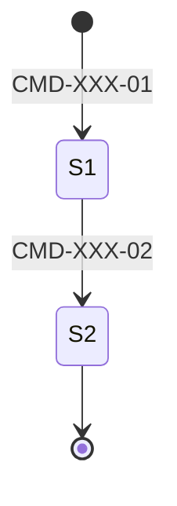

# Convention: Documentation Structure

> **Dành cho AI agents**: Đây là quy ước tổ chức tài liệu cho toàn bộ project.
> Trước khi tạo bất kỳ file doc nào, xác định đúng tier và đặt đúng chỗ.

---

## 3-Tier Structure

```
docs/
├── global/      # Kiến thức nền — đọc một lần, áp dụng mãi
├── service/     # Thiết kế cụ thể của từng component
└── feature/     # Flow xuyên service của từng tính năng
```

---

## Tier 1 — `global/`

**Scope:** Toàn hệ thống. Không phụ thuộc vào service hay feature cụ thể.

**Nguyên tắc:** Nếu một thông tin cần biết *trước khi* bắt đầu bất kỳ service nào → thuộc `global/`.

```
global/
├── 1.requirement/     # Yêu cầu nghiệp vụ, NFR, actors — thuần business, không kỹ thuật
├── 2.architecture/    # Living-reference: bounded context, service map, communication,
│                      #   event catalog, security model, deployment, tech stack
│                      # + adr/ — decision log (immutable)
├── 3.technical/       # Cross-cutting implementation cookbook — cách làm đúng 1 concern khó
└── 4.convention/      # Coding conventions, doc structure, DDD rules
```

**Vòng đời:** Ít thay đổi. Khi thay đổi, impact rộng → review cẩn thận.

### Phân biệt `architecture/` vs `technical/` vs `adr/`

Ba loại tài liệu này hay bị nhầm lẫn vì đều "nói về kỹ thuật". Phân biệt bằng **volatility** và **loại nội dung**, không phải bằng độ quan trọng:

| | `architecture/*.md` | `technical/*.md` | `adr/*.md` |
|---|---|---|---|
| Bản chất | Bảng tra cứu **hiện trạng** — "hệ thống đang như thế nào" | Cookbook — "làm sao implement đúng 1 concern khó, trải nhiều service" | Tường thuật **1 quyết định** — "tại sao chọn X thay vì Y, trade-off gì" |
| Sửa khi nào | Mỗi khi hiện trạng đổi (thêm service, thêm event, đổi topology) | Khi hiểu biết về cách làm tốt hơn / phát hiện edge-case mới | **Không bao giờ** — chỉ superseded bởi ADR mới |
| Tần suất đọc | Cao — tra lại ở hầu hết mọi session | Trung bình — chỉ đọc khi đụng đúng concern đó | Thấp — đọc 1 lần khi cần hiểu "vì sao lại thế này" |
| Test nhanh | "Đây có phải câu trả lời cho *what/where* không?" | "Đây có phải câu trả lời cho *how* không?" | "Đây có phải câu trả lời cho *why*, và có đảo ngược được không?" |

Hệ quả cụ thể:
- Không viết lại lý do lựa chọn (rationale) trong `architecture/*.md` — nếu cần giải thích "tại sao", đó là việc của 1 ADR, `architecture/*.md` chỉ trỏ tới ADR đó.
- Không nhét bảng tra cứu tĩnh vào `technical/*.md` — nếu 1 file trong `technical/` bắt đầu có bảng "hiện trạng toàn hệ thống", tách phần đó ra `architecture/`.
- Khi 1 file lẫn cả 3 loại nội dung (dấu hiệu: vừa có "Vấn đề cần giải quyết", vừa có "Quyết định: chọn A", vừa có "Bảng kết quả cuối"), tách thành 3: phần quyết định → ADR mới, phần bảng kết quả → `architecture/`, phần cách-làm chi tiết → `technical/`.

---

## Tier 2 — `service/`

**Scope:** Một component cụ thể (microservice hoặc shared library).

**Nguyên tắc:** Nếu tài liệu chỉ mô tả *một* service/lib → thuộc `service/`. Nếu cần nhắc đến 2+ service → thuộc `feature/`.

```
service/
├── libs/
│   ├── overview.md        # Index toàn bộ lib — 1 dòng/lib nếu lib nhỏ
│   └── {lib-name}.md      # Chỉ tạo khi API surface đủ lớn để inline vào overview làm mất thông tin
├── {service-name}/
│   ├── analysis.md         # Phân tích nghiệp vụ — nguồn gốc lý do (xem mục riêng dưới)
│   ├── service.md         # Thiết kế kỹ thuật — cách hiện thực analysis.md (nguồn cho data.md, api.yaml)
│   ├── data.md             # DB schema, index strategy — hệ quả của service.md (bỏ qua nếu là lib)
│   ├── api.yaml            # OpenAPI spec — hệ quả của service.md (bỏ qua nếu không expose HTTP)
│   └── {topic}.md          # File phụ (cache, flashsale...) — BẮT BUỘC được service.md trỏ tới
```

**Vòng đời:** Tạo khi bắt đầu design service. Cập nhật liên tục khi implement.

### Quan hệ `analysis.md` ↔ các file còn lại

`analysis.md` là tài liệu **tầng đầu, chỉ nói về nghiệp vụ** — không nhắc code, công nghệ, schema, API, hiện
trạng triển khai hay độ lệch với code. `service.md`/`data.md`/`api.yaml` là tài liệu **thiết kế/triển khai**,
tham chiếu ngược về `analysis.md` khi cần giải thích "vì sao lại thế này" — **không có chiều ngược lại**:
`analysis.md` không bao giờ trỏ sang `service.md`/`data.md`/`api.yaml`.

`analysis.md` phản ánh **trạng thái nghiệp vụ hiện tại kèm lý do**, không ghi lịch sử thay đổi (khác ADR — xem
bảng phân biệt ở Tier 1). Khi hiểu nghiệp vụ thay đổi, sửa thẳng vào đúng đoạn văn xuôi liên quan, không thêm
mục "trước đây làm gì". Khuôn mẫu đầy đủ và quy ước viết ở template dưới.

### Quan hệ `service.md` ↔ `data.md` / `api.yaml` / code

Chiều dẫn xuất một chiều: `analysis.md` → `service.md` → (`data.md`, `api.yaml`, code).

- `service.md` là **nguồn thiết kế kỹ thuật**. Viết/sửa nó từ `analysis.md`, **không** suy ra hay đối chiếu nội dung
  `data.md`/`api.yaml` — 2 file đó là hệ quả, `service.md` chỉ trỏ tới bằng link.
- Đổi thiết kế thì sửa `service.md` trước, rồi cập nhật `data.md`/`api.yaml`/code theo. Hai file đó lệch `service.md`
  là lỗi của 2 file đó, không phải lý do sửa `service.md`.
- `service.md` mô tả thiết kế **đích**. Mục "Lệch giữa thiết kế và code" chỉ điền khi **rà code thật** — không điền từ
  tài liệu khác (tài liệu cũ, `data.md`, `api.yaml` có thể đã lệch code); chưa rà thì ghi "Chưa rà code".

### Khi nào tách file phụ (`{topic}.md`) khỏi `service.md`

Chỉ tách khi cả 3 đúng:
1. Nội dung dài hơn ~1 trang nếu nhét vào `service.md` (sẽ làm loãng phần domain model chính)
2. Mang tính kiến trúc/thiết kế ổn định — **không phải** checklist việc cần làm (đó là `feature/implementation.md`)
3. Không fit vào 3 template có sẵn (`service.md` / `data.md` / `api.yaml`)

Nếu tách, **bắt buộc** thêm dòng trỏ tới trong mục "Tài liệu liên quan" của `service.md` — file phụ không được ai trỏ tới coi như không tồn tại.

### Khi nào tách file riêng cho 1 lib

Chỉ tách khi API surface của lib đủ lớn (auto-config phức tạp, nhiều class public). Lib nhỏ (VD chỉ export 1 exception type) chỉ cần 1 dòng trong `libs/overview.md`. Mọi file lib — dù tách riêng hay không — phải ghi rõ **scope KHÔNG được chứa gì** (business logic riêng của 1 domain lọt vào shared lib là lỗi kiến trúc phổ biến nhất của microservices).

---

## Tier 3 — `feature/`

**Scope:** Một tính năng end-to-end, span qua nhiều services (hoặc 1 capability hoàn chỉnh của người dùng dù chạm 1 service chính).

**Nguyên tắc:** Nếu cần sequence diagram có 2+ service tham gia → thuộc `feature/`. Service doc chỉ mô tả *phần tham gia* của service đó, link về feature doc để đọc flow đầy đủ.

```
feature/
└── {NN}-{feature-name}/
    ├── design.md          # Business flow, actors, business rules, sequence diagram NHÚNG trực tiếp
    └── implementation.md  # Master plan: phase table, checklist, verify criteria, Session Log
```

Tên folder có prefix `{NN}-` (2 chữ số, zero-padded — cùng style `adr/{NNN}-{slug}.md`) đánh số **theo thứ tự xây dựng thật**, không phải thứ tự ưu tiên nghiệp vụ — feature build trước có số nhỏ hơn. Dùng số tiếp theo còn trống; không renumber feature cũ khi thêm feature mới xen giữa.

**Không còn `sequence.puml` như 1 file riêng.** Sequence diagram nhúng thẳng vào `design.md` bằng fenced block:

````markdown

```plantuml
@startuml
...
@enduml
```
````

Đặt ngay tại section flow liên quan (VD dưới "Happy Path"), không phải 1 block duy nhất cuối bài nếu có nhiều nhánh (happy path + failure branch phức tạp) — mỗi nhánh đáng vẽ thì 1 block riêng, vẫn trong cùng `design.md`. Lý do gộp: giữ file `.puml` rời tạo 2 nguồn cho cùng 1 diagram nếu ai đó sửa 1 chỗ quên chỗ kia; JetBrains render được `plantuml` fenced-block trực tiếp trong Markdown preview nên không mất khả năng xem trực quan.

**Không còn thư mục `progress/phase-N-*.md`.** Checklist tick trực tiếp trong `implementation.md`; nhật ký session dồn vào 1 mục "Session Log" nén cuối file — xem chi tiết & tiêu chí phân tách phase tại `feature-implementation.md`.

**Vòng đời:** Tạo khi bắt đầu feature. `design.md` cập nhật nếu flow thay đổi. `implementation.md` tick dần khi implement xong, có thể xoá sau khi feature hoàn thành nếu Session Log không còn giá trị tra cứu (hiếm — thường giữ lại vì chi phí thấp).

---

## Phân loại nhanh

| Câu hỏi                                                                | Nếu "có" → tier              |
|------------------------------------------------------------------------|------------------------------|
| Cần biết trước khi code bất kỳ service nào?                            | `global/`                    |
| Chỉ mô tả 1 service/lib?                                               | `service/`                   |
| Mô tả flow có 2+ service tham gia, hoặc 1 capability hoàn chỉnh?       | `feature/`                   |
| Là bảng tra cứu hiện trạng, đọc lại thường xuyên?                      | `global/2.architecture/`     |
| Là cách implement đúng 1 concern khó, đọc khi đụng tới?                | `global/3.technical/`        |
| Là quyết định kiến trúc không thể đảo ngược / ảnh hưởng nhiều service? | `global/2.architecture/adr/` |

---

## Template: `service/{name}/analysis.md`

````markdown
# Phân tích nghiệp vụ — `<Tên Bounded Context>`

> **Trạng thái:** DRAFT / ỔN ĐỊNH · **Cập nhật:** `YYYY-MM-DD` · **Mã BC:** `<XXX>` (prefix cho ID)
>
> Tài liệu giữ nghiệp vụ **đã chốt kèm lý do**, phản ánh trạng thái hiện tại, không ghi lịch sử thay đổi.

<!--
QUY ƯỚC VIẾT (xoá khối này khi đã quen)

1. Đây là tài liệu tầng đầu: chỉ nói về nghiệp vụ. Không nhắc code, công nghệ, schema, API, service,
   hiện trạng triển khai hay độ lệch với code. Những thứ đó thuộc tài liệu thiết kế (service.md...),
   và tài liệu thiết kế tham chiếu ngược về đây — không có chiều ngược lại.
2. Lý luận trước, kết luận sau. Mỗi aggregate (§6.x), quy tắc xuyên aggregate (§7) và quy tắc tra cứu (§10)
   viết văn xuôi (vai trò, thành phần, vòng đời + lý do) trước, rồi mới tới bảng/khối "Kết luận" có cấu trúc.
   Văn xuôi của một quyết định phải nêu CÁC PHƯƠNG ÁN ĐÃ CÂN NHẮC và LÝ DO LOẠI, không chỉ phương án được chọn
   — thiếu phần này, người đọc sau không biết vì sao không làm cách "hiển nhiên hơn" và dễ quay lại chính nó.
3. Bảng/khối "Kết luận" chỉ TÓM TẮT văn xuôi ngay phía trên nó, không chứa quy tắc mới.
   Sửa lý luận thì sửa kết luận trong cùng lần sửa. Quy tắc không có trong văn xuôi là dấu hiệu thiếu lý do.
4. Bề rộng đủ ngay từ đầu: mọi aggregate (§6.0) và mọi sự kiện liên BC (§8.1) phải có mặt dù chưa phân tích sâu.
   Chiều sâu điền dần, đánh dấu độ chi tiết ở §6.0.
5. ID không tái sử dụng. Phần tử bị bỏ thì xoá khỏi tài liệu (không giữ lịch sử).
6. Không để section cụt kiểu "đã gộp vào §x" — xoá hẳn.
7. Ô "?" trong ma trận §6.x là câu hỏi chưa trả lời → phải có Q-ID tương ứng ở §13.
8. Mọi quy tắc (INV) phải ghi rõ Loại:
   - Liên tục: luôn phải đúng suốt vòng đời (vd tổ hợp phân loại của SKU không đổi).
   - Tiên quyết: chỉ kiểm tại đúng hành động được nêu, sau đó không cần giữ
     (vd giá trị chọn khi tạo SKU phải còn dùng được — giá trị bị tắt sau đó không làm SKU cũ sai).
   Nhầm loại sẽ khiến bên triển khai xử lý hệ quả không tồn tại, hoặc bỏ sót hệ quả có thật.
9. Hệ ID thống nhất cho MỌI BC: AGG / INV / CMD / EVT / POL / RM / Q. Không dùng hệ riêng (R1, Q1...).
   - Q-ID chỉ dành cho câu hỏi CHƯA chốt. Quyết định đã chốt là văn xuôi lý luận (quy ước 2) + kết luận
     (INV/RM...), không mang ID riêng. Quyết định mang tính kỹ thuật không thuộc file này (→ service.md / ADR).
   - POL chỉ dành cho "khi X thì RA LỆNH Y" (kích hoạt hành động đổi trạng thái nghiệp vụ).
     Duy trì dữ liệu hiển thị khi BC khác thay đổi KHÔNG phải POL — ghi ở RM (§10, cột Dữ liệu nguồn).
10. Quy tắc thuộc BC khác thì THAM CHIẾU ID của BC đó, không định nghĩa lại
    (vd điều kiện "hiển thị công khai" của sản phẩm do catalog định nghĩa).
11. Mục không áp dụng ghi "N/A — {lý do ngắn}", không xoá mục.
    BC kiểu read-model (tổng hợp dữ liệu của BC khác để tra cứu): §6–§7 thường N/A, trọng tâm ở §10.
    Quy tắc riêng của việc tra cứu (không thuộc aggregate nào) mang INV và nằm ở bảng "Quy tắc tra cứu" §10.
12. Dữ liệu nguồn của RM trỏ về SỰ KIỆN NGHIỆP VỤ của BC nguồn (EVT-...), không trỏ về event kỹ thuật
    (snapshot, CDC, integration event) — cách gom/vận chuyển dữ liệu thuộc service.md của các bên.

13. Kỳ vọng phi chức năng (§12): PHÂN TÍCH TRƯỚC, KẾT LUẬN SAU. Đi từ dữ kiện của yêu cầu gốc → phép suy → con số; không
    chọn con số trước rồi viết lời giải thích theo sau. Con số do yêu cầu gốc cho sẵn thì nói rõ là cho sẵn. Con số ta
    tự chọn phải nêu TIÊU CHÍ (hậu quả nghiệp vụ nào ta chịu được) rồi tính ngược ra mức, kèm mức khác đã cân nhắc.
    Dữ kiện yêu cầu gốc không có thì ghi rõ là GIẢ ĐỊNH và tạo Q-ID để xác nhận.
-->

> **Loại BC:** Domain (có aggregate, có vòng đời) / Read-model (tổng hợp dữ liệu BC khác để tra cứu)

---

## 1. Nhiệm vụ

`<BC>` là **nguồn sự thật duy nhất** về `<...>`:

- `<khái niệm / thông tin sở hữu>`

Các BC khác nhận biết `<khái niệm>` qua định danh do BC này cấp.

## 2. Tại sao cần tách riêng

| Nhu cầu | Nếu không tách              |
|---------|-----------------------------|
| `<...>` | `<hệ quả nghiệp vụ cụ thể>` |

## 3. Không làm gì

- **Không** `<...>` → `<BC chịu trách nhiệm>`.

## 4. Actor và chức năng lõi

| Actor     | Chức năng |
|-----------|-----------|
| `<Actor>` | `<...>`   |

## 5. Ngôn ngữ chung

> Một khái niệm = một dòng. Chọn một thuật ngữ chính và dùng thống nhất trong toàn tài liệu.

| Thuật ngữ chính | Cách gọi khác (ngành / thường gặp) | Định nghĩa | Nghĩa ở BC khác (nếu khác) |
|-----------------|------------------------------------|------------|----------------------------|
| `<Sản phẩm>`    | `<SPU>`                            | `<...>`    | `<Giỏ hàng: ...>`          |

---

## 6. Mô hình domain

### 6.0 Suy ra thực thể

> Văn xuôi: đi từ nhu cầu nghiệp vụ → vì sao cần từng khái niệm → vì sao ranh giới nằm ở đây
> (vì sao cái này là thực thể riêng, cái kia nằm bên trong ranh giới của cái khác).

`<...>`

**Bản đồ aggregate** (bắt buộc đầy đủ)

| ID           | Aggregate | Chứa bên trong     | Vai trò (bảo vệ tính nhất quán của gì) | Phụ thuộc   | Độ chi tiết          |
|--------------|-----------|--------------------|----------------------------------------|-------------|----------------------|
| `AGG-XXX-01` | `<Tên>`   | `<thành phần con>` | `<...>`                                | `<AGG-...>` | TBD / PARTIAL / DONE |

> Nếu hai khái niệm có thể là một aggregate hoặc hai, ghi rõ lựa chọn và lý do ở văn xuôi phía trên —
> lựa chọn này quyết định quy tắc nào là nội bộ, quy tắc nào là xuyên aggregate (§7).

Thứ tự phân tích bên dưới theo thứ tự phụ thuộc: không phụ thuộc gì trước.

---

### 6.1 `<Tên aggregate>` — `AGG-XXX-01`

**Vai trò & ranh giới**

`<Trả lời câu hỏi gì. Không làm gì. Vì sao không gộp/không tách với khái niệm lân cận.>`

**Thành phần**

- `<Thành phần>` — `<ý nghĩa; bất biến hay sửa được, và vì sao>`

**Vòng đời & hành vi**

`<Các trạng thái, hành vi được phép/không được phép, và LÝ DO cho từng quy tắc.>`

#### Kết luận

**Quy tắc bất biến**

| ID           | Quy tắc | Loại       | Kiểm tra khi                     |
|--------------|---------|------------|----------------------------------|
| `INV-XXX-01` | `<...>` | Liên tục   | `<mọi hành động làm thay đổi X>` |
| `INV-XXX-02` | `<...>` | Tiên quyết | `<CMD-...>`                      |

**Trạng thái & chuyển đổi**

> Nếu aggregate có nhiều trục trạng thái độc lập, mỗi trục một bảng + ghi rõ định nghĩa kết hợp
> (vd "hiển thị công khai = trục A ở X VÀ trục B ở Y").


```mermaid
stateDiagram-v2
    [*] --> S1: CMD-XXX-01
    S1 --> S2: CMD-XXX-02
    S2 --> [*]
```

| Từ    | Hành động    | Actor     | Điều kiện    | Sang | Sự kiện      |
|-------|--------------|-----------|--------------|------|--------------|
| `[*]` | `CMD-XXX-01` | `<Actor>` | `INV-XXX-01` | `S1` | `EVT-XXX-01` |

**Ma trận hành động × trạng thái**

> Buộc trả lời mọi ô. ✓ = cho phép · ✗ = cấm · ? = chưa quyết (phải có Q-ID ở §13).
> Với nhiều trục: cột là tổ hợp trạng thái.

| Hành động \ Trạng thái | `S1` | `S2` | `S3` |
|------------------------|------|------|------|
| `CMD-XXX-01`           | ✓   | ✗   | ?    |

**Sự kiện phát sinh**

| ID           | Sự kiện | Phát sinh khi              | Phạm vi          |
|--------------|---------|----------------------------|------------------|
| `EVT-XXX-01` | `<Tên>` | `<chuyển đổi / hành động>` | Nội bộ / Liên BC |

---

### 6.2 `<Tên aggregate>` — `AGG-XXX-02`

> Lặp lại cấu trúc 6.1.

---

## 7. Quy tắc xuyên aggregate

> Quy tắc liên quan nhiều aggregate (không một aggregate nào tự đảm bảo được). Văn xuôi lý do trước, bảng sau.

`<...>`

> Cột "Độ cũ dữ liệu chấp nhận được" mang nghĩa theo Loại:
> - Liên tục: quy tắc được phép sai tạm thời bao lâu trước khi phải đúng trở lại.
> - Tiên quyết: lúc kiểm, dữ liệu đọc từ aggregate kia được phép cũ đến đâu (vd đúng lúc đó bên kia vừa đổi).

| ID           | Quy tắc | Loại       | Aggregate liên quan | Kiểm tra khi | Độ cũ dữ liệu chấp nhận được  | Nếu bị vi phạm thì                    |
|--------------|---------|------------|---------------------|--------------|-------------------------------|---------------------------------------|
| `INV-XXX-91` | `<...>` | Liên tục   | `AGG-..., AGG-...`  | `<...>`      | `<không / tối đa ...>`        | `<hệ quả nghiệp vụ, cách xử lý>`      |
| `INV-XXX-92` | `<...>` | Tiên quyết | `AGG-..., AGG-...`  | `<CMD-...>`  | `<chấp nhận / không, vì ...>` | `<trạng thái sau đó có hợp lệ không>` |

---

## 8. Sự kiện nghiệp vụ

### 8.1 Phát ra cho BC khác (hợp đồng)

> Tổng hợp từ các khối Kết luận. Sự kiện liên BC phải liệt kê sớm dù aggregate chưa chi tiết.

| ID           | Sự kiện | Aggregate    | Ý nghĩa nghiệp vụ | BC quan tâm |
|--------------|---------|--------------|-------------------|-------------|
| `EVT-XXX-01` | `<Tên>` | `AGG-XXX-01` | `<...>`           | `<BC>`      |

### 8.2 Nhận từ BC khác

| Sự kiện        | Từ BC  | Dẫn đến            |
|----------------|--------|--------------------|
| `<EVT-YYY-..>` | `<BC>` | `<CMD / POL / RM>` |

> `RM` = sự kiện chỉ làm dữ liệu hiển thị của BC này thay đổi, không ra lệnh gì (quy ước 9).
> Không nhận gì → ghi "Không — upstream thuần".

## 9. Policy

> "Khi [sự kiện / mốc thời gian] thì [hành động]". Gồm cả policy theo thời gian.

| ID           | Khi     | Điều kiện | Thì         |
|--------------|---------|-----------|-------------|
| `POL-XXX-01` | `<...>` | `<...>`   | `<CMD-...>` |

## 10. Hiển thị & tra cứu

> Với BC read-model, đây là mục trọng tâm: mỗi truy vấn tìm kiếm / duyệt / tra cứu là một RM.
> Quy tắc riêng của việc tra cứu (lọc, xếp hạng, xử lý dữ liệu nguồn đến trễ) theo đúng quy ước 2–3:
> văn xuôi lý do (kèm phương án bị loại) trước, bảng "Quy tắc tra cứu" chỉ tóm tắt.

`<...>`

| ID          | Ai        | Xem gì  | Điều kiện được xem                                              | Dữ liệu nguồn (BC / sự kiện nghiệp vụ) | Độ tươi chấp nhận được                  |
|-------------|-----------|---------|-----------------------------------------------------------------|----------------------------------------|-----------------------------------------|
| `RM-XXX-01` | `<Actor>` | `<...>` | `<định nghĩa duy nhất — tham chiếu §6.x hoặc ID của BC sở hữu>` | `<BC này / catalog: EVT-CAT-..>`       | `<ngay lập tức / vài giây / cuối ngày>` |

**Quy tắc tra cứu** _(chỉ khi có quy tắc không thuộc aggregate nào — thường gặp ở BC read-model; không có → N/A)_

| ID           | Quy tắc | Loại     | Áp dụng cho            |
|--------------|---------|----------|------------------------|
| `INV-XXX-nn` | `<...>` | Liên tục | `RM-XXX-01, RM-XXX-02` |

## 11. Quan hệ với BC khác

| BC     | Chiều                 | Kiểu quan hệ                                    | BC này cung cấp / nhận gì   |
|--------|-----------------------|-------------------------------------------------|-----------------------------|
| `<BC>` | Upstream / Downstream | `OHS-PL / ACL / Conformist / Customer-Supplier` | `<EVT-... / thông tin ...>` |

## 12. Kỳ vọng phi chức năng từ nghiệp vụ

> Chỉ ghi kỳ vọng và lý do nghiệp vụ, không ghi cách đáp ứng. **Phân tích trước, kết luận sau** (quy ước 13): §12.1 dữ
> kiện, §12.2 phân tích, §12.3 kết luận.

### 12.1 Dữ kiện từ yêu cầu gốc

| Dữ kiện | Giá trị | Nguồn |
|---------|---------|-------|
| `<...>` | `<con số nguyên văn>` | `<requirement.md §>` |

### 12.2 Phân tích

> Mỗi chủ đề một đoạn văn xuôi, theo mạch: **câu hỏi** (người dùng chịu được gì?) → **dữ kiện** dùng → **phép suy** (kèm
> tiêu chí nếu con số do ta chọn) → **phương án/mức đã cân nhắc** và vì sao loại → **kết quả**. Con số do yêu cầu gốc
cho
> sẵn thì nói rõ "cho sẵn" và phân tích hệ quả của nó, không giả vờ là ta suy ra.

`<...>`

### 12.3 Kết luận

> Chỉ tóm tắt §12.2, không chứa con số mới.

| Chức năng | Kỳ vọng                            | Lý do nghiệp vụ | Nguồn / phân tích              |
|-----------|------------------------------------|-----------------|--------------------------------|
| `<...>`   | `<độ trễ / quy mô / tải cao điểm>` | `<...>`         | `<requirement.md § / §12.2x>`  |

## 13. Chưa chốt

| ID         | Câu hỏi | Ảnh hưởng       | Chặn gì            | Dự kiến giải quyết khi |
|------------|---------|-----------------|--------------------|------------------------|
| `Q-XXX-01` | `<...>` | `§6.x, INV-...` | `<UC / tính năng>` | `<...>`                |

---

## Quy ước ID

| Prefix       | Ý nghĩa                                                            |
|--------------|--------------------------------------------------------------------|
| `AGG-XXX-nn` | Aggregate                                                          |
| `INV-XXX-nn` | Quy tắc bất biến (`9x` cho xuyên aggregate; quy tắc tra cứu ở §10) |
| `CMD-XXX-nn` | Hành động                                                          |
| `EVT-XXX-nn` | Sự kiện                                                            |
| `POL-XXX-nn` | Policy                                                             |
| `RM-XXX-nn`  | Hiển thị / tra cứu                                                 |
| `Q-XXX-nn`   | Câu hỏi chưa chốt                                                  |

## Nguồn tham chiếu

- `<Nền tảng>` — [`<tiêu đề>`](`<url>`) — `<rút ra điều gì>`

## Tài liệu liên quan

- [`global/1.requirement/requirement.md`](../1.requirement/old/requirement.md) — yêu cầu gốc
- [`global/2.architecture/2. bounded-context-map.md`](<../2.architecture/2.%20bounded-context-map.md>) — bản đồ các BC
- `<../other-bc/analysis.md>` — `<quan hệ>`
````

---

## Template: `service/{name}/service.md`

````markdown
# {Service Name}

> **Trạng thái:** DRAFT / ỔN ĐỊNH · **Cập nhật:** `YYYY-MM-DD`
>
> Tầng kỹ thuật: **cách hiện thực** nghiệp vụ ở [`analysis.md`](./analysis.md), cùng giải pháp cho NFR và các vấn đề
> tích hợp (idempotency, concurrency, độ tin cậy). Không định nghĩa lại nghiệp vụ.

<!--
QUY ƯỚC VIẾT (xoá khối này khi đã quen)

1. Tham chiếu một chiều: service.md → analysis.md (qua ID AGG/INV/CMD/EVT/POL/RM). Analysis không nhắc file này.

2. Không viết lại nghiệp vụ. Đang giải thích "vì sao được/không được làm X" → thuộc analysis.md.
   Ở đây chỉ trả lời: làm bằng gì, đặt ở đâu, xử lý sự cố thế nào. Lý do ở đây là lý do kỹ thuật.

3. Độ phủ (analysis → service): mọi phần tử analysis phải có chỗ hiện thực:
   - INV → §3 · CMD → §4 · RM → §5 (+ §8 nếu là projection) · EVT liên BC → §7.1
   - POL → §7.2 (hiện thực bằng consumer) HOẶC §11 (hiện thực bằng job)
   Không có dòng = chưa hiện thực → ghi §16.

4. Truy vết ngược (service → analysis): mọi giải pháp kỹ thuật có cột "Phục vụ". Được trỏ về:
   - phần tử analysis (INV / POL / RM / mục NFR), hoặc
   - một cơ chế khác trong file này (C-, J-, T-, dòng §7.2...) — vd job dọn bảng dedup phục vụ idempotency consumer.
   Chuỗi tham chiếu cuối cùng phải dẫn về analysis. Không dẫn về được → giải pháp thừa,
   hoặc analysis đang thiếu quy tắc — quay lại analysis trước.

5. Mô tả thiết kế ĐÍCH. Code chưa khớp → §16, không sửa thiết kế cho khớp code.
   §16 chỉ điền khi rà code thật; chưa rà thì ghi "Chưa rà code".
   data.md / api.yaml là hệ quả của file này: chỉ link tới, không suy thiết kế từ nội dung của chúng.

6. Mục không áp dụng ghi "N/A — {lý do ngắn}", không xoá mục (vd read-model service: §3, §4 thường N/A).
   Mục đánh dấu (tuỳ chọn) chỉ viết khi service có nhu cầu đó.

7. Chủ đề kỹ thuật dài (cache, flash sale, search sync...) → tách file phụ, ở đây chỉ tóm tắt + link.

8. Quyết định kỹ thuật: trong phạm vi service → T-ID ở §14 (kèm phương án bị loại).
   Ảnh hưởng nhiều service → ADR, §14 chỉ link.

9. Cột Test (§3, §7.2, §11): `—` = CHƯA có test (việc còn nợ). Không cần test thì ghi "Không cần — {lý do}".

10. Nợ kỹ thuật (§18) khác §15 và §16: §15 = câu hỏi CHƯA quyết; §16 = code lệch thiết kế (sửa code cho khớp);
    §18 = việc đã BIẾT và đã QUYẾT hoãn có chủ đích (thiết kế đã đúng, chỉ chưa làm) — luôn kèm lý do hoãn và điều kiện
    phải trả. Không dùng §18 để giấu lỗi đang khai thác được: lỗi bảo mật/toàn vẹn ghi §16 và sửa sớm.
-->

---

## 1. Tổng quan kỹ thuật

_{1–2 câu trách nhiệm. Nghiệp vụ đầy đủ: [`analysis.md`](./analysis.md) §1–§3.}_

- **Loại service:** _{domain (có aggregate) / read-model / gateway / ...}_
- **Stack:** _{Java 21, Spring Boot, PostgreSQL, Redis, Kafka...}_
- **Kiến trúc trong service:** _{hexagonal / vertical slice}_ · **Module:** _{cấu trúc package chính}_

---

## 2. Ánh xạ domain → code

### 2.1 Aggregate

| Aggregate (analysis) | Root | Entity / VO bên trong | Package | Ghi chú |
|---|---|---|---|---|
| `AGG-XXX-01` {Tên nghiệp vụ} | `{Class}` | `{...}` | `{...}` | _{nếu ranh giới trong code khác analysis: lý do kỹ thuật}_ |

### 2.2 Thuật ngữ khác tên

> Chỉ ghi thuật ngữ mà tên trong code KHÁC tên nghiệp vụ (analysis §5). Trùng tên thì không cần dòng.

| Thuật ngữ (analysis) | Tên trong code |
|---|---|
| {Thuật ngữ} | `{Class / field / enum}` |

### 2.3 Trạng thái

| Trục trạng thái (analysis) | Biểu diễn | Giá trị |
|---|---|---|
| {Tên trục} | `{enum / cờ}` | `{...}` |
| {Điều kiện kết hợp, vd hiển thị công khai} | `{hàm/predicate dùng chung duy nhất}` | `{biểu thức}` |

---

## 3. Đảm bảo quy tắc

> - **Liên tục**: chặn ở mọi đường có thể làm sai — trong aggregate + ràng buộc DB nếu cần.
> - **Tiên quyết**: kiểm trong use case của hành động đó, tại thời điểm chạy.
> - Gồm cả quy tắc tra cứu (analysis §10) — thường hiện thực ở tầng query / projection.

| INV | Loại | Tầng (domain / application / DB / query) | Cơ chế | Test |
|---|---|---|---|---|
| `INV-XXX-01` | Liên tục | Domain + DB | _{không có setter + unique index}_ | `{TestClass#method}` |
| `INV-XXX-02` | Tiên quyết | Application | _{đọc trạng thái X trong cùng transaction}_ | — |

---

## 4. Commands

| CMD (analysis) | Handler | API | Quyền | Transaction / khoá | Idempotency | Publishes |
|---|---|---|---|---|---|---|
| `CMD-XXX-01` | `{HandlerClass}` | `{METHOD /path}` | `{role / ownership}` | _{1 tx, optimistic — xem C-01}_ | _{tự nhiên / Idempotency-Key / không cần}_ | `{EventName}` |

---

## 5. Queries

| RM (analysis) | Handler | API | Quyền | Nguồn đọc | Điều kiện hiển thị | Phục vụ NFR |
|---|---|---|---|---|---|---|
| `RM-XXX-01` | `{HandlerClass}` | `{GET /path}` | `{public / role}` | _{DB / replica / cache — xem §12.1 / projection §8}_ | _{predicate §2.3}_ | _{mục NFR analysis}_ |

---

## 6. Use cases — tham gia

> Nơi DUY NHẤT mô tả vai trò của service trong saga / luồng xuyên service.

| Feature | Vai trò | Bước của service này | Bước bù trừ | Publishes |
|---|---|---|---|---|
| [{feature-name}](../../feature/{feature-name}/design.md) | _{coordinator / participant / consumer}_ | _{command / event xử lý}_ | _{hành động bù trừ, hoặc "không có — vì..."}_ | _{events}_ |

---

## 7. Integration contract

### 7.1 Publishes

| EVT (analysis) | Event | Topic | Loại (domain / integration) | Partition key | Schema | Cơ chế phát |
|---|---|---|---|---|---|---|
| `EVT-XXX-01` | `{EventName}` | `{topic.name}` | _{domain}_ | `{aggregateId}` | `{Avro subject}` | _{outbox + CDC / outbox poller}_ |

> Integration event (vd snapshot cho read-model) không có EVT trong analysis → cột EVT ghi các EVT mà nó gom lại.

- **Thứ tự:** _{đảm bảo theo aggregate nhờ partition key; không đảm bảo giữa các aggregate}_
- **Tiến hoá schema:** _{mức compatibility trên Schema Registry}_

### 7.2 Consumes

> Chỉ vấn đề giao nhận. Ánh xạ dữ liệu của read-model → §8.
> Consumer của projection: cột Idempotency và Sai thứ tự ghi "xem §8.1" — §8.1 là nguồn duy nhất.

| Topic | Event | Handler | Consumer group | Hiện thực | Idempotency (dedup theo) | Sai thứ tự | Retry / DLQ | Test |
|---|---|---|---|---|---|---|---|---|
| `{topic.name}` | `{EventName}` | `{HandlerClass}` | `{group}` | _{POL-XXX-01 / projection §8}_ | `{eventId / aggregateId+version}` | _{bỏ event có version cũ hơn}_ | _{số lần, backoff, DLQ topic}_ | — |

> Không consume → "N/A — upstream thuần".

### 7.3 Sync calls

| Chiều | Đối tác | Giao thức | Endpoint | Timeout | Retry | Khi đối tác lỗi |
|---|---|---|---|---|---|---|
| Outbound | `{service}` | REST / gRPC | `{path / method}` | `{ms}` | _{chỉ với lệnh idempotent}_ | _{circuit breaker → fallback / báo lỗi}_ |
| Inbound | `{service}` | REST | `{path}` | | | |

---

## 8. Projection *(tuỳ chọn — service có read model)*

### 8.1 Ánh xạ event → dữ liệu

| Event nguồn | Từ BC | Ghi vào | Field / thao tác | Guard (idempotency + sai thứ tự) | Phục vụ |
|---|---|---|---|---|---|
| `{EventName}` | `{BC}` | `{index / bảng}` | _{upsert field a, b / xoá document}_ | _{chỉ ghi nếu version mới hơn}_ | `RM-...` |

### 8.2 Rebuild

- **Khi nào cần:** _{đổi mapping, hỏng dữ liệu, thêm field}_
- **Cách:** _{phát lại snapshot từ nguồn / đọc lại topic từ offset đầu / alias swap}_
- **Thời gian ước tính & ảnh hưởng khi rebuild:** _{...}_

---

## 9. Concurrency

> Chỉ điểm có tranh chấp thật. §4 trỏ về đây bằng C-ID.

| ID | Điểm tranh chấp | Ai tranh chấp | Cơ chế | Thứ tự khoá | Khi xung đột | Phục vụ |
|---|---|---|---|---|---|---|
| `C-01` | _{cập nhật cùng aggregate}_ | _{2 request song song}_ | _{optimistic `@Version`}_ | — | _{409, client tải lại}_ | `INV-...` |
| `C-02` | _{trừ nhiều dòng cùng lúc}_ | | _{SELECT FOR UPDATE}_ | _{theo id tăng dần — chống deadlock}_ | | `INV-...` |
| `C-03` | _{quy tắc xuyên aggregate}_ | | _{không khoá — nghiệp vụ chấp nhận}_ | — | | `INV-XXX-9x` |

---

## 10. Độ tin cậy

> Cơ chế chung. Saga → §6, job → §11, rebuild read model → §8.2.

| Hạng mục | Thiết kế | Phục vụ |
|---|---|---|
| Ghi DB + phát event nguyên tử | _{transactional outbox}_ | _{§7.1}_ |
| Consumer lỗi lặp lại | _{DLQ + alert}_ | _{§7.2}_ |
| Resilience | _{timeout / retry / circuit breaker}_ | _{§7.3}_ |

---

## 11. Job định kỳ

| ID | Job | Trigger (task type scheduler) | Tần suất | Phục vụ | Idempotent (cách) | Khi chạy lỗi | Test |
|---|---|---|---|---|---|---|---|
| `J-01` | _{huỷ đơn quá hạn thanh toán}_ | `{TASK_TYPE}` | _{mỗi phút}_ | `POL-...` | _{chỉ đổi đơn còn PENDING}_ | _{lần sau quét lại; alert nếu lỗi N lần}_ | — |
| `J-02` | _{đối soát Redis ↔ DB}_ | | | `INV-...` | | | |
| `J-03` | _{dọn bảng dedup cũ}_ | | | _{idempotency §7.2}_ | | | |

---

## 12. NFR → giải pháp

> Kỳ vọng lấy từ mục NFR của analysis.

| Kỳ vọng (analysis) | Giải pháp | Chi tiết | Kiểm chứng |
|---|---|---|---|
| _{trang chi tiết < 100ms}_ | _{cache L1 + L2}_ | [`cache.md`](cache.md) | _{load test, P99, kịch bản}_ |
| _{tải đỉnh}_ | _{...}_ | | |
| _{quy mô dữ liệu}_ | _{index / partition}_ | [`data.md`](data.md) | |

### 12.1 Cache (tóm tắt)

| Cache gì | Tầng | Key | TTL | Invalidate khi | Phục vụ |
|---|---|---|---|---|---|
| _{trang chi tiết}_ | _{L1 + L2}_ | `{pattern}` | `{...}` | _{event nào / pub-sub evict L1}_ | _{NFR / RM-...}_ |

### 12.2 Observability

_{metric chính (latency, cache hit ratio, outbox lag, consumer lag, job fail), span quan trọng, alert}_

---

## 13. Quyền & danh tính

| Hạng mục | Thiết kế | Phụ thuộc |
|---|---|---|
| Danh tính caller | _{claim nào trong JWT}_ | _{oauth2-service}_ |
| Quyền sở hữu | _{kiểm ở đâu}_ | |
| Role | _{kiểm ở gateway / service}_ | |

---

## 14. Quyết định kỹ thuật

| ID | Câu hỏi | Chọn | Phương án bị loại (vì sao) | Phục vụ |
|---|---|---|---|---|
| `T-01` | _{...}_ | _{...}_ | _{A — vì...; B — vì...}_ | _{INV / NFR / C-..}_ |
| — | _{quyết định liên service}_ | → [`ADR-xxx`](../../adr/ADR-xxx.md) | | |

---

## 15. Chưa chốt (kỹ thuật)

| ID | Câu hỏi | Ảnh hưởng | Phụ thuộc |
|---|---|---|---|
| `TQ-01` | _{...}_ | `§...` | _{service / feature}_ |

---

## 16. Lệch giữa thiết kế và code

> Gồm cả phần tử analysis chưa có chỗ hiện thực (quy ước 3). Chỉ điền khi rà code thật (quy ước 5).

| # | Thiết kế quy định | Code hiện tại | Hệ quả | Trạng thái |
|---|---|---|---|---|
| L1 | `{§ / INV / POL}` | _{...}_ | _{...}_ | Mở / Đã sửa |

---

## 17. Dependencies

- **Services:** _{cần chạy cùng khi dev / test}_
- **Infrastructure:** _{DB, cache, broker, topic phải tồn tại, schema registry...}_

---

## 18. Nợ kỹ thuật

> Việc đã biết, đã quyết hoãn có chủ đích (quy ước 10). Trả xong thì xoá dòng — không giữ lịch sử.

| ID | Hạng mục | Hiện trạng | Hệ quả nếu chưa trả | Vì sao hoãn | Trả khi nào | Liên quan |
|---|---|---|---|---|---|---|
| `TD-01` | _{...}_ | _{...}_ | _{...}_ | _{...}_ | _{điều kiện/mốc cụ thể}_ | _{§ / INV / TQ}_ |

## Tài liệu liên quan

- [`analysis.md`](analysis.md) — nghiệp vụ (nguồn sự thật cho quy tắc)
- [`data.md`](data.md) — schema
- [`api.yaml`](api.yaml) — hợp đồng API
- _{file phụ, vd [`cache.md`](cache.md)}_
- _{ADR liên quan}_
````

---

## Template: `service/{name}/data.md`

```markdown
# Data Schema — {Service Name}

## Database

**Engine:** _{PostgreSQL / MongoDB / Redis — ghi rõ lý do nếu không phải mặc định}_

## Tables / Collections

### `{table_name}`

| Column | Type | Nullable | Notes |
|---|---|---|---|
| `id` | `uuid` | NO | PK |
| `{field}` | `{type}` | _{YES/NO}_ | _{Notes trả lời TẠI SAO, không lặp lại kiểu dữ liệu — kiểu dữ liệu đã tự rõ}_ |
| `created_at` | `timestamp` | NO | |

**Indexes:**
- `{index_name}` on `({columns})` — _{lý do}_

### `outbox_events` _(nếu service dùng Outbox pattern)_

| Column | Type | Notes |
|---|---|---|
| `id` | `uuid` | PK |
| `aggregate_type` | `varchar` | |
| `aggregate_id` | `uuid` | |
| `event_type` | `varchar` | |
| `payload` | `jsonb` | |
| `created_at` | `timestamp` | |
| `published_at` | `timestamp` | NULL = chưa publish |
```

---

## Template: `feature/{name}/design.md`

```markdown
# Feature: {Feature Name}

## Mục tiêu

_{1-2 câu: tính năng này giải quyết vấn đề gì cho ai.}_

## Actors

| Actor | Role |
|---|---|
| `{Actor}` | _{Làm gì trong flow này}_ |

## Services tham gia

| Service | Role |
|---|---|
| `{service-name}` | _{coordinator / participant / consumer}_ |

## Happy Path

```
1. {Actor} → {action}
2. {service-name} → {xử lý gì} → publish {EventName}
3. {service-name} → nhận {EventName} → {xử lý gì} → publish {EventName}
...
```

​```plantuml
@startuml
' sequence diagram cho happy path — nhúng trực tiếp, không tách file .puml
@enduml
​```

## Failure Scenarios

| Điểm thất bại | Compensating action | Kết quả cuối |
|---|---|---|
| _{service fail ở bước N}_ | _{ai compensate}_ | _{state cuối cùng}_ |

_{Nếu 1 failure branch đủ phức tạp để đáng vẽ riêng, thêm 1 block ```plantuml``` nữa ngay dưới bảng — không dồn hết vào 1 diagram duy nhất.}_

## Business Rules

- _{Rule cần enforce trong flow này}_

## NFR Assessment

_{Bắt buộc — đối chiếu với target trong `global/1.requirement/requirement.md`/NFR memory (latency SLA, RPS baseline) áp dụng riêng cho feature này, không lặp lại số liệu toàn hệ thống nếu không liên quan trực tiếp. Không viết chung chung "cần đảm bảo hiệu năng tốt" — mỗi dòng phải trỏ tới 1 endpoint/cơ chế cụ thể trong chính flow vừa mô tả ở trên, và nói rõ đã xác nhận trên code hay chỉ là rủi ro thiết kế chưa verify.}_

| Rủi ro | Vì sao | Đề xuất |
|---|---|---|
| _{Endpoint/cơ chế nào trong flow trên}_ | _{Lý do — state-changing? I/O bên thứ 3? thiếu rate-limit/idempotency? Đã xác nhận trên code hay chỉ nghi ngờ?}_ | _{Cách xử lý cụ thể, hoặc "chấp nhận được, chỉ note lại" nếu đúng là không đáng sửa}_ |

_{Nếu rà soát không phát hiện gap nào ở 1 phần cụ thể của flow, ghi rõ 1 dòng xác nhận thay vì bỏ trống — phân biệt "đã kiểm tra, ổn" với "chưa kiểm tra".}_
```

---

## Template: `feature/{name}/implementation.md`

```markdown
# Implementation Plan: {Feature Name}

**Design**: [`design.md`](design.md)

---

## Docs cần tạo / cập nhật

| Tài liệu | Hành động | Nội dung |
|---|---|---|
| `service/{name}/service.md` | Tạo mới / Cập nhật | _{commands, events mới}_ |
| `service/{name}/data.md` | Tạo mới / Cập nhật | _{tables mới}_ |
| `service/{name}/api.yaml` | Tạo mới / Cập nhật | _{endpoints mới}_ |
| `global/2.architecture/event-catalog.md` | Cập nhật | _{events của feature này}_ |

---

## Phase N — {Tên phase}

**Status:** `TODO` | `IN_PROGRESS` | `DONE` | `BLOCKED`

- [ ] _{Task}_

**Verify:** _{Assertion cụ thể — SQL trả về gì, HTTP status + payload gì, message xuất hiện ở topic nào}_

---

## Checklist hoàn thành

- [ ] Happy path chạy end-to-end
- [ ] Failure scenarios đã test
- [ ] Outbox hoạt động — không mất event khi restart
- [ ] Idempotency — duplicate event không tạo duplicate state
- [ ] Tất cả service docs cập nhật đúng thực tế
- [ ] Event catalog cập nhật payload cuối cùng

---

## Session Log

_{Chỉ ghi khi có blocker/deviation thật so với plan — KHÔNG ghi routine progress ("done phase X"). Tick checkbox ở trên đã đủ để biết cái gì xong. Format: `- YYYY-MM-DD: {1-2 dòng}`.}_
```
