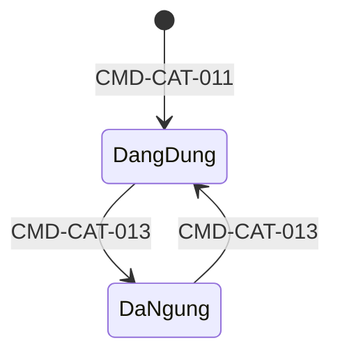
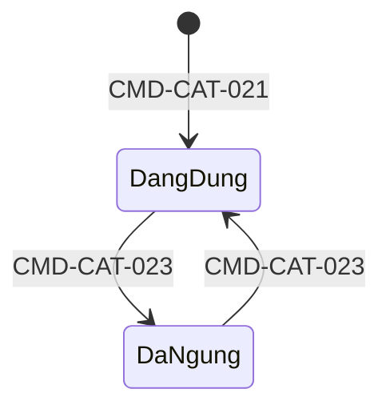
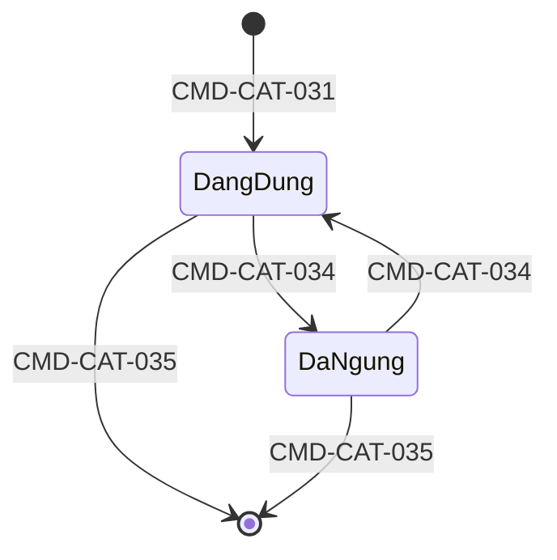
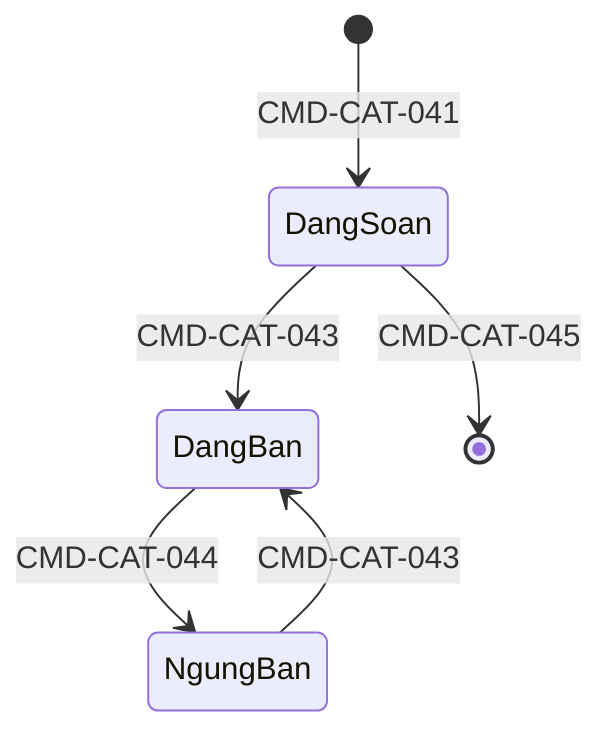
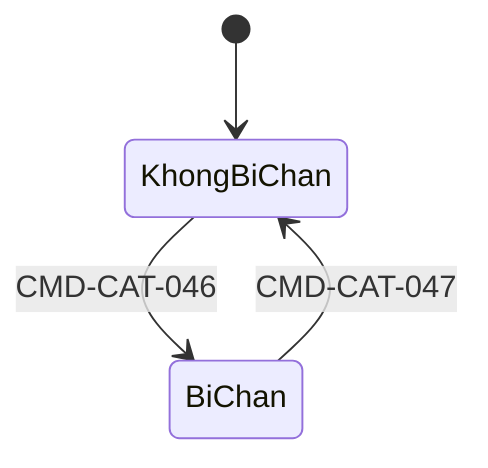
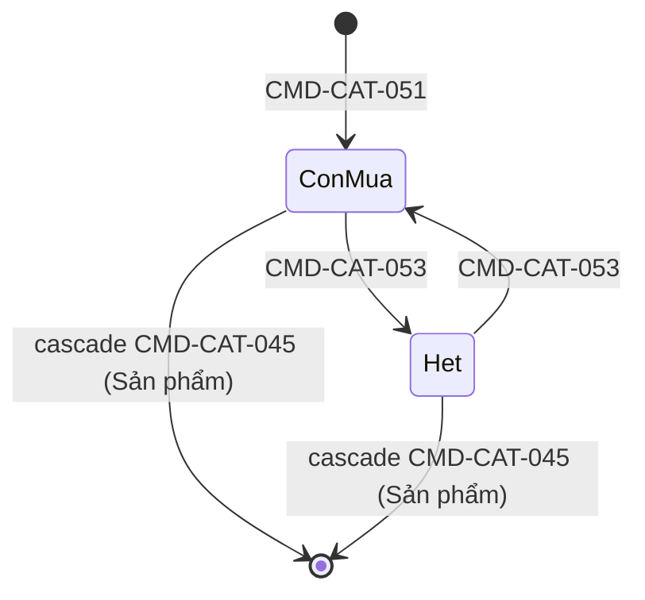

# Phân tích nghiệp vụ — catalog-service

> **Trạng thái:** ỔN ĐỊNH · **Cập nhật:** 2026-09-28 · **Mã BC:** `CAT` (prefix cho ID)
>
> Tài liệu giữ nghiệp vụ **đã chốt kèm lý do**, phản ánh trạng thái hiện tại, không ghi lịch sử thay đổi.
> Đây là tài liệu tầng đầu: chỉ nói về nghiệp vụ, không nhắc code/công nghệ/schema/API — những thứ đó thuộc
> `service.md`/`data.md`/`api.yaml`, và các file đó tham chiếu ngược về đây khi cần giải thích "vì sao".

---

## 1. Nhiệm vụ

`catalog-service` là **nguồn sự thật duy nhất** về "sản phẩm là gì":
- Sản phẩm (mô tả chung) và các đơn vị bán được (SKU) bên dưới nó.
- Master data dùng chung toàn sàn: cây danh mục, thuộc tính, thương hiệu.
- Trạng thái hiển thị của sản phẩm (seller đăng/gỡ, admin chặn).

Các BC khác (inventory, cart, order, search) nhận biết sản phẩm/đơn vị bán được qua định danh do catalog cấp.

## 2. Tại sao cần tách riêng

| Nhu cầu                                                                             | Nếu không tách                                                          |
|-------------------------------------------------------------------------------------|-------------------------------------------------------------------------|
| Master data (danh mục, thuộc tính) phải thống nhất toàn sàn để lọc/tìm được         | Mỗi seller tự đặt "Màu"/"Color"/"màu sắc" → không lọc gộp được          |
| Định danh đơn vị bán được phải ổn định vì inventory, cart, order đều giữ tham chiếu | Đổi cấu trúc tuỳ tiện làm vỡ đơn hàng, tồn kho                          |
| Tải đọc rất lớn (trang chi tiết là trang nóng nhất lúc cao điểm) nhưng ghi thưa     | Chung hạ tầng với luồng ghi nóng (tồn kho, đơn hàng) → tranh tài nguyên |

## 3. Không làm gì

- **Không** quản lý tồn kho, không quyết định còn mua được thật hay không → inventory.
- **Không** quyết định giá cuối (khuyến mãi, voucher) → pricing/promotion. Catalog chỉ giữ **giá niêm yết**.
- **Không** tìm kiếm, lọc, xếp hạng → search.
- **Không** kiểm duyệt nội dung trước khi lên sàn (không có approval flow trước khi seller tự đăng bán — xem
  AGG-CAT-04, INV-CAT-042).
- **Không** nhận event từ BC nào — thuần upstream (xem §8.2).

---

## 4. Actor và chức năng lõi

| Actor           | Chức năng                                                                                                 |
|-----------------|-----------------------------------------------------------------------------------------------------------|
| **Admin**       | Quản lý cây danh mục, thuộc tính, thương hiệu, gán thuộc tính vào danh mục. Chặn/bỏ chặn sản phẩm vi phạm |
| **Seller**      | Tạo/sửa sản phẩm, khai thuộc tính, tạo đơn vị bán được, đăng/gỡ/xoá sản phẩm                              |
| **Buyer/Guest** | Xem cây danh mục, thương hiệu, chi tiết sản phẩm và đơn vị bán được                                       |

**Ranh giới sở hữu dữ liệu (áp dụng cho mọi hành vi Seller/Admin dưới đây):** một hành vi Seller chỉ hợp lệ trên
sản phẩm **do chính seller đó tạo**; một hành vi Admin chỉ hợp lệ khi người gọi mang vai trò Admin. Đây là quy
tắc nền, không lặp lại ở từng hành vi bên dưới.

## 5. Ngôn ngữ chung

| Thuật ngữ chính    | Cách gọi khác (ngành/thường gặp) | Định nghĩa                                                                                       | Nghĩa ở BC khác                                                                   |
|--------------------|----------------------------------|--------------------------------------------------------------------------------------------------|-----------------------------------------------------------------------------------|
| Sản phẩm           | SPU, Product, Listing            | Bản mô tả chung 1 loại hàng seller đang bán (AGG-CAT-04)                                         | —                                                                                 |
| Đơn vị bán được    | SKU, Variant                     | Bản cụ thể có giá, mua được, thuộc 1 Sản phẩm (AGG-CAT-05)                                       | Cart/Order: đơn vị được thêm vào giỏ/đơn; Inventory: đơn vị được theo dõi tồn kho |
| Thuộc tính         | Attribute, AttributeTemplate     | Định nghĩa dùng chung 1 sự thật có cấu trúc (AGG-CAT-01)                                         | —                                                                                 |
| Giá trị chuẩn      | Option, AttributeOption          | Giá trị hợp lệ của 1 Thuộc tính kiểu chọn — nằm trong ranh giới AGG-CAT-01, không đứng riêng     | —                                                                                 |
| Danh mục           | Category                         | Nút trong cây phân loại (AGG-CAT-03)                                                             | Search: đơn vị facet điều hướng                                                   |
| Thương hiệu        | Brand                            | Định danh chuẩn hoá "ai sản xuất/gắn nhãn" (AGG-CAT-02)                                          | —                                                                                 |
| Dùng được          | —                                | Còn được **chọn mới** (Thuộc tính/Giá trị chuẩn/Thương hiệu/Danh mục) — không phải "còn tồn tại" | —                                                                                 |
| Được xem công khai | `visible`                        | Sản phẩm ở trạng thái Đang bán VÀ không bị chặn (INV-CAT-044)                                    | Search: điều kiện đưa vào index tìm kiếm                                          |
| Giá niêm yết          | Giá gốc, giá thường               | Giá thường seller đặt cho một đơn vị bán được (AGG-CAT-05). Catalog chỉ giữ giá này; giảm giá không thuộc catalog (§3) | Pricing/promotion: giá bán = giá niêm yết sau khi áp khuyến mãi |

---

## 6. Mô hình domain

### 6.0 Suy ra thực thể

Điểm bắt đầu là đơn vị nhỏ nhất mà các BC khác (giỏ hàng, đơn hàng, tồn kho) cần một định danh ổn định để trỏ
tới — một thứ có giá, mua được. Nhưng một seller thường bán "cùng một món" ở nhiều biến thể (áo nhiều màu/size,
mỗi biến thể giá/tồn kho riêng). Nếu bắt mỗi biến thể khai lại toàn bộ tên/ảnh/mô tả từ đầu: seller phải nhập
liệu lặp lại rất nhiều, và buyer tìm "áo thun nam" sẽ thấy hàng chục kết quả gần giống nhau (mỗi màu 1 kết quả)
thay vì 1 kết quả rồi tự chọn màu — trải nghiệm duyệt hàng tệ. → Tách thành 2 khái niệm: một bản **mô tả chung**
(Sản phẩm, buyer tìm/duyệt tới) và một hoặc nhiều **đơn vị bán được** cụ thể bên dưới (Sản phẩm buyer thực sự
mua).

Bản mô tả chung cần thêm cách để buyer **so sánh/lọc** giữa hàng của nhiều seller khác nhau cùng bán 1 loại —
chữ tự do không đủ (không có cấu trúc để lọc). Cần một cách khai các "sự thật có cấu trúc" (VD dung lượng pin là
một con số). Vì sàn có rất nhiều seller độc lập, nếu để mỗi seller tự đặt tên sự thật này theo ý mình ("Dung
lượng pin"/"Pin"/"Battery") thì buyer không lọc gộp được — cùng vấn đề "Đỏ"/"đỏ"/"Red" sẽ gặp lại ở dưới. → Cần
một **định nghĩa Thuộc tính dùng chung toàn sàn**, độc lập với bất kỳ Sản phẩm hay seller cụ thể nào. Với thuộc
tính cần lọc theo một tập giá trị cố định (màu sắc), cùng lý do đó, cần kèm sẵn tập giá trị chuẩn hoá — nhưng
tập giá trị này chỉ có ý nghĩa gắn với đúng 1 Thuộc tính, không tồn tại độc lập, nên nằm bên trong ranh giới của
Thuộc tính, không đứng thành thực thể riêng.

Với hàng nghìn loại sản phẩm khác nhau, danh sách Thuộc tính dùng chung sẽ rất lớn — không phải thuộc tính nào
cũng liên quan tới mọi loại hàng (dung lượng pin không liên quan gì tới áo thun). Bắt mọi Sản phẩm hiện MỌI
thuộc tính đang có trên sàn sẽ ra một form nhập liệu dài vô nghĩa. → Cần một cách **nhóm sản phẩm theo loại**
(Danh mục), để biết loại này thì thuộc tính nào liên quan — đây đồng thời giải quyết luôn nhu cầu cho buyer
**duyệt hàng** theo nhánh (một danh sách phẳng hàng nghìn loại không duyệt được).

Cuối cùng, "ai sản xuất/gắn nhãn" cho sản phẩm cũng cần chuẩn hoá cùng lý do trên (nhiều seller cùng bán hàng 1
hãng, đặt tên khác nhau thì buyer lọc theo hãng không gộp được) — nhưng khác các Thuộc tính khác ở 2 điểm: áp
dụng cho hầu hết mọi loại hàng (không riêng theo Danh mục nào), và có xu hướng phát sinh mối quan tâm riêng theo
thời gian (ai được công nhận là kênh bán chính hãng — một câu hỏi ủy quyền, khác hẳn bản chất một thuộc tính mô
tả). Vì vậy tách thành **Thương hiệu** — một khái niệm riêng, không gộp vào cơ chế Thuộc tính chung.

**Bản đồ aggregate:**

| ID           | Aggregate       | Chứa bên trong                     | Vai trò (bảo vệ tính nhất quán của gì)                                                            | Phụ thuộc                                | Độ chi tiết |
|--------------|-----------------|------------------------------------|---------------------------------------------------------------------------------------------------|------------------------------------------|-------------|
| `AGG-CAT-01` | Thuộc tính      | Giá trị chuẩn (entity con)         | Định nghĩa dùng chung 1 sự thật có cấu trúc; tính duy nhất mã định danh/mã giá trị                | —                                        | DONE        |
| `AGG-CAT-02` | Thương hiệu     | —                                  | Định nghĩa dùng chung "ai sản xuất/gắn nhãn"; tính duy nhất tên                                   | —                                        | DONE        |
| `AGG-CAT-03` | Danh mục        | Cấu hình thuộc tính áp dụng (ở lá) | Vị trí trong cây; tính duy nhất tên trong nhóm anh em; luật thuộc tính của 1 loại hàng            | `AGG-CAT-01`                             | DONE        |
| `AGG-CAT-04` | Sản phẩm        | Giá trị thuộc tính                 | 2 trục trạng thái (ý muốn bán, bị chặn) luôn nhất quán với nhau và với định nghĩa "xem công khai" | `AGG-CAT-01`, `AGG-CAT-02`, `AGG-CAT-03` | DONE        |
| `AGG-CAT-05` | Đơn vị bán được | —                                  | Tổ hợp phân loại bất biến; giá/trạng thái mua được của 1 bản cụ thể                               | `AGG-CAT-04`                             | DONE        |

Thứ tự phân tích bên dưới theo đúng thứ tự phụ thuộc: `AGG-CAT-01`, `AGG-CAT-02` (không phụ thuộc gì) trước,
rồi `AGG-CAT-03`, rồi `AGG-CAT-04`, rồi `AGG-CAT-05`.

---

### 6.1 Thuộc tính — `AGG-CAT-01`

**Vai trò & ranh giới**

Một khái niệm mô tả dùng chung toàn sàn, trả lời "loại sự thật gì đang được khai" (VD "Dung lượng pin" — sự
thật là một con số có đơn vị). Không tự áp dụng vào sản phẩm nào — Danh mục (`AGG-CAT-03`) chọn thuộc tính nào
liên quan tới loại hàng của nó. Nếu thuộc kiểu "chọn" (giá trị phải nằm trong tập cố định), thuộc tính giữ ngay
tập giá trị chuẩn của chính nó — tập này không có danh tính hay ý nghĩa gì tách khỏi thuộc tính cha, không
seller/danh mục nào tham chiếu 1 giá trị mà không biết nó thuộc thuộc tính nào, nên nó là 1 phần bên trong ranh
giới của Thuộc tính, không đứng thành aggregate riêng.

**Thành phần**

- Tên định danh (ổn định, dùng cho tích hợp/tham chiếu) và tên hiển thị (sửa lại được, khác tên định danh).
- Kiểu dữ liệu — quyết định seller nhập gì, validate ra sao. Cần đủ đa dạng để phủ các loại sự thật thường gặp:
  chữ tự do (mô tả không cấu trúc), số (kèm đơn vị đo, VD "8" + "GB"), đúng/sai, ngày, và chọn 1/chọn nhiều trong
  tập giá trị chuẩn (khi cần lọc/so sánh chính xác). Không cần thêm kiểu "khoảng" riêng — nhu cầu lọc theo
  khoảng (VD pin 4000–5000mAh) giải quyết bằng kiểu số kết hợp với cách LỌC theo khoảng (không phải cách LƯU) —
  lưu 1 giá trị cụ thể và cho lọc theo khoảng trên các giá trị đó là 2 việc khác nhau.
- Đơn vị đo — chỉ có ý nghĩa với kiểu số, là một phần ý nghĩa của con số (8 vô nghĩa nếu không biết 8GB hay 8
  inch) — bất biến, đổi đơn vị coi như đổi hẳn ý nghĩa của mọi số đã lưu trước đó.
- Với kiểu chọn: tập giá trị chuẩn, mỗi giá trị có mã ổn định (để tham chiếu) + nhãn hiển thị (sửa được) + thứ
  tự hiển thị.
- Trạng thái còn cho khai báo mới hay không (của chính thuộc tính, và độc lập của từng giá trị chuẩn).

**Vòng đời & hành vi**

Một khi Thuộc tính (hoặc 1 giá trị chuẩn của nó) đã được dùng, không thể xoá thẳng — sẽ làm những sản phẩm đã
khai giá trị đó mất chỗ neo. Nhưng Admin vẫn cần cách dọn dẹp khi một khái niệm không còn phù hợp (lỗi thời, đổi
hướng kinh doanh). Giải pháp: một cờ "còn cho khai mới không" — tắt cờ không xoá gì, chỉ khiến seller không
chọn được nó cho khai báo MỚI; sản phẩm cũ đã khai giá trị đó tiếp tục hiển thị đúng như đã lưu.

Từ đây, 2 việc luôn được phép bất kể cờ đang tắt hay mở: **sửa lại nhãn hiển thị** (đổi cách gọi, không đổi ý
nghĩa — sửa lỗi diễn đạt cho cái đã có vẫn có lợi ngay cả khi nó đã ngừng dùng, vì nhãn đúng hơn áp dụng ngay
cho những sản phẩm cũ đang tham chiếu) và **đổi lại chính cờ đó** (việc đổi cờ không nên bị khoá bởi chính nó).

Chỉ 1 việc bị cờ này chi phối: **thêm giá trị chuẩn mới** (không mở rộng thêm cho một khái niệm đã ngừng dùng).
Việc **seller chọn dùng nó cho sản phẩm mới** cũng bị chi phối tương tự, nhưng đó là hành vi của `AGG-CAT-04`
(§7, quy tắc xuyên aggregate), không phải hành vi nội bộ của chính Thuộc tính.

Với riêng kiểu "chọn": thuộc tính vẫn "còn dùng được" miễn còn ít nhất 1 giá trị đang mở — tắt hết toàn bộ giá
trị thì thuộc tính, dù cờ riêng của nó chưa tắt, cũng không còn cách nào để khai mới (không có gì để chọn). Vì
lẽ đó, **thêm giá trị chuẩn mới chỉ cần kiểm cờ của chính thuộc tính cha đang "Đang dùng"** — không cần kiểm
thêm điều kiện "còn ≥1 giá trị active", vì nếu kiểm cả 2 sẽ tạo vòng luẩn quẩn: thuộc tính hết giá trị active thì
không "dùng được", mà không "dùng được" thì lại chặn luôn cách duy nhất để cứu nó (thêm giá trị mới).

#### Kết luận

**Quy tắc bất biến**

| ID            | Quy tắc                                                                                                        | Loại       | Kiểm tra khi                                     |
|---------------|----------------------------------------------------------------------------------------------------------------|------------|--------------------------------------------------|
| `INV-CAT-011` | Mã định danh duy nhất toàn sàn, kể cả thuộc tính đã ngừng dùng                                                 | Tiên quyết | `CMD-CAT-011`                                    |
| `INV-CAT-012` | Mã giá trị chuẩn duy nhất trong phạm vi 1 thuộc tính (không phân biệt hoa/thường), kể cả giá trị đã ngừng dùng | Tiên quyết | `CMD-CAT-014`                                    |
| `INV-CAT-013` | Chỉ thêm giá trị chuẩn mới khi thuộc tính cha đang "Đang dùng"                                                 | Tiên quyết | `CMD-CAT-014`                                    |
| `INV-CAT-014` | Đơn vị đo và kiểu dữ liệu bất biến sau khi tạo                                                                 | Liên tục   | (không có `CMD` nào cho sửa — nêu để tường minh) |

**Trạng thái & chuyển đổi**

2 trục độc lập: **Trục A** — trạng thái của chính Thuộc tính; **Trục B** — trạng thái của TỪNG giá trị chuẩn
(mỗi giá trị độc lập, không phải 1 trục dùng chung). "Dùng được" (dẫn xuất) = Trục A ở "Đang dùng" VÀ (không
phải kiểu chọn HOẶC có ≥1 giá trị ở Trục B = "Đang dùng").

| Từ                  | Hành động                               | Actor | Điều kiện                    | Sang      | Sự kiện |
|---------------------|-----------------------------------------|-------|------------------------------|-----------|---------|
| `[*]`               | `CMD-CAT-011` Tạo thuộc tính mới        | Admin | `INV-CAT-011`                | Đang dùng | —       |
| Đang dùng           | `CMD-CAT-013` Chuyển trạng thái         | Admin | —                            | Đã ngừng  | —       |
| Đã ngừng            | `CMD-CAT-013` Chuyển trạng thái         | Admin | —                            | Đang dùng | —       |
| `[*]` (1 giá trị)   | `CMD-CAT-014` Thêm giá trị chuẩn mới    | Admin | `INV-CAT-012`, `INV-CAT-013` | Đang dùng | —       |
| Đang dùng (giá trị) | `CMD-CAT-017` Chuyển trạng thái giá trị | Admin | —                            | Đã ngừng  | —       |
| Đã ngừng (giá trị)  | `CMD-CAT-017` Chuyển trạng thái giá trị | Admin | —                            | Đang dùng | —       |

**Ma trận hành động × trạng thái** (Trục A)

| Hành động \ Trạng thái                     | Đang dùng | Đã ngừng |
|--------------------------------------------|-----------|----------|
| `CMD-CAT-012` Sửa tên hiển thị             | ✓        | ✓       |
| `CMD-CAT-013` Chuyển trạng thái            | ✓        | ✓       |
| `CMD-CAT-014` Thêm giá trị chuẩn mới       | ✓        | ✗       |
| `CMD-CAT-015` Sửa nhãn giá trị chuẩn       | ✓        | ✓       |
| `CMD-CAT-016` Sắp lại thứ tự giá trị chuẩn | ✓        | ✓       |
| `CMD-CAT-017` Chuyển trạng thái 1 giá trị  | ✓        | ✓       |

**Sự kiện phát sinh**

Không có — chưa BC nào khác cần đồng bộ định nghĩa thuộc tính (search đọc qua snapshot Sản phẩm, không đồng bộ
Thuộc tính riêng).

---

### 6.2 Thương hiệu — `AGG-CAT-02`

**Vai trò & ranh giới**

Trả lời đúng 1 câu: "sản phẩm này của ai sản xuất/gắn nhãn". Không xác nhận seller có quyền bán chính hãng
thương hiệu đó — đó là một mối quan tâm khác (xác thực/ủy quyền kênh bán), ngoài phạm vi của một danh sách định
danh thương hiệu.

Không gộp vào cơ chế Thuộc tính (`AGG-CAT-01`) dù về hình thức đều là "chọn 1 trong tập giá trị chuẩn": (a)
thương hiệu áp dụng cho hầu hết mọi sản phẩm bất kể thuộc danh mục nào, không như thuộc tính chỉ liên quan
trong phạm vi một số danh mục; (b) thương hiệu nhiều khả năng phát sinh mối quan tâm riêng theo thời gian (xác
thực kênh bán chính hãng) mà cơ chế thuộc tính chung không tính tới.

**Thành phần**

- Tên hiển thị (sửa được, duy nhất toàn sàn — đây chính là lý do tồn tại của Thương hiệu: không duy nhất thì
  "Nike"/"NIKE"/"nike" tách thành nhiều thương hiệu trong mắt hệ thống).
- Định danh ổn định cho đường dẫn riêng — không đổi được, đổi sẽ hỏng đường dẫn người khác đã lưu/chia sẻ.
- Trạng thái còn cho chọn mới không.

**Vòng đời & hành vi**

Cùng nguyên tắc như Thuộc tính: tắt chỉ chặn chọn mới (sản phẩm cũ vẫn hiển thị tên bình thường); đổi tên hiển
thị luôn được phép, áp dụng ngay cho mọi sản phẩm đang tham chiếu — sửa một lỗi viết sai không phải "chọn mới"
nên không có lý do bị cờ trạng thái cản. Vì tên hiển thị sửa được (khác mã định danh bất biến của Thuộc tính),
tính duy nhất phải kiểm lại **cả lúc đổi tên**, không chỉ lúc tạo.

Không cần một thương hiệu đại diện "không có thương hiệu" được hệ thống tạo sẵn — nhu cầu này hiếm; khi cần,
Admin tạo một thương hiệu bình thường cho trường hợp đó là đủ.

#### Kết luận

**Quy tắc bất biến**

| ID            | Quy tắc                                                                             | Loại       | Kiểm tra khi                 |
|---------------|-------------------------------------------------------------------------------------|------------|------------------------------|
| `INV-CAT-021` | Tên duy nhất toàn sàn (không phân biệt hoa/thường), kể cả thương hiệu đã ngừng dùng | Tiên quyết | `CMD-CAT-021`, `CMD-CAT-022` |
| `INV-CAT-022` | Định danh đường dẫn bất biến sau khi tạo                                            | Liên tục   | (không có `CMD` nào cho sửa) |

**Trạng thái & chuyển đổi**

| Từ        | Hành động                         | Actor | Điều kiện     | Sang      | Sự kiện |
|-----------|-----------------------------------|-------|---------------|-----------|---------|
| `[*]`     | `CMD-CAT-021` Tạo thương hiệu mới | Admin | `INV-CAT-021` | Đang dùng | —       |
| Đang dùng | `CMD-CAT-023` Chuyển trạng thái   | Admin | —             | Đã ngừng  | —       |
| Đã ngừng  | `CMD-CAT-023` Chuyển trạng thái   | Admin | —             | Đang dùng | —       |

**Ma trận hành động × trạng thái**

| Hành động \ Trạng thái          | Đang dùng | Đã ngừng |
|---------------------------------|-----------|----------|
| `CMD-CAT-022` Sửa tên hiển thị  | ✓        | ✓       |
| `CMD-CAT-023` Chuyển trạng thái | ✓        | ✓       |

**Sự kiện phát sinh**

Không có — chưa BC nào khác cần đồng bộ riêng (search đọc tên thương hiệu qua snapshot Sản phẩm).

---

### 6.3 Danh mục — `AGG-CAT-03`

**Vai trò & ranh giới**

Phục vụ 2 việc: cho buyer duyệt hàng theo nhánh rộng → hẹp, và tại điểm phân loại cụ thể nhất của mỗi nhánh,
định nghĩa "luật chơi" — thuộc tính nào liên quan và dùng thế nào. Danh mục không chứa sản phẩm hay giá trị
thuộc tính thật — nó chỉ là điểm phân loại và nơi cấu hình luật.

Chỉ điểm cụ thể nhất (không còn nhánh con nào bên dưới) trong mỗi đường phân loại mới thực sự gắn sản phẩm và
mang luật riêng — các điểm rộng hơn phía trên chỉ để gom nhóm duyệt. Gắn luật ở tầng rộng buộc phải giải quyết
bài toán kế thừa/đè xuống con — thêm một lớp phức tạp cho nhu cầu chưa rõ ràng (một chiếc điện thoại không cần
vừa tuân luật "Điện thoại" vừa tuân luật rộng hơn "Điện tử" cùng lúc — luật "Điện thoại" tự nó đã đủ đặc tả).

Cây nên có bao nhiêu tầng là quyết định thuộc mức độ chi tiết cần để phân loại đúng cho quy mô hiện tại của
sàn, không phải một giới hạn tự nhiên — càng nhiều tầng càng mịn nhưng seller/buyer qua nhiều bước hơn.

**Thành phần**

- Tên (đủ phân biệt với anh em cùng nhóm — 2 nhánh khác cha có thể trùng tên vì là 2 khái niệm khác nhau tình cờ
  gọi giống nhau, VD "Phụ kiện" của điện thoại và "Phụ kiện" của xe hơi), ảnh minh hoạ.
- Đường dẫn: **tra theo định danh của danh mục**, phần chữ đọc được trong đường dẫn chỉ để dễ đọc/dễ tìm và **tự
  sinh từ tên** (đổi tên thì đổi theo; đường dẫn cũ vẫn mở được nhờ định danh, chỉ chuyển về đường dẫn mới). Khác
  Thương hiệu (định danh đường dẫn do Admin đặt, bất biến — `AGG-CAT-02`) vì tên danh mục chỉ duy nhất trong nhóm
  anh em: bắt phần chữ duy nhất toàn sàn thì 2 nhánh "Phụ kiện" phải đặt tên đường dẫn gượng ép, và bắt nó bất biến
  thì đổi tên xong đường dẫn nói một đằng, tên một nẻo. Đã cân nhắc dùng cùng cách với Thương hiệu cho thống nhất —
  loại vì 2 lý do trên; Thương hiệu không gặp vì tên của nó đã duy nhất toàn sàn.
- Vị trí trong cây (cha) — cố định từ lúc tạo (xem lý do ở "Vòng đời").
- Thứ tự hiển thị giữa các nhánh cùng cha — phục vụ mục đích trưng bày, một nhu cầu vận hành thường gặp.
- Ở điểm cụ thể nhất: danh sách thuộc tính liên quan, mỗi thuộc tính kèm — có bắt buộc khai không, ràng buộc
  riêng theo loại hàng này (chồng lên ràng buộc mặc định của thuộc tính — VD "dung lượng pin" ràng buộc khác
  nhau giữa điện thoại và laptop, vì đây là ngữ cảnh sử dụng, không phải bản chất thuộc tính, nên đặt ở đây), và
  cách buyer tìm/lọc/sắp xếp theo nó (kiểu thuộc tính quyết định cách lọc hợp lý — số/ngày lọc theo khoảng, chọn
  1/nhiều lọc theo tick chọn, đúng/sai lọc dạng có/không).
- Trạng thái còn nhận sản phẩm mới không.

**Vòng đời & hành vi**

*Còn dùng được (nhận sản phẩm mới) khi nào* — vì là cây, một nhánh chỉ còn dùng được khi CHÍNH NÓ và MỌI nhánh
cha của nó đều còn mở — một nhánh cha đóng coi như cắt đường vào cả nhánh con, cho sản phẩm mới vào nơi không
còn lối vào là vô nghĩa dù bản thân nhánh con chưa đóng.

*Đóng một nhánh* — không xoá gì, chỉ ẩn khỏi cây duyệt và chặn sản phẩm mới; sản phẩm cũ trong đó không bị ảnh
hưởng, tiếp tục bán/tìm thấy bình thường (chỉ mất đường duyệt theo cây, không mất khả năng tìm bằng từ khoá).
**Tạo danh mục con dưới một cha đã đóng vẫn được phép** — chuẩn bị trước rồi mở cả nhánh sau là thao tác hợp lệ.

*Đổi tên/ảnh/thứ tự/luật thuộc tính đã gán* — không bị chặn bởi trạng thái mở/đóng, cùng lý do như Thuộc tính:
đây là sửa cái đã có, không phải mở rộng hay chọn mới. **Gỡ 1 thuộc tính khỏi danh mục** (khác với Thuộc tính tự
nó "Đã ngừng" — ở đây thuộc tính vẫn dùng được, chỉ riêng danh mục này không cần nó nữa) cũng không bị chặn: sản
phẩm cũ đã khai giá trị đó giữ nguyên, chỉ sản phẩm mới trong danh mục này không thấy thuộc tính đó nữa.

**Siết ràng buộc riêng của 1 thuộc tính đã gán** (VD giảm giá trị tối đa từ 10.000 xuống 6.000) cũng không bị
chặn và **chỉ áp cho tương lai**: sản phẩm cũ đã lưu giá trị ngoài ràng buộc mới (VD 8.000) vẫn hợp lệ, vẫn bán
bình thường — chỉ khi seller sửa CHÍNH giá trị đó thì giá trị mới phải thoả ràng buộc mới (miễn trừ `INV-CAT-92`).
Lý do: seller không làm gì sai, chỉ là luật đổi sau; coi là không hợp lệ ngay thì 1 thao tác của Admin có thể làm
hàng loạt sản phẩm đang bán bị gỡ. Trường hợp hàng vi phạm *không được phép* tiếp tục bán (lý do tuân thủ) không
xử lý bằng ràng buộc dữ liệu, mà bằng cơ chế Admin chặn Sản phẩm đã có.

*Xoá hẳn (khác đóng)* — chỉ hợp lệ khi CHƯA có nhánh con nào và CHƯA có sản phẩm nào bên trong. Vì sao cần cơ
chế này mà Thuộc tính/Thương hiệu không cần: 2 khái niệm đó là danh sách phẳng, sai thì sửa (đổi tên/nhãn) là
xong. Danh mục có thêm 1 chiều mà 2 khái niệm kia không có — vị trí trong cây. Tạo nhầm một nhánh dưới sai cha,
sửa tên không giải quyết được vị trí sai — cách duy nhất là xoá và tạo lại đúng chỗ (di chuyển 1 nhánh sang cha
khác là tính năng phức tạp hơn hẳn — phải tính lại quan hệ với mọi nhánh con — không cần thiết cho nhu cầu hiện
tại, xoá-tạo-lại khi chưa ai dùng là đủ). "Xoá hẳn" ở đây thực chất là công cụ hoàn tác cho lúc tạo sai vị trí
hoặc trùng lặp, không phải một công cụ dọn dẹp chung.

#### Kết luận

**Quy tắc bất biến**

| ID            | Quy tắc                                                              | Loại       | Kiểm tra khi                 |
|---------------|----------------------------------------------------------------------|------------|------------------------------|
| `INV-CAT-031` | Tên duy nhất trong nhóm anh em cùng cha (không phân biệt hoa/thường) | Tiên quyết | `CMD-CAT-031`, `CMD-CAT-032` |
| `INV-CAT-032` | Vị trí trong cây (cha) bất biến sau khi tạo                          | Liên tục   | (không có `CMD` di chuyển)   |
| `INV-CAT-033` | Chỉ điểm không có nhánh con (lá) mới gán được thuộc tính             | Liên tục   | `CMD-CAT-036`                |
| `INV-CAT-034` | Mỗi thuộc tính chỉ gán đúng 1 lần vào 1 danh mục                     | Liên tục   | `CMD-CAT-036`                |
| `INV-CAT-035` | Xoá hẳn chỉ khi chưa có nhánh con nào                                | Tiên quyết | `CMD-CAT-035`                |

**Trạng thái & chuyển đổi**

| Từ                   | Hành động                       | Actor | Điều kiện                        | Sang      | Sự kiện                     |
|----------------------|---------------------------------|-------|----------------------------------|-----------|-----------------------------|
| `[*]`                | `CMD-CAT-031` Tạo danh mục mới  | Admin | `INV-CAT-031`                    | Đang dùng | —                           |
| Đang dùng            | `CMD-CAT-034` Chuyển trạng thái | Admin | —                                | Đã ngừng  | `CategoryUpdated` (Liên BC) |
| Đã ngừng             | `CMD-CAT-034` Chuyển trạng thái | Admin | —                                | Đang dùng | `CategoryUpdated` (Liên BC) |
| Đang dùng / Đã ngừng | `CMD-CAT-035` Xoá hẳn           | Admin | `INV-CAT-035`, `INV-CAT-98` (§7) | `[*]`     | `CategoryUpdated` (Liên BC) |

**Ma trận hành động × trạng thái**

| Hành động \ Trạng thái                       | Đang dùng                        | Đã ngừng                         |
|----------------------------------------------|----------------------------------|----------------------------------|
| `CMD-CAT-032` Sửa tên/ảnh                    | ✓                               | ✓                               |
| `CMD-CAT-033` Sắp lại thứ tự anh em          | ✓                               | ✓                               |
| `CMD-CAT-034` Chuyển trạng thái              | ✓                               | ✓                               |
| `CMD-CAT-035` Xoá hẳn                        | ✓ (nếu thoả `INV-CAT-035`/`98`) | ✓ (nếu thoả `INV-CAT-035`/`98`) |
| `CMD-CAT-036` Gán thêm thuộc tính mới        | ✓ (chỉ nếu là lá)               | ✓ (chỉ nếu là lá)               |
| `CMD-CAT-037` Sửa cấu hình thuộc tính đã gán | ✓                               | ✓                               |
| `CMD-CAT-038` Gỡ 1 thuộc tính khỏi danh mục  | ✓                               | ✓                               |

**Sự kiện phát sinh**

| ID            | Sự kiện           | Phát sinh khi                              | Phạm vi                              |
|---------------|-------------------|--------------------------------------------|--------------------------------------|
| `EVT-CAT-031` | `CategoryUpdated` | Đổi tên/ảnh/trạng thái/cấu hình thuộc tính | Liên BC (search đồng bộ cây + facet) |

---

### 6.4 Sản phẩm — `AGG-CAT-04`

**Vai trò & ranh giới**

Đại diện "một loại hàng mà 1 seller đang bán" — mô tả chung (tên, ảnh, mô tả, thông tin bảo hành), gắn với đúng
1 danh mục cụ thể nhất (xác định luật thuộc tính áp dụng) và 1 thương hiệu, cùng giá trị các thuộc tính liên
quan. Không phải đơn vị buyer mua trực tiếp — đơn vị mua được nằm ở `AGG-CAT-05`; Sản phẩm chỉ là điểm buyer
tìm/duyệt tới trước khi chọn đơn vị cụ thể.

**Thành phần — khai giá trị thuộc tính**

Với mỗi thuộc tính danh mục cho phép, seller khai giá trị theo đúng 1 trong 2 vai:
- **Thông số chung** — một tập giá trị áp dụng như nhau cho mọi đơn vị bán được bên dưới (VD "Hệ điều hành:
  Android" — không đổi theo màu/size).
- **Trục để phân loại đơn vị bán được** — seller khai một TẬP giá trị khả dụng (VD "Màu: Đen, Trắng, Xanh"), và
  mỗi đơn vị bán được bên dưới chỉ nhận ĐÚNG 1 giá trị trong tập đó. Chỉ thuộc tính kiểu "chọn 1" mới đóng được
  vai này — kiểu chữ tự do/số/ngày không có tập rời rạc để mỗi đơn vị chọn đúng 1, và kiểu "chọn nhiều" thì một
  đơn vị nhận nhiều giá trị cùng lúc lại mâu thuẫn với ý nghĩa "phân loại" (phân loại phải tách biệt).

Đây là cùng một loại dữ liệu (thuộc tính có mặt + giá trị), chỉ khác cách giá trị được phân phối xuống các đơn
vị bán được — không phải 2 loại dữ liệu bản chất khác nhau, nên không cần 2 danh sách riêng.

Thuộc tính bắt buộc theo danh mục chỉ thực sự ép seller điền khi thuộc tính đó còn dùng được — Admin tắt 1
thuộc tính không nên làm form seller đòi điền một thứ không còn hiện ra để điền.

*Tập trục bị khoá khi đã có đơn vị bán được đầu tiên.* Mỗi đơn vị bán được mang đúng 1 giá trị cho mỗi trục, và tổ
hợp đó không sửa được (`AGG-CAT-05`). Nếu seller thêm trục "Size" sau khi đã có đơn vị "Đỏ" và "Xanh", 2 đơn vị cũ
thiếu giá trị Size mà không có cách bổ sung; bỏ bớt một trục thì ngược lại, đơn vị cũ mang giá trị cho một trục không
còn tồn tại. Cả 2 đều làm các đơn vị cùng sản phẩm không còn so sánh/chọn được theo cùng một bộ trục. Đã cân nhắc
khoá theo mốc "đã từng đang bán" thay vì "đã có đơn vị" — loại, vì đơn vị bán được có định danh và được BC khác (tồn
kho) theo dõi ngay từ lúc tạo, trước cả khi sản phẩm công khai; và vấn đề thiếu/thừa trục xảy ra ngay khi có đơn vị,
không phụ thuộc buyer đã thấy hay chưa. Muốn đổi bộ trục, seller tạo sản phẩm mới.

*Bỏ bớt giá trị đã khai.* Được phép, nhưng khác nhau theo vai:
- **Thông số chung** — bỏ tự do; thuộc tính bắt buộc thì vẫn phải còn ít nhất 1 giá trị.
- **Trục phân loại** — chỉ bỏ được giá trị **chưa có đơn vị bán được nào dùng** (VD khai Đen/Trắng/Xanh nhưng mới
  tạo đơn vị Đen, Trắng → bỏ được Xanh). Giá trị đã có đơn vị dùng thì không bỏ được, kể cả khi đơn vị đó đang tắt:
  trang chi tiết dựng bộ chọn theo tập giá trị sản phẩm đã khai, bỏ "Đỏ" khỏi tập trong khi đơn vị Đỏ vẫn còn thì
  buyer không còn nút nào để chọn tới một đơn vị vẫn đang mua được (đơn vị tắt thì vẫn hiện, đánh dấu không mua
  được — xem dưới). Đã cân nhắc cho bỏ tự do và coi đơn vị cũ là "được miễn" như `INV-CAT-92` — loại, vì miễn trừ
  đó dành cho dữ liệu cũ lệch với **luật của Admin** đổi về sau (vẫn hiển thị đúng), còn ở đây là lệch **bên trong
  chính sản phẩm**, làm hỏng hiển thị ngay. Vì đơn vị bán được không xoá được, hệ quả là tập giá trị của 1 trục chỉ
  tăng thêm theo thời gian; muốn ngừng bán 1 giá trị thì tắt đơn vị tương ứng.

Bỏ một giá trị rồi khai lại tính là **khai mới**, không còn được miễn kiểm như giá trị giữ nguyên (`INV-CAT-92`):
nếu Admin đã tắt giá trị đó trong lúc chờ, seller không khai lại được (`INV-CAT-91`).

*Thuộc tính đã bị gỡ khỏi danh mục (`CMD-CAT-038`) nhưng sản phẩm còn giá trị.* Buyer vẫn thấy giá trị như cũ — gỡ
khỏi danh mục chỉ chặn khai mới (`AGG-CAT-03`). Khi seller sửa sản phẩm, thuộc tính này chỉ còn 2 lựa chọn:
- **Giữ nguyên** — được miễn kiểm như mọi giá trị không đổi (`INV-CAT-92`).
- **Bỏ hẳn** — được, nhưng **không hoàn tác**: khai lại là khai mới, mà danh mục không còn cho phép thuộc tính đó.

Không thêm hay sửa giá trị được: giá trị mới/đổi phải thuộc thuộc tính danh mục đang cho phép. Đã cân nhắc cho sửa tiếp
như thuộc tính bình thường — loại, vì Admin gỡ thuộc tính chính là tuyên bố loại hàng này không còn cần nó; cho sửa
tiếp sẽ nuôi dữ liệu mà danh mục đã bỏ. Nếu thuộc tính đó là **trục phân loại** đang có đơn vị bán được dùng thì chỉ
còn giữ nguyên, không bỏ được (`INV-CAT-99`). Seller cần nhìn thấy rõ các thuộc tính này tách khỏi thuộc tính danh
mục đang áp dụng (chỉ đọc, kèm lựa chọn bỏ nếu được phép), để hiểu vì sao không sửa được.

**Vòng đời & hành vi — đây là phần cốt lõi của vai trò Sản phẩm, không tách rời**

Có 2 câu hỏi độc lập luôn cần trả lời riêng cho một Sản phẩm — gộp lẫn 2 câu hỏi này là nguồn gốc phổ biến của
lỗi khi xây hệ thống marketplace:

1. **Seller có muốn bán cái này không** — quyết định kinh doanh của seller. Sản phẩm đi qua đúng 3 giai đoạn có
   thứ tự: **đang soạn** (chưa từng cho buyer thấy), **đang bán** (buyer thấy được), **đã ngừng bán** (từng công
   khai, seller tự rút, có thể bán lại). Không quay lại "đang soạn" sau khi đã từng công khai — một khi buyer đã
   có thể thấy, có thể đã có người xem/lưu/hỏi mua, xoá sạch dấu vết không còn hợp lý.
2. **Sàn có cho phép nó xuất hiện không** — quyết định của Admin khi xử lý vi phạm, độc lập hoàn toàn với (1) —
   kể cả sản phẩm chưa từng công khai ("đang soạn") cũng chặn được, để ngăn từ trước việc nó được đăng bán (xem
   ma trận dưới). Một sản phẩm "đang bán" bị chặn thì vẫn "đang bán" theo ý seller, chỉ là sàn không cho lộ ra.

Gộp 2 câu hỏi vào 1 trạng thái duy nhất sẽ mất khả năng phân biệt "không thấy được VÌ seller tự rút" và "không
thấy được VÌ admin chặn" — dẫn tới xử lý sai khi cần làm ĐÚNG NGƯỢC LẠI: bỏ chặn một sản phẩm mà trước đó seller
đã tự ngừng bán không thể tự động "bật lại bán" được — đó vẫn phải là quyết định của seller.

Từ 2 trục trên, suy ra các quy tắc:

- **Sửa nội dung không bị chi phối bởi cả 2 trục** — sửa là chỉnh lại cái đã có, không phải đưa ra công khai
  mới. Ngay cả khi bị admin chặn, seller vẫn cần sửa được để khắc phục đúng lý do bị chặn — khoá luôn cả việc
  sửa sẽ treo sản phẩm vô thời hạn, không có đường tự khắc phục, dồn hết việc về tay admin. Chặn chỉ cần khoá
  đúng 1 thứ: được thấy công khai. Cùng lý do, **ngừng bán vẫn thực hiện được khi đang bị chặn** (hạ cấp, không
  phải đưa ra công khai) và **xoá hẳn vẫn thực hiện được ở "đang soạn" dù đang bị chặn**.
- **Chuyển sang "đang bán" bị chi phối bởi cả 2 trục** — đây mới là hành vi đưa ra công khai thật: cần seller
  chủ động, cần sản phẩm không đang bị chặn (đăng lúc bị chặn gây hiểu lầm "đã bán được" dù thực tế vẫn ẩn), và
  cần có ít nhất 1 đơn vị bán được đang mở (đang bán mà không có gì để mua là nói sai sự thật).
- **Admin bỏ chặn không tự đưa sản phẩm về "đang bán"** — bỏ chặn nghĩa là "sàn không còn lý do khoá", không
  đồng nghĩa "sàn xác nhận sản phẩm sẵn sàng bán". Quyết định bán tiếp vẫn là của seller. Vì 2 trục là **độc
  lập hoàn toàn** — Trục A (ý muốn bán) không hề bị Trục B (chặn) đụng tới trong suốt lúc bị chặn — bỏ chặn
  **không cần** "trả về" gì cả: Trục A vẫn nguyên giá trị nó đang có, `visible` tự đúng lại ngay (nếu trước đó
  Trục A đang ở "đang bán" thì sản phẩm hiện lại ngay, seller không cần bấm gì thêm).
- **Hết đơn vị bán được không tự đưa sản phẩm về "ngừng bán"** — hết hàng tạm là tình huống vận hành nhất thời,
  khác quyết định kinh doanh "ngừng bán mặt hàng này". Sản phẩm vẫn "đang bán", chỉ đơn giản không có gì mua
  được ngay lúc này — buyer đã từng tìm/lưu không thấy nó biến mất khó hiểu, chỉ thấy phần chọn mua báo hết.
- **Xoá hẳn chỉ hợp lệ ở "đang soạn"** — cùng lý do như Danh mục: một khi đã từng công khai, có thể đã có hệ
  quả thật — xoá lúc đó mất lịch sử thật. "Đang soạn" thì chắc chắn chưa ai từng thấy — bất kể đang bị chặn hay
  không (chặn không ảnh hưởng khả năng xoá, xem điểm đầu).
- **Không cần thêm giai đoạn "ngừng bán vĩnh viễn"** tách khỏi "ngừng bán" — sự khác biệt "tạm"/"vĩnh viễn" chỉ
  có ý nghĩa để seller tự ghi nhớ ý định, không ảnh hưởng buyer hay quy tắc hệ thống (cả 2 đều ẩn khỏi buyer
  giống nhau) — nếu seller cần tổ chức catalogue theo ý này, đó là một nhãn ghi chú riêng.
- **Một định nghĩa "được xem công khai" duy nhất** = Trục A ở "đang bán" VÀ Trục B ở "không bị chặn" — dùng
  thống nhất ở mọi nơi buyer chạm tới sản phẩm, không định nghĩa lại rải rác (rải rác dễ lệch — thiếu 1 trong 2
  điều kiện ở 1 nơi thì sản phẩm bị chặn/chưa bán vẫn lộ ra ngoài).
- **Đơn vị bán được đã tắt của sản phẩm đang bán vẫn hiện trong trang chi tiết** (đánh dấu không mua được,
  không ẩn hẳn) — buyer từng xem/lưu qua lựa chọn đó không thấy nó biến mất khó hiểu.

Catalog không tự quyết "còn hàng thật không" — "mua được" ở đây chỉ là cờ seller tự bật/tắt cấp mô tả, tồn kho
thật thuộc phạm vi một hệ thống khác.

#### Kết luận

**Quy tắc bất biến**

| ID            | Quy tắc                                                            | Loại       | Kiểm tra khi                                  |
|---------------|--------------------------------------------------------------------|------------|-----------------------------------------------|
| `INV-CAT-041` | Không quay lại "đang soạn" sau khi đã từng "đang bán"              | Liên tục   | Mọi chuyển trạng thái Trục A                  |
| `INV-CAT-042` | Chuyển sang "đang bán" chỉ khi không đang bị chặn                  | Tiên quyết | `CMD-CAT-043`                                 |
| `INV-CAT-043` | Xoá hẳn chỉ khi đang "đang soạn"                                   | Tiên quyết | `CMD-CAT-045`                                 |
| `INV-CAT-044` | "Được xem công khai" = Trục A "đang bán" VÀ Trục B "không bị chặn" | Liên tục   | Mọi lượt Buyer đọc (`RM-CAT-02`, `RM-CAT-03`) |

**Trạng thái & chuyển đổi** — 2 trục độc lập

*Trục A — Ý muốn bán (Seller):*

*Trục B — Bị chặn (Admin), độc lập với Trục A:*

Định nghĩa kết hợp: **được xem công khai** = Trục A ở "đang bán" VÀ Trục B ở "không bị chặn" (`INV-CAT-044`).

| Từ (Trục A) | Hành động                          | Actor  | Điều kiện                        | Sang (Trục A) | Sự kiện                        |
|-------------|------------------------------------|--------|----------------------------------|---------------|--------------------------------|
| `[*]`       | `CMD-CAT-041` Tạo sản phẩm         | Seller | `INV-CAT-94`, `INV-CAT-95` (§7)  | Đang soạn     | —                              |
| Đang soạn   | `CMD-CAT-043` Chuyển sang đang bán | Seller | `INV-CAT-042`, `INV-CAT-96` (§7) | Đang bán      | `ProductPublished` (Liên BC)   |
| Đang bán    | `CMD-CAT-044` Ngừng bán            | Seller | —                                | Ngừng bán     | `ProductUnpublished` (Liên BC) |
| Ngừng bán   | `CMD-CAT-043` Chuyển sang đang bán | Seller | `INV-CAT-042`, `INV-CAT-96` (§7) | Đang bán      | `ProductPublished` (Liên BC)   |
| Đang soạn   | `CMD-CAT-045` Xoá hẳn              | Seller | `INV-CAT-043`                    | `[*]`         | `ProductDeleted` (Liên BC)     |

| Từ (Trục B)   | Hành động             | Actor | Điều kiện | Sang (Trục B) | Sự kiện                      |
|---------------|-----------------------|-------|-----------|---------------|------------------------------|
| Không bị chặn | `CMD-CAT-046` Chặn    | Admin | —         | Bị chặn       | `ProductBlocked` (Liên BC)   |
| Bị chặn       | `CMD-CAT-047` Bỏ chặn | Admin | —         | Không bị chặn | `ProductUnblocked` (Liên BC) |

**Ma trận hành động × trạng thái** (cột = tổ hợp Trục A × Trục B)

| Hành động \ Trạng thái             | Soạn, Không chặn   | Soạn, Bị chặn   | Bán, Không chặn   | Bán, Bị chặn    | Ngừng, Không chặn | Ngừng, Bị chặn  |
|------------------------------------|--------------------|-----------------|-------------------|-----------------|-------------------|-----------------|
| `CMD-CAT-042` Sửa nội dung         | ✓                 | ✓              | ✓                | ✓              | ✓                | ✓              |
| `CMD-CAT-043` Chuyển sang đang bán | ✓*                | ✗              | ✗ (đã ở đó)      | ✗              | ✓*               | ✗              |
| `CMD-CAT-044` Ngừng bán            | ✗ (chưa từng bán) | ✗              | ✓                | ✓              | ✗ (đã ở đó)      | ✗ (đã ở đó)    |
| `CMD-CAT-045` Xoá hẳn              | ✓                 | ✓              | ✗                | ✗              | ✗                | ✗              |
| `CMD-CAT-046` Chặn                 | ✓                 | ✗ (đã bị chặn) | ✓                | ✗ (đã bị chặn) | ✓                | ✗ (đã bị chặn) |
| `CMD-CAT-047` Bỏ chặn              | ✗ (chưa bị chặn)  | ✓              | ✗ (chưa bị chặn) | ✓              | ✗ (chưa bị chặn) | ✓              |

`*` — còn cần thoả `INV-CAT-96` (§7): có ≥1 đơn vị bán được đang mở.

`CMD-CAT-042` ✓ ở mọi tổ hợp trạng thái — nhưng nội dung sửa vẫn phải thoả `INV-CAT-99` (§7): không đổi tập trục khi
đã có đơn vị bán được, không bỏ giá trị trục đang được đơn vị dùng. Đây là ràng buộc theo "đã có đơn vị hay chưa",
không theo 2 trục trạng thái.

**Sự kiện phát sinh**

| ID            | Sự kiện              | Phát sinh khi                | Phạm vi                                                                                                            |
|---------------|----------------------|------------------------------|--------------------------------------------------------------------------------------------------------------------|
| `EVT-CAT-041` | `ProductPublished`   | Trục A → Đang bán            | Liên BC (search index; inventory không cần)                                                                        |
| `EVT-CAT-042` | `ProductUnpublished` | Trục A: Đang bán → Ngừng bán | Liên BC (search bỏ index)                                                                                          |
| `EVT-CAT-043` | `ProductBlocked`     | Trục B → Bị chặn             | Liên BC (search bỏ index nếu đang hiện)                                                                            |
| `EVT-CAT-044` | `ProductUnblocked`   | Trục B → Không bị chặn       | Liên BC (search index lại nếu Trục A đang "đang bán")                                                              |
| `EVT-CAT-045` | `ProductUpdated`     | Sửa nội dung (`CMD-CAT-042`) | Liên BC (search đồng bộ lại snapshot)                                                                              |
| `EVT-CAT-046` | `ProductDeleted`     | Xoá hẳn (`CMD-CAT-045`)      | Liên BC (inventory dọn `Stock` mồ côi nếu có; thực tế chưa có vì "đang soạn" chưa từng có đơn vị bán được publish) |

---

### 6.5 Đơn vị bán được — `AGG-CAT-05`

**Vai trò & ranh giới**

Đại diện đúng 1 thứ buyer thực sự bỏ vào giỏ và mua — đơn vị mà mọi BC khác (giỏ hàng, đơn hàng, quản lý tồn
kho) cần một định danh ổn định để tham chiếu trực tiếp, không đi qua Sản phẩm. Sản phẩm mô tả "đây là loại hàng
gì"; Đơn vị bán được là "bản cụ thể, có giá, mua được".

**Thành phần**

- Đúng 1 giá trị cho mỗi trục phân loại Sản phẩm đã khai (VD Màu=Đen, Size=M) — tổ hợp này **bất biến** sau khi
  tạo: đổi tổ hợp thực chất tạo ra một đơn vị khác, không phải sửa đơn vị cũ (giỏ hàng/đơn hàng cũ đã trỏ vào
  đúng tổ hợp ban đầu, đổi ngầm sẽ làm sai lệch dữ liệu đã chốt ở nơi khác).
- **Giá niêm yết** (xem "Giá" ở phần Vòng đời), và thông tin vật lý cần cho vận chuyển (khối lượng, kích thước) — có
  thể khác nhau giữa các đơn vị cùng 1 sản phẩm (áo size lớn nặng hơn size nhỏ, hoặc giá khác theo size).
- Còn mua được lúc này hay không.

**Vòng đời & hành vi**

Tạo một đơn vị bán được mới là hành vi **chọn dùng**: giá trị chọn cho mỗi trục phải nằm trong tập Sản phẩm đã
khai cho trục đó, và tại đúng lúc tạo, thuộc tính/giá trị đó phải còn dùng được — tập Sản phẩm khai có thể đã
"cũ" hơn thực tế hiện tại (một giá trị bị ngừng dùng sau khi Sản phẩm đã đưa vào tập).

Hai điều này khác bản chất nên xử lý khác nhau. "Còn dùng được" là trạng thái master data do Admin đổi độc lập với
seller — chỉ kiểm **lúc tạo**; Admin tắt giá trị sau đó không làm đơn vị cũ sai (cùng nguyên tắc "tắt chỉ chặn chọn
mới"). Còn "nằm trong tập sản phẩm đã khai, đủ mọi trục" là tính nhất quán **bên trong** sản phẩm — phải đúng **suốt
vòng đời**, vì trang chi tiết dựng bộ chọn từ chính tập đó (xem "Bỏ bớt giá trị đã khai" ở `AGG-CAT-04`).

Trong 1 sản phẩm, 2 đơn vị bán được không được trùng tổ hợp: buyer chọn "Đỏ + M" phải ra đúng 1 đơn vị — trùng thì
không biết đơn vị nào được bỏ vào giỏ, giá/tồn kho nào đúng. Đã cân nhắc cho trùng để seller bán cùng 1 tổ hợp với 2
mức giá (VD hàng trưng bày) — loại, vì khác biệt đó là một trục phân loại thật ("Tình trạng: Mới/Trưng bày"), seller
khai thành trục thì buyer mới thấy và chọn được.

Tắt/bật một đơn vị không bị chi phối bởi giai đoạn bán của Sản phẩm — tắt hết mọi đơn vị không tự đổi giai đoạn
của Sản phẩm, chỉ đơn giản là tạm thời không có gì mua được.

**Giá.** Mỗi đơn vị bán được có đúng **một** giá: **giá niêm yết**, tức giá thường seller đặt cho đơn vị đó. Tính bằng
đồng và là số nguyên (tiền đồng không có phần lẻ); luôn dương, vì 0 hoặc âm không phải một mức giá niêm yết có nghĩa
(tặng kèm, giảm về 0 là việc của khuyến mãi). Đây cũng chính là **"giá gốc"**: khi sau này có khuyến mãi, phần giá gạch
ngang là giá niêm yết này, còn giá bán là giá sau khuyến mãi do pricing/promotion tính (§3). Catalog **không biết**
khuyến mãi, không giữ giá gốc riêng, không giữ giá có thời hạn và không giữ lịch sử giá; BC nào cần giá tại một thời
điểm hay chuỗi thay đổi thì tự ghi lại từ `EVT-CAT-052`.

Phương án đã cân nhắc, đối chiếu với các hệ thống khác:
- **Thêm trường giá gốc riêng trên đơn vị bán được**, seller tự nhập (cách Shopify: "compare-at price", chỉ hiện gạch
  ngang khi lớn hơn giá bán). Loại, vì (1) cùng một BC giữ hai giá trong khi việc giảm giá không thuộc catalog; (2) giá
  gốc do seller tự nhập thì **giá gốc giả** (nâng giá ngay trước khi giảm) là rủi ro có thật. Shopee cấm và phạt hành
  vi này; Amazon chỉ cho gạch giá khi giá tham chiếu được đối chiếu với lịch sử bán; quy định của EU buộc "giá trước
  đó" là giá thấp nhất trong 30 ngày gần nhất. Mọi cách chống đều cần lịch sử giá và luật đối chiếu, tức là việc của
  pricing, không phải của bản mô tả sản phẩm.
- **Giá khuyến mãi có thời hạn ngay trên đơn vị** (cách Lazada, Amazon: giá thường cộng giá đặc biệt kèm ngày bắt
  đầu và kết thúc). Loại, vì khuyến mãi cần lịch, giới hạn số lượng, điều kiện áp dụng và xử lý xung đột giữa các chương
  trình; thêm dần sẽ biến catalog thành một cơ chế khuyến mãi.
- **Giá thường là giá gốc, giảm giá là chương trình riêng có thời hạn** (cách Shopee). Chọn, vì khớp ranh giới ở §3.

Seller đổi giá ở **mọi giai đoạn**, kể cả khi sản phẩm đang bị chặn hoặc đã ngừng bán: đổi giá không phải đưa sản phẩm ra
công khai mới (cùng nguyên tắc "sửa không bị chi phối" ở `AGG-CAT-04`). Giá mới có hiệu lực ngay cho mọi lượt xem sau
đó. Giá của đơn đã đặt và giỏ hàng là việc của BC tương ứng; catalog chỉ cung cấp giá niêm yết hiện tại và báo khi nó đổi.

Không có cơ chế "xoá hẳn" độc lập cho một đơn vị — một khi đã tạo, nó tồn tại vĩnh viễn (chỉ tắt/bật), vì nó đã
là một phần cấu trúc thật của Sản phẩm. Trường hợp duy nhất bị xoá cứng: xoá luôn cả Sản phẩm khi Sản phẩm còn ở
"đang soạn" — mọi đơn vị bên dưới bị xoá theo, vì lúc đó cả Sản phẩm vẫn còn hợp lệ để xoá hẳn. Sự kiện
`VariantDeleted` (nếu phát) chỉ xảy ra trong cascade này — **không có hành động "xoá 1 đơn vị bán được độc
lập"**.

#### Kết luận

**Quy tắc bất biến**

| ID            | Quy tắc                                                                        | Loại     | Kiểm tra khi                                             |
|---------------|--------------------------------------------------------------------------------|----------|----------------------------------------------------------|
| `INV-CAT-051` | Tổ hợp phân loại bất biến sau khi tạo                                          | Liên tục | (không có `CMD` sửa tổ hợp)                              |
| `INV-CAT-052` | Không xoá hẳn độc lập — chỉ xoá theo cascade khi Sản phẩm bị xoá ở "đang soạn" | Liên tục | —                                                        |
| `INV-CAT-053` | Tổ hợp phân loại duy nhất trong phạm vi 1 sản phẩm                             | Liên tục | `CMD-CAT-051` (tổ hợp bất biến nên chỉ cần kiểm lúc tạo) |
| `INV-CAT-054` | Giá niêm yết > 0 và là số nguyên đồng                                          | Liên tục | `CMD-CAT-051`, `CMD-CAT-052`                             |

**Trạng thái & chuyển đổi**

| Từ       | Hành động                         | Actor  | Điều kiện                                                     | Sang    | Sự kiện                        |
|----------|-----------------------------------|--------|---------------------------------------------------------------|---------|--------------------------------|
| `[*]`    | `CMD-CAT-051` Tạo đơn vị bán được | Seller | `INV-CAT-053`, `INV-CAT-054`, `INV-CAT-97`, `INV-CAT-99` (§7) | Còn mua | `VariantCreated` (Liên BC)     |
| Còn mua  | `CMD-CAT-053` Chuyển trạng thái   | Seller | —                                                             | Hết     | `VariantDeactivated` (Liên BC) |
| Hết      | `CMD-CAT-053` Chuyển trạng thái   | Seller | —                                                             | Còn mua | `VariantActivated` (Liên BC)   |
| (bất kỳ) | cascade từ `CMD-CAT-045`          | —      | Sản phẩm đang "đang soạn"                                     | `[*]`   | `VariantDeleted` (Liên BC)     |

**Ma trận hành động × trạng thái**

| Hành động \ Trạng thái                     | Còn mua | Hết |
|--------------------------------------------|---------|-----|
| `CMD-CAT-052` Sửa giá/thông tin vận chuyển | ✓      | ✓  |
| `CMD-CAT-053` Chuyển trạng thái            | ✓      | ✓  |

**Sự kiện phát sinh**

| ID            | Sự kiện                                   | Phát sinh khi                         | Phạm vi                             |
|---------------|-------------------------------------------|---------------------------------------|-------------------------------------|
| `EVT-CAT-051` | `VariantCreated`                          | `CMD-CAT-051`                         | Liên BC (inventory tạo `Stock`)     |
| `EVT-CAT-052` | `VariantPriceChanged`                     | `CMD-CAT-052` sửa giá                 | Liên BC (search đồng bộ; pricing/promotion khi có) |
| `EVT-CAT-053` | `VariantActivated` / `VariantDeactivated` | `CMD-CAT-053`                         | Liên BC (inventory bật/tắt `Stock`) |
| `EVT-CAT-054` | `VariantDeleted`                          | Cascade từ xoá Sản phẩm ở "đang soạn" | Liên BC (inventory dọn `Stock`)     |

---

## 7. Quy tắc xuyên aggregate

Các quy tắc dưới đây không aggregate nào tự đảm bảo được một mình — mỗi quy tắc đọc dữ liệu của ≥2 aggregate
tại đúng thời điểm 1 hành động chạy. Hầu hết thuộc Loại **Tiên quyết** (kiểm tại đúng 1 hành động, không phải
bất biến cần giữ liên tục). Ngoại lệ duy nhất là `INV-CAT-99` (**Liên tục**): tính nhất quán giữa tập giá trị trục
của Sản phẩm và tổ hợp của các Đơn vị bán được bên dưới — lý do ở `AGG-CAT-04` ("Tập trục bị khoá…", "Bỏ bớt giá
trị đã khai") và `AGG-CAT-05`. Vì vậy `INV-CAT-97` chỉ còn giữ phần "đang dùng được lúc tạo" (Tiên quyết); phần
"nằm trong tập đã khai" chuyển sang `INV-CAT-99` vì phải đúng suốt vòng đời, không chỉ lúc tạo.

| ID           | Quy tắc                                                                                                                                                                                                                                                                               | Aggregate liên quan                      | Kiểm tra khi                                                 | Độ cũ dữ liệu chấp nhận được                                   | Nếu bị vi phạm thì                                                                    |
|--------------|---------------------------------------------------------------------------------------------------------------------------------------------------------------------------------------------------------------------------------------------------------------------------------------|------------------------------------------|--------------------------------------------------------------|----------------------------------------------------------------|---------------------------------------------------------------------------------------|
| `INV-CAT-91` | Giá trị thuộc tính MỚI/THAY ĐỔI trên Sản phẩm phải đang dùng được                                                                                                                                                                                                                     | `AGG-CAT-01`, `AGG-CAT-04`               | `CMD-CAT-042`                                                | Không chấp nhận cũ — đọc trạng thái Thuộc tính đúng lúc submit | Reject, không lưu                                                                     |
| `INV-CAT-92` | Giá trị GIỮ NGUYÊN từ lần lưu trước không bị kiểm lại dù Thuộc tính/Danh mục đã đổi (miễn trừ) — kể cả khi Admin siết ràng buộc riêng của thuộc tính trong danh mục (`CMD-CAT-037`)                                                                                                   | `AGG-CAT-01`, `AGG-CAT-03`, `AGG-CAT-04` | `CMD-CAT-042`                                                | N/A — chỉ áp dụng cho phần không đổi                           | N/A — đây là quy tắc MIỄN kiểm, không phải ràng buộc chặn                             |
| `INV-CAT-93` | Gán thêm 1 thuộc tính mới vào Danh mục — thuộc tính đó phải đang dùng được                                                                                                                                                                                                            | `AGG-CAT-01`, `AGG-CAT-03`               | `CMD-CAT-036`                                                | Không chấp nhận cũ                                             | Reject                                                                                |
| `INV-CAT-94` | Danh mục gán cho Sản phẩm phải là lá và đang dùng được lúc tạo/đổi                                                                                                                                                                                                                    | `AGG-CAT-03`, `AGG-CAT-04`               | `CMD-CAT-041`, `CMD-CAT-042` (khi đổi danh mục)              | Không chấp nhận cũ                                             | Reject                                                                                |
| `INV-CAT-95` | Thương hiệu gán cho Sản phẩm phải đang dùng được lúc tạo/đổi                                                                                                                                                                                                                          | `AGG-CAT-02`, `AGG-CAT-04`               | `CMD-CAT-041`, `CMD-CAT-042` (khi đổi thương hiệu)           | Không chấp nhận cũ                                             | Reject                                                                                |
| `INV-CAT-96` | Chuyển Sản phẩm sang "đang bán" cần ≥1 Đơn vị bán được đang mở                                                                                                                                                                                                                        | `AGG-CAT-04`, `AGG-CAT-05`               | `CMD-CAT-043`                                                | Không chấp nhận cũ — đọc danh sách đơn vị đúng lúc submit      | Reject                                                                                |
| `INV-CAT-97` | Tạo Đơn vị bán được mới: giá trị mỗi trục đang dùng được lúc tạo (Tiên quyết — Admin tắt giá trị sau đó không làm đơn vị cũ sai)                                                                                                                                                      | `AGG-CAT-01`, `AGG-CAT-05`               | `CMD-CAT-051`                                                | Không chấp nhận cũ                                             | Reject                                                                                |
| `INV-CAT-98` | Xoá hẳn Danh mục cần chưa có Sản phẩm nào gán vào                                                                                                                                                                                                                                     | `AGG-CAT-03`, `AGG-CAT-04`               | `CMD-CAT-035`                                                | Không chấp nhận cũ                                             | Reject                                                                                |
| `INV-CAT-99` | **(Liên tục)** Mỗi Đơn vị bán được có đúng 1 giá trị cho mỗi trục của Sản phẩm — không thiếu, không thừa trục — và giá trị đó nằm trong tập Sản phẩm đã khai cho trục. Hệ quả: tập trục khoá khi đã có đơn vị; giá trị trục đang được đơn vị dùng (kể cả đơn vị đã tắt) không bỏ được | `AGG-CAT-04`, `AGG-CAT-05`               | `CMD-CAT-051`; `CMD-CAT-042` (đổi tập trục, bỏ giá trị trục) | Không chấp nhận cũ — đọc danh sách đơn vị đúng lúc submit      | Reject — sai lệch làm bộ chọn trên trang chi tiết không chọn tới được đơn vị đang bán |

---

## 8. Sự kiện nghiệp vụ

### 8.1 Phát ra cho BC khác (hợp đồng)

| ID            | Sự kiện                                 | Aggregate    | Ý nghĩa nghiệp vụ                                 | BC quan tâm                            |
|---------------|-----------------------------------------|--------------|---------------------------------------------------|----------------------------------------|
| `EVT-CAT-031` | `CategoryUpdated`                       | `AGG-CAT-03` | Cây danh mục hoặc luật thuộc tính của 1 nhánh đổi | search                                 |
| `EVT-CAT-041` | `ProductPublished`                      | `AGG-CAT-04` | Sản phẩm bắt đầu ở trạng thái "đang bán"          | search                                 |
| `EVT-CAT-042` | `ProductUnpublished`                    | `AGG-CAT-04` | Seller tự rút sản phẩm khỏi bán                   | search                                 |
| `EVT-CAT-043` | `ProductBlocked`                        | `AGG-CAT-04` | Admin khoá hiển thị vì vi phạm                    | search                                 |
| `EVT-CAT-044` | `ProductUnblocked`                      | `AGG-CAT-04` | Admin gỡ khoá                                     | search                                 |
| `EVT-CAT-045` | `ProductUpdated`                        | `AGG-CAT-04` | Nội dung sản phẩm thay đổi                        | search                                 |
| `EVT-CAT-046` | `ProductDeleted`                        | `AGG-CAT-04` | Sản phẩm ở "đang soạn" bị xoá hẳn                 | inventory (dọn dữ liệu nếu có), search |
| `EVT-CAT-051` | `VariantCreated`                        | `AGG-CAT-05` | 1 đơn vị bán được mới ra đời                      | inventory, search                      |
| `EVT-CAT-052` | `VariantPriceChanged`                   | `AGG-CAT-05` | Giá niêm yết đổi                                  | search                                 |
| `EVT-CAT-053` | `VariantActivated`/`VariantDeactivated` | `AGG-CAT-05` | Đơn vị bán được đổi trạng thái còn/hết mua        | inventory, search                      |
| `EVT-CAT-054` | `VariantDeleted`                        | `AGG-CAT-05` | Đơn vị bán được bị xoá theo cascade Sản phẩm      | inventory                              |

### 8.2 Nhận từ BC khác

Không — catalog là **upstream thuần**, không tiêu thụ event của BC nào (§3).

---

## 9. Policy

Không có policy nào — mọi hành vi trong catalog đều do Actor (Seller/Admin) chủ động gọi, không có phản ứng tự
động theo event hoặc mốc thời gian.

---

## 10. Hiển thị & tra cứu

*Admin xem chi tiết sản phẩm (`RM-CAT-10`).* Chặn/bỏ chặn (`CMD-CAT-046`/`047`) cần Admin nhìn được nội dung sản phẩm,
nhưng trang công khai của buyer không đáp ứng: sản phẩm đang bị chặn hoặc đang soạn không có trang công khai (bỏ chặn
để kiểm tra seller đã khắc phục chưa, hay chặn trước một bản nháp, đều cần xem thứ buyer không thấy), và kể cả sản
phẩm đang bán thì trang công khai cũng không cho biết seller là ai, đang ở trạng thái nào. Đã cân nhắc dùng lại màn
xem của seller — loại, vì màn đó giới hạn theo quyền sở hữu và mang thông tin hỗ trợ sửa, không phải thông tin kiểm
duyệt. Danh sách/tìm kiếm sản phẩm cho Admin là câu hỏi riêng, phụ thuộc Admin phát hiện vi phạm từ đâu (`Q-CAT-03`).

| ID          | Ai          | Xem gì                                                                       | Điều kiện được xem                                                             | Độ tươi chấp nhận được         |
|-------------|-------------|------------------------------------------------------------------------------|--------------------------------------------------------------------------------|--------------------------------|
| `RM-CAT-01` | Buyer/Guest | Cây danh mục                                                                 | Danh mục "dùng được" (chính nó + mọi tổ tiên "Đang dùng"), theo thứ tự đã sắp  | Vài giây                       |
| `RM-CAT-02` | Buyer/Guest | Chi tiết 1 sản phẩm                                                          | `INV-CAT-044` — "được xem công khai"                                           | Gần như ngay lập tức (NFR §12) |
| `RM-CAT-03` | Buyer/Guest | Đơn vị bán được của 1 sản phẩm                                               | Cùng điều kiện `RM-CAT-02`; đơn vị "Hết mua" vẫn hiện, đánh dấu không mua được | Gần như ngay lập tức           |
| `RM-CAT-04` | Buyer/Guest | Danh sách thương hiệu                                                        | Thương hiệu "Đang dùng", tìm theo tên, phân trang                              | Vài giây                       |
| `RM-CAT-05` | Seller      | Thuộc tính + giá trị chuẩn áp dụng cho danh mục đã chọn                      | Chỉ thuộc tính/giá trị "dùng được"                                             | Ngay lập tức (đang điền form)  |
| `RM-CAT-06` | Seller      | Gợi ý thương hiệu khi khai sản phẩm                                          | Chỉ thương hiệu "Đang dùng", khớp từ khoá                                      | Ngay lập tức                   |
| `RM-CAT-07` | Admin       | Cây danh mục quản trị                                                        | Mọi trạng thái                                                                 | Ngay lập tức                   |
| `RM-CAT-08` | Admin       | Chi tiết cấu hình thuộc tính đã gán vào 1 danh mục                           | Đủ, kể cả thuộc tính đã ngừng dùng                                             | Ngay lập tức                   |
| `RM-CAT-09` | Admin       | Gợi ý thuộc tính có thể gán thêm vào danh mục                                | Chỉ thuộc tính "dùng được" và chưa gán                                         | Ngay lập tức                   |
| `RM-CAT-10` | Admin       | Chi tiết 1 sản phẩm: nội dung, đơn vị bán được, cả 2 trục trạng thái, seller | Mọi sản phẩm, mọi trạng thái (kể cả đang soạn, đang bị chặn)                   | Ngay lập tức                   |

---

## 11. Quan hệ với BC khác

| BC          | Chiều                           | Kiểu quan hệ                          | BC này cung cấp / nhận gì                                                                       |
|-------------|---------------------------------|---------------------------------------|-------------------------------------------------------------------------------------------------|
| inventory   | Upstream (catalog → inventory)  | Customer-Supplier                     | Cấp `EVT-CAT-051/053/054` để inventory tạo/bật/tắt/dọn `Stock` theo đơn vị bán được             |
| pricing, promotion *(chưa tồn tại)* | Upstream (catalog → pricing/promotion) | Customer-Supplier | Sẽ nhận `EVT-CAT-051`, `EVT-CAT-052` để biết giá niêm yết làm cơ sở tính giá bán; catalog không biết gì về khuyến mãi (`Q-CAT-07`) |
| search      | Upstream (catalog → search)     | OHS-PL (event-carried state transfer) | Cấp toàn bộ event ở §8.1 để search xây document tìm kiếm/facet; không nhận gì ngược lại         |
| cart, order | Upstream (catalog → cart/order) | Customer-Supplier                     | Cấp định danh Đơn vị bán được ổn định để tham chiếu; catalog không biết gì về giỏ hàng/đơn hàng |

---

## 12. Kỳ vọng phi chức năng từ nghiệp vụ

> Phân tích trước, kết luận sau (quy ước 13): §12.1 dữ kiện, §12.2 phân tích, §12.3 kết luận.

### 12.1 Dữ kiện từ yêu cầu gốc

| Dữ kiện | Giá trị | Nguồn |
|---|---|---|
| Người dùng đồng thời, ngày thường | 20.000 | `requirement.md` §2.1 |
| Nhịp truy cập mỗi người | ~1 request / 2,5s | §2.1 |
| Đọc từ bên ngoài, ngày thường | ~8.000 req/s | §2.1 |
| Ghi từ bên ngoài, ngày thường | ~800 req/s (thanh toán, tạo đơn, cập nhật giỏ) | §2.1 |
| Người dùng đồng thời, flash sale | 200.000 (gấp 10) | §2.2 |
| Đọc lúc cao điểm | ~80.000 req/s, chủ yếu "trang sản phẩm + đồng hồ đếm ngược" | §2.2 |
| Thời lượng một đợt flash sale | 15–30 phút | §2.2 |
| Độ trễ P99: chi tiết sản phẩm / thêm vào giỏ / thanh toán | < 100ms / < 200ms / < 2s | §2.3 |
| Quy mô | 5.000.000 SKU | §2.5 |

### 12.2 Phân tích

**a. Hai con số tải đọc đến từ đâu.** 8.000 và 80.000 không phải hai mục tiêu độc lập. 20.000 người mỗi người một request
mỗi 2,5s cho 20.000 ÷ 2,5 = 8.000; 200.000 người cùng nhịp đó cho 200.000 ÷ 2,5 = 80.000. Khác biệt duy nhất là số
người (gấp 10). Hệ quả: kiểm chứng ở một mức thì suy ra được mức kia, với điều kiện nhịp mỗi người không đổi. Điều kiện
này dễ sai lúc flash sale, vì đồng hồ đếm ngược khiến người mua tải lại dày hơn. Nếu vậy 80.000 là mức sàn, không phải
mức trần. Yêu cầu gốc không nói nhịp lúc flash sale nên ta lấy nhịp không đổi làm giả định.

**b. Tải đọc không rải đều.** 80.000 req/s là tổng trên toàn sàn. Nếu rải đều trên 5.000.000 đơn vị thì mỗi đơn vị chỉ
nhận 80.000 ÷ 5.000.000 = 0,016 req/s, chẳng có vấn đề gì. Nhưng flash sale bán một tập nhỏ sản phẩm và 200.000 người
cùng nhìn vào đó. Yêu cầu gốc không cho số sản phẩm nên ta xét cận trên bằng cách coi toàn bộ 80.000 req/s là trang sản
phẩm:

| Số sản phẩm trong đợt flash sale | Tải trung bình mỗi sản phẩm |
|---|---|
| 1.000 | 80 req/s |
| 100 | 800 req/s |
| 10 | 8.000 req/s |

Đây mới là trung bình; trong thực tế vài sản phẩm hot chiếm phần lớn nên con số của sản phẩm hot cao hơn. Cùng tổng tải
nhưng mức dồn khác nhau hàng trăm lần, nên tổng 80.000 không đủ để kiểm chứng. Kết quả: kịch bản kiểm chứng phải dồn vào
ít sản phẩm, và ta cần biết số sản phẩm trong một đợt (`Q-CAT-06`).

**c. Xem chi tiết dưới 100ms (cho sẵn).** Con số này do yêu cầu gốc cho, ta không tự chọn. Phân tích chỉ hỏi nó kéo theo
gì. Mở một trang sản phẩm cần cả `RM-CAT-02` (chi tiết) và `RM-CAT-03` (đơn vị bán được). Nếu người mua phải chờ hai
truy vấn nối tiếp thì 100ms mỗi truy vấn cho ra trang ~200ms ở tình huống xấu, ngang mức thêm vào giỏ và tìm kiếm. Vì
vậy 100ms cần hiểu là mức **cho từng truy vấn**, không phải cho cả trang. Nó chặt hơn tìm kiếm (200ms) là hợp lý: chi
tiết chỉ đọc một sản phẩm, còn tìm kiếm phải tính bộ lọc trên tập lớn.

**d. Quy mô.** 5.000.000 là số **đơn vị bán được**. Số sản phẩm nhỏ hơn: trung bình 3–5 đơn vị mỗi sản phẩm cho
khoảng 1–1,7 triệu sản phẩm (giả định, `Q-CAT-06`). Hệ quả cho các chỗ analysis nói "tất cả sản phẩm" (danh sách của
seller, tra cứu của Admin ở `Q-CAT-03`): ở quy mô này không có màn quản trị nào được phép quét toàn bộ.

**e. Độ trễ khi seller sửa (yêu cầu gốc không cho).** Ta phải tự chọn, nên đi từ tiêu chí trước. Câu hỏi: seller chấp
nhận chờ bao lâu khi sửa nhiều sản phẩm liên tiếp? Tiêu chí đề xuất: **sửa 100 sản phẩm tuần tự trong chưa đầy một phút**,
đủ cho một shop nhỏ. Từ đó mỗi thao tác tối đa 600ms, làm tròn xuống **500ms**. Các mức khác đã cân nhắc:
- **200ms** (mức của giỏ hàng): loại, vì giỏ hàng ghi vào bộ nhớ nhanh, còn ghi catalog đi qua cơ sở dữ liệu và phát sự
  kiện nên không đạt được ổn định.
- **1s**: 100 sản phẩm mất 100s, vẫn dùng được nhưng seller sẽ thấy chậm.
- **2s** (mức của thanh toán): 100 sản phẩm mất 200s (hơn 3 phút), quá chậm cho thao tác lặp liên tục.

Ghi catalog không nằm trong ~800 req/s ghi nóng nên không tranh với thanh toán. 500ms **không** giải quyết cập nhật hàng
nghìn sản phẩm (1.000 sản phẩm mất ~8 phút); nhu cầu đó cần cách nhập hàng loạt riêng, ngoài phạm vi ở đây.

### 12.3 Kết luận

| Chức năng | Kỳ vọng | Lý do nghiệp vụ | Nguồn / phân tích |
|---|---|---|---|
| Xem chi tiết sản phẩm (`RM-CAT-02`, `RM-CAT-03`) | P99 < 100ms cho từng truy vấn | Trang buyer chạm nhiều nhất; hai truy vấn mỗi trang | `requirement.md` §2.3; 12.2c |
| Đọc toàn hệ thống | ~8.000 req/s thường, ~80.000 req/s cao điểm; kiểm chứng theo kịch bản **dồn vào ít sản phẩm** | Tăng vọt và dồn vào tập nhỏ lúc flash sale | `requirement.md` §2.1, §2.2; 12.2a, 12.2b |
| Quy mô catalogue | ~5.000.000 đơn vị bán được (~1–1,7 triệu sản phẩm) | Quy mô mục tiêu của sàn | `requirement.md` §2.5; 12.2d |
| Seller sửa sản phẩm | P99 < 500ms *(đề xuất)* | Sửa 100 sản phẩm trong chưa đầy một phút | Tiêu chí ở 12.2e; chưa có trong `requirement.md` |

---

## 13. Chưa chốt

| ID         | Câu hỏi                                                                                                                                                                                                  | Ảnh hưởng                   | Chặn gì                              | Dự kiến giải quyết khi     |
|------------|----------------------------------------------------------------------------------------------------------------------------------------------------------------------------------------------------------|-----------------------------|--------------------------------------|----------------------------|
| `Q-CAT-01` | Seller có được đề xuất giá trị chuẩn mới cho 1 thuộc tính (Admin duyệt) khi danh sách thiếu, hay chỉ Admin tự thêm?                                                                                      | `AGG-CAT-01`, `CMD-CAT-014` | Tính năng "seller propose" (nếu làm) | Có nhu cầu vận hành thật   |
| `Q-CAT-03` | Admin có cần danh sách/tìm kiếm sản phẩm (lọc theo seller, trạng thái, đang bị chặn) không? Phụ thuộc Admin phát hiện vi phạm từ đâu — báo cáo/khiếu nại (có sẵn ID, chỉ cần `RM-CAT-10`) hay tự rà soát | `§10`, `CMD-CAT-046`        | Màn quản trị sản phẩm                | Có quy trình xử lý vi phạm |
| `Q-CAT-04` | Catalog có phát sự kiện nghiệp vụ khi **đổi tên thương hiệu** hoặc **đổi nhãn giá trị chuẩn** của thuộc tính không? Hiện chỉ có sự kiện khi đổi danh mục và sản phẩm (`EVT-CAT-031`, `041`…`054`); Thuộc tính và Thương hiệu không phát gì (§6.1, §6.2). Search cần biết để tên và nhãn hiển thị đúng sau khi Admin đổi | `AGG-CAT-01`, `AGG-CAT-02`, §8.1 | `Q-SRC-06` của search | Khi làm search (Phase B) |
| `Q-CAT-05` | "Thời điểm sản phẩm được đăng bán lần đầu" có là sự thật nghiệp vụ catalog cam kết cung cấp không? Analysis mới nêu trạng thái hiện tại của Trục A, chưa nêu thời điểm; search cần cho sắp xếp "Mới nhất" và độ mới | `AGG-CAT-04`, §8.1 | `Q-SRC-04` của search | Khi làm search (Phase B) |
| `Q-CAT-06` | Dữ kiện tải mà `requirement.md` chưa cho: (a) số sản phẩm trong một đợt flash sale; (b) tỉ lệ trang sản phẩm trong 80.000 req/s cao điểm; (c) số đơn vị bán được trung bình mỗi sản phẩm | §12.2b, §12.2d | Kiểm chứng NFR đọc theo kịch bản dồn | Trước khi chốt kịch bản kiểm chứng |
| `Q-CAT-07` | `EVT-CAT-052` (giá niêm yết đổi) có mang **giá cũ** cùng giá mới không? Catalog không lưu lịch sử giá (§6.5); nếu pricing/promotion cần phát hiện đổi giá bất thường hoặc thông báo giảm giá thì cần giá cũ, nếu không sẽ phải tự tra lại | `AGG-CAT-05`, §8.1 | Tính năng chống giá gốc giả, thông báo giảm giá | Khi làm pricing/promotion |

---

## Nguồn tham chiếu

- Shopify — [ProductStatus enum](https://shopify.dev/docs/api/admin-graphql/latest/enums/ProductStatus); [trạng thái Unlisted (10/2025)](https://changelog.shopify.com/posts/new-unlisted-product-status-1); [variant đã xoá trên đơn cũ](https://community.shopify.com/t/cannot-get-selectedoptions-in-delete-variants-lineitem-of-orders-graphql-admin/194342)
- Shopee — [Checking banned listings](https://seller.shopee.com.my/edu/article/1547/check-ban-listing-violation); [Reviewing banned listings](https://seller.shopee.com.my/edu/article/1548/how-long-review-ban-listing-violation); [Listing violations](https://seller.shopee.sg/edu/article/6858/shopee-listing-violation-policy)
- Lazada — [FAQ: Product QC](https://community.lazada.co.th/article/faq-product-qc-1410500-hc)
- Amazon — [How to reactivate suppressed listings](https://www.selleractive.com/support/how-to-reactivate-suppressed-listings-on-amazon); [Fix inactive, suppressed, deleted listings](https://www.ecomengine.com/help/inactive-suppressed-deleted-listings) (nguồn thứ ba)
- Tiki — [Hướng dẫn bật/tắt sản phẩm trên Seller Center](https://hocvien.tiki.vn/faq/huong-dan-bat-tat-an-san-pham-tren-seller-center/)
- Shopee — [Brand Registration Form Submission (PH Seller Education)](https://seller.shopee.ph/edu/article/7521)
- Amazon — "Generic" cho sản phẩm không thương hiệu: [JungleScout](https://www.junglescout.com/resources/articles/gtin-exemption-amazon/), [Threecolts](https://www.threecolts.com/blog/gtin-exemption-amazon/) (nguồn thứ ba)
- Shopify — [Managing vendor information](https://help.shopify.com/en/manual/products/managing-vendor-info); [product-taxonomy — categories/el_electronics.yml (độ sâu danh mục)](https://github.com/Shopify/product-taxonomy/blob/main/data/categories/el_electronics.yml)
- Amazon — [ASIN and Category Restricted Even Though I am Brand Owner (Seller Forums)](https://sellercentral.amazon.com/seller-forums/discussions/t/235c3693-56e0-4180-a919-eda4369aec13); [Amazon Restricted and Gated Brands](https://www.webretailer.com/amazon/amazon-restricted-gated-brands/) (nguồn thứ ba)
- Shopee — [Đăng ký Thương hiệu khi đăng bán sản phẩm](https://banhang.shopee.vn/edu/article/8055)

- Giá gốc và giảm giá — Shopify: [Sale pricing (Help Center)](https://help.shopify.com/en/manual/products/details/product-pricing/sale-pricing); Shopee (qua bên thứ ba trích quy định): [Ginee — how to create discount in Shopee](https://ginee.com/my/insights/how-to-create-discount-in-shopee/); EU (Chỉ thị Omnibus 2019/2161, Điều 6a Chỉ thị 98/6/EC — tóm tắt của hãng luật): [Bird & Bird](https://www.twobirds.com/en/insights/2025/global/transparency-of-price-reductions-a-closer-look-at-the-legal-framework-in-the-eu); Amazon, Lazada (chỉ đọc bản tóm tắt tìm kiếm, chưa đọc trang gốc): [ChannelEngine — Amazon strikethrough pricing](https://support.channelengine.com/hc/en-us/articles/32047525488285-Amazon-set-up-strikethrough-pricing-with-pricing-v2), [ChannelEngine — Lazada](https://support.channelengine.com/hc/en-us/articles/4409485398685-Lazada-marketplace-guide)

## Tài liệu liên quan

- `service.md` — domain model kỹ thuật, tham chiếu ngược về đây để giải thích "vì sao"
- `data.md` — schema
- `api.yaml` — API
- `../search-service/analysis.md` — consumer chính của event ở §8.1
- `../inventory-service/service.md` — consumer `EVT-CAT-051/053/054`
