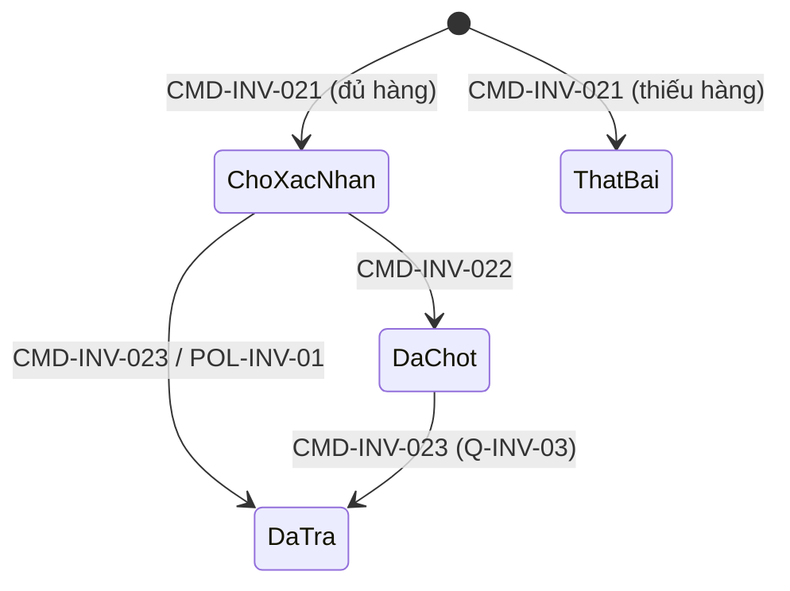

# Phân tích nghiệp vụ — inventory-service

> **Trạng thái:** DRAFT · **Cập nhật:** `2026-10-02` · **Mã BC:** `INV` (prefix cho ID)
>
> Tài liệu giữ nghiệp vụ **kèm lý do**, phản ánh trạng thái hiện tại, không ghi lịch sử thay đổi.
> Bản draft này chưa có người ra quyết định nghiệp vụ xác nhận; chỗ cần chốt nằm ở §13.

> **Loại BC:** Domain (có aggregate, có vòng đời)

---

## 1. Nhiệm vụ

`inventory-service` là **nguồn sự thật duy nhất** về hàng bán được của từng đơn vị bán được:
- **Số lượng** của từng đơn vị bán được và mọi thay đổi của nó (nhập, điều chỉnh).
- **Giữ chỗ**: phần hàng đang được giữ cho các đơn chưa hoàn tất, để không bán vượt số hiện có.
- **Giới hạn số lượng ưu đãi** (limited offer): trần số lượng bán trong một khoảng thời gian cho một đơn vị bán được.

Các BC khác biết một đơn vị bán được "còn hàng" hay không qua BC này.

## 2. Tại sao cần tách riêng

| Nhu cầu | Nếu không tách |
|---|---|
| Không bán vượt số hàng có: khi 200.000 người cùng tranh một số ít đơn vị (`requirement.md` §2.2), việc kiểm số còn và giữ chỗ phải là một bước không thể chen ngang | Hai đơn cùng thấy "còn 1" và cùng thành công; một khách nhận thông báo huỷ sau khi đã trả tiền |
| Tồn kho là nguồn ghi nóng nhất hệ thống, trong khi catalog là nguồn đọc nhiều ghi thưa (`catalog-service/analysis.md` §12) | Hai kiểu tải trái ngược dùng chung hạ tầng: nghẽn ghi kéo chậm trang sản phẩm |
| Giữ chỗ có vòng đời riêng (hết hạn, chốt, trả) gắn với đơn, không gắn với sản phẩm | Đơn hàng phải tự quản việc hàng bị giữ, và mỗi lần lỗi là một lượng hàng bị giữ oan |
| Số lượng đến từ **nhiều nguồn** tuỳ loại seller (seller tự khai, kho xác nhận) | Mỗi nơi tự giữ một con số, không có chỗ nào đúng |

## 3. Không làm gì

- **Không** quản lý sản phẩm, giá, danh mục, trạng thái đang bán/bị chặn → catalog. Inventory chỉ giữ bản sao để biết có được giữ chỗ không (`INV-INV-92`).
- **Không** quyết định đơn hợp lệ, thanh toán, huỷ đơn → order, payment. Inventory chỉ phản hồi các lệnh giữ, chốt, trả của saga.
- **Không** quản lý vị trí vật lý (kho, ô kệ, nhận hàng, xuất hàng) → Warehouse (Phase 2, `bounded-contexts.md`).
- **Không** vận chuyển, phân công shipper → Fulfillment.
- **Không** quyết định loại seller hay nguồn tồn kho của một seller → Seller BC.
- **Không** tìm kiếm hay hiển thị cho người mua → search (nhận sự kiện từ đây).

---

## 4. Actor và chức năng lõi

| Actor | Chức năng |
|---|---|
| **Seller thông thường** | Đặt số lượng tồn tuyệt đối; đặt ngưỡng cảnh báo tồn thấp; xem tồn của mình |
| **Đối tác** | Không thao tác trực tiếp lên số lượng; hàng của họ vào qua Warehouse |
| **Warehouse** *(BC, Phase 2)* | Xác nhận nhận hàng, xuất hàng, điều chỉnh kiểm kê, làm tăng giảm số lượng của hàng đối tác |
| **Order** *(saga)* | Giữ chỗ cho đơn mới; chốt giữ chỗ khi đơn xác nhận; trả chỗ khi đơn huỷ |
| **Promotion / Admin** | Cấu hình giới hạn số lượng ưu đãi cho một đơn vị bán được |
| **Hệ thống (đồng hồ)** | Trả các giữ chỗ quá hạn |

**Ranh giới sở hữu:** seller chỉ đặt số lượng cho đơn vị bán được thuộc sản phẩm do chính seller đó tạo (cùng nguyên tắc ở catalog `analysis.md` §4). Đối tác không có thao tác đặt số lượng (`INV-INV-013`).

## 5. Ngôn ngữ chung

| Thuật ngữ chính | Cách gọi khác | Định nghĩa | Nghĩa ở BC khác |
|---|---|---|---|
| Tồn kho | Stock | Số lượng của một đơn vị bán được, kèm các giữ chỗ và sổ biến động của nó (`AGG-INV-01`) | Warehouse: số hàng vật lý trong kho |
| Số lượng gốc | Tổng | Tổng số hàng hiện có của đơn vị bán được, chưa trừ giữ chỗ | — |
| Giữ chỗ | Reservation | Phần hàng được giữ tạm cho một đơn đang xử lý (`AGG-INV-02`) | — |
| Khả dụng | Available | Số lượng gốc trừ tổng số đang giữ chỗ còn hiệu lực. Là con số trả lời "còn hàng không" | Search: "còn hàng" suy từ khả dụng |
| Chốt giữ chỗ | Commit | Giữ chỗ của một đơn đã xác nhận: dừng đồng hồ hết hạn, vẫn bị trừ khỏi khả dụng | — |
| Trả chỗ | Release | Giữ chỗ được trả về khả dụng khi đơn huỷ hoặc quá hạn | — |
| Bút toán biến động | Stock entry | Một dòng ghi nhận số lượng gốc đổi (nhập, điều chỉnh), kèm nguồn và mã tham chiếu | Warehouse: phiếu nhận hàng |
| Nguồn tồn kho | Source | Ai là chủ của con số: **seller khai** hoặc **kho xác nhận** | — |
| Ngưỡng cảnh báo | Low-stock threshold | Mức khả dụng mà dưới đó seller muốn được báo | — |
| Slot ưu đãi | Slot | Một phần trong trần số lượng bán ưu đãi (`AGG-INV-03`) | Promotion: cấu hình limited offer |
| Đơn vị bán được | SKU | Như catalog `AGG-CAT-05`; Tồn kho tham chiếu bằng định danh của nó | Catalog định nghĩa |
| Được xem công khai | — | Như catalog `INV-CAT-044` | Catalog định nghĩa |

---

## 6. Mô hình domain

### 6.0 Suy ra thực thể

Điểm xuất phát là câu hỏi "còn bao nhiêu hàng có thể bán". Để không bán vượt, ta cần một con số **khả dụng** luôn đúng. Con số này đổi vì hai lý do độc lập:
1. **Hàng thật hoặc hàng được khai thay đổi**: nhập thêm, điều chỉnh, kiểm kê. Chủ của thay đổi này là seller hoặc kho.
2. **Đơn hàng giữ, chốt, trả**. Chủ của thay đổi này là saga đặt hàng.

Hai nguồn thay đổi có chủ, nhịp và vòng đời khác nhau, nên tách: **Tồn kho** (`AGG-INV-01`) giữ con số gốc và lịch sử thay đổi của nó; **Giữ chỗ** (`AGG-INV-02`) giữ vòng đời theo đơn. Giữ chỗ không thể nằm trong Tồn kho: nó định danh bằng đơn chứ không bằng đơn vị bán được, một đơn có nhiều dòng, và có đồng hồ hết hạn riêng. Quy tắc nối hai bên (khả dụng không âm) vì vậy là quy tắc xuyên aggregate (§7).

Thêm một điều: số lượng gốc không đổi bằng cách "đè số mới". Mỗi thay đổi là một **bút toán** có nguồn và mã tham chiếu; số hiện tại là kết quả của các bút toán. Lý do ở 6.1.

**Limited offer** (`AGG-INV-03`) là cấu hình do Promotion đưa vào, nhưng việc chặn vượt trần phải thực hiện cùng lúc với giữ chỗ, nên Inventory sở hữu trạng thái bán đã dùng bao nhiêu slot.

**Bản đồ aggregate:**

| ID | Aggregate | Chứa bên trong | Vai trò (bảo vệ tính nhất quán của gì) | Phụ thuộc | Độ chi tiết |
|---|---|---|---|---|---|
| `AGG-INV-01` | Tồn kho | Sổ bút toán biến động; bản sao điều kiện bán từ catalog | Số lượng gốc không âm; mỗi thay đổi có nguồn và truy vết được; đúng một nguồn mỗi đơn vị | `AGG-CAT-05` | PARTIAL |
| `AGG-INV-02` | Giữ chỗ | Các dòng (đơn vị, số lượng) | Vòng đời giữ, chốt, trả của một đơn; tất cả hoặc không | `AGG-INV-01` | PARTIAL |
| `AGG-INV-03` | Limited offer | Trạng thái dùng slot | Trần số lượng bán ưu đãi theo thời gian | `AGG-INV-01` | TBD |

Thứ tự phân tích: `AGG-INV-01`, rồi `AGG-INV-02`, rồi `AGG-INV-03`.

---

### 6.1 Tồn kho — `AGG-INV-01`

**Vai trò & ranh giới**

Trả lời đúng một câu: "đơn vị bán được này còn bao nhiêu hàng bán được". Không quyết định đơn vị có được bán không (catalog) hay hàng nằm ở vị trí nào (Warehouse).

Mỗi đơn vị bán được có **đúng một** Tồn kho, ra đời cùng đơn vị đó (`EVT-CAT-051`) và dùng chung định danh với nó.

**Thành phần**

- **Số lượng gốc**, không âm. Lúc tạo bằng 0, nên sản phẩm có thể được đăng bán khi chưa có hàng; khi đó nó là sản phẩm "hết hàng" (search xử lý như hết hàng, `INV-SRC-02`). Đã cân nhắc bắt buộc có hàng mới cho đăng bán: loại, vì kéo ràng buộc của Inventory vào luồng đăng bán của catalog, và chặn việc seller chuẩn bị gian hàng trước khi nhập hàng.
- **Nguồn tồn kho**, một trong hai: **seller khai** hoặc **kho xác nhận**. Quyết định bởi loại seller (xem "Nhập hàng"), không do từng đơn vị chọn.
- **Sổ bút toán biến động**: mỗi dòng gồm lượng đổi (có dấu), nguồn, mã tham chiếu, thời điểm.
- **Ngưỡng cảnh báo tồn thấp** do seller đặt.
- **Bản sao điều kiện bán** lấy từ catalog: đơn vị đang mở hay không, sản phẩm đang được xem công khai hay không. Dùng để từ chối giữ chỗ mới (`INV-INV-92`).

**Vòng đời & hành vi**

*Nhập hàng.* Có hai cách thay đổi số lượng gốc, tuỳ nguồn:
- **Seller thông thường** đặt số lượng tuyệt đối. Hệ thống không lưu đè con số mà ghi một bút toán điều chỉnh bằng *số mới trừ số hiện tại*. Số mới không được thấp hơn lượng đang giữ chỗ, nếu không khả dụng âm (`INV-INV-91`).
- **Đối tác** không có thao tác này. Số lượng của họ chỉ thay đổi bằng bút toán do Warehouse ghi nhận (nhận hàng, xuất hàng, điều chỉnh kiểm kê, hàng hoàn nhập lại).

Phương án đã cân nhắc cho cách nhập:
- **Chỉ số tuyệt đối** (cách đơn giản nhất): loại, vì (1) đối tác và kho phát ra *biến động* chứ không phải trạng thái, nên không ghép được; (2) đặt đè số tuyệt đối chạy song song với giữ chỗ sẽ làm mất giữ chỗ hoặc âm; (3) không truy vết được vì sao số đổi.
- **Chỉ cộng dồn** (nhận số cộng thêm): loại, vì seller nghĩ bằng số mình có, bắt họ tính hiệu số dễ sai.
- **Sổ bút toán, cho phép cả hai kiểu nhập** (số tuyệt đối được đổi thành hiệu số): chọn. Mọi nguồn dùng chung một cơ chế, idempotent nhờ mã tham chiếu, và truy vết được.

*Đúng một nguồn mỗi đơn vị.* Nếu hai nguồn cùng ghi một đơn vị thì không biết bên nào đúng, và hàng bị đếm hai lần. Vì vậy mỗi đơn vị có đúng một nguồn tại một thời điểm, và nguồn theo loại seller (xem `seller-service/discussion.md`): seller thông thường là seller khai, đối tác là kho xác nhận. Khi nâng seller thông thường lên đối tác (hiếm), các đơn vị của họ chuyển nguồn bằng một quy trình có đối trừ: số hàng gửi vào kho được trừ khỏi số tự khai trong cùng bước.

*Chốt giữ chỗ khác với trừ hàng thật.* Đơn xác nhận chỉ chốt giữ chỗ; hàng chưa rời đi. Số lượng gốc giảm khi hàng thật rời đi (với đối tác là lúc xuất kho). Với seller thông thường chưa có tín hiệu "hàng đã rời" nên cần chốt thời điểm: `Q-INV-01`.

*Điều kiện giữ chỗ.* Chỉ giữ chỗ mới cho đơn vị đang mở và sản phẩm đang được xem công khai. Tắt đơn vị hay chặn sản phẩm **không** huỷ giữ chỗ đã có: đơn đã đặt vẫn xử lý bình thường (cùng nguyên tắc "tắt chỉ chặn chọn mới" ở catalog).

*Cảnh báo cho seller.* Khi khả dụng chạm xuống ngưỡng đã đặt, và khi hàng có lại sau lúc hết (`requirement.md`: restock kích hoạt Notification), seller nhận cảnh báo. Đây là cảnh báo cho *seller*, khác với thông tin còn/hết cho người mua (`EVT-INV-011`).

*Xoá.* Khi đơn vị bán được bị xoá theo bản nháp (`EVT-CAT-054`), Tồn kho tương ứng bị xoá theo; lúc đó chưa từng có giữ chỗ vì bản nháp chưa công khai.

#### Kết luận

**Quy tắc bất biến**

| ID | Quy tắc | Loại | Kiểm tra khi |
|---|---|---|---|
| `INV-INV-011` | Mỗi đơn vị bán được có đúng một Tồn kho, tạo cùng đơn vị, số lượng ban đầu 0 | Liên tục | `CMD-INV-011` |
| `INV-INV-012` | Số lượng gốc không bao giờ âm | Liên tục | Mọi bút toán |
| `INV-INV-013` | Mỗi đơn vị có đúng một nguồn tồn kho tại một thời điểm, theo loại seller; đối tác không có thao tác đặt số lượng | Liên tục | `CMD-INV-012`, `CMD-INV-013` |
| `INV-INV-014` | Mỗi thay đổi số lượng gốc là một bút toán có nguồn và mã tham chiếu; trùng mã tham chiếu thì bỏ qua (không ghi hai lần) | Liên tục | `CMD-INV-012`, `CMD-INV-013` |
| `INV-INV-015` | Tồn kho chỉ được xoá khi đơn vị bán được bị xoá theo bản nháp | Tiên quyết | `EVT-CAT-054` |

**Trạng thái & chuyển đổi**

Tồn kho không có trạng thái vòng đời rời rạc; trạng thái "còn hàng / hết hàng" suy ra từ khả dụng. Chuyển đổi đáng chú ý:

| Từ | Hành động | Actor | Điều kiện | Sang | Sự kiện |
|---|---|---|---|---|---|
| `[*]` | `CMD-INV-011` Tạo tồn kho | Hệ thống | `INV-INV-011` | Số lượng 0 | `EVT-INV-011` |
| Khả dụng > 0 | Giữ chỗ, hoặc giảm số lượng | Order, seller, kho | `INV-INV-91` | Khả dụng = 0 | `EVT-INV-011`, `EVT-INV-012` |
| Khả dụng = 0 | Nhập thêm, hoặc trả chỗ | Seller, kho, hệ thống | — | Khả dụng > 0 | `EVT-INV-011`, `EVT-INV-013` |

**Ma trận hành động × trạng thái**

| Hành động \ Trạng thái | Khả dụng > 0 | Khả dụng = 0 |
|---|---|---|
| `CMD-INV-012` Seller đặt số lượng | ✓ (không dưới lượng đang giữ chỗ) | ✓ |
| `CMD-INV-013` Ghi nhận nhập từ kho | ✓ | ✓ |
| `CMD-INV-014` Đặt ngưỡng cảnh báo | ✓ | ✓ |

**Sự kiện phát sinh**

| ID | Sự kiện | Phát sinh khi | Phạm vi |
|---|---|---|---|
| `EVT-INV-011` | `StockLevelChanged` *(mới)* | Khả dụng của một đơn vị đổi | Liên BC (search) |
| `EVT-INV-012` | `StockDepleted` | Khả dụng chạm xuống ngưỡng cảnh báo | Liên BC (notification, cho seller) |
| `EVT-INV-013` | `StockReplenished` | Hàng có lại sau lúc hết | Liên BC (notification, cho seller) |

---

### 6.2 Giữ chỗ — `AGG-INV-02`

**Vai trò & ranh giới**

Giữ một phần hàng cho **một đơn** trong lúc đơn chưa hoàn tất, để hai đơn không cùng lấy chung số hàng. Không quyết định đơn có được xác nhận hay huỷ (order); chỉ thực hiện lệnh giữ, chốt, trả.

**Thành phần**

- Định danh theo **đơn**: mỗi đơn có đúng một Giữ chỗ.
- Các **dòng**: đơn vị bán được và số lượng.
- **Trạng thái**.
- **Hạn giữ**, chỉ có khi đang chờ.

**Vòng đời & hành vi**

*Giữ chỗ tất cả hoặc không.* Đơn nhiều dòng mà một dòng thiếu hàng thì cả đơn thất bại, không giữ một phần. Giữ một phần để lại hàng bị khoá oan cho một đơn vốn sẽ bị huỷ. Thất bại được ghi nhận (`CANCELLED`) để nhận lại cùng yêu cầu vẫn cho cùng kết quả.

*Idempotent theo đơn.* Yêu cầu giữ chỗ có thể đến nhiều lần (gửi lại). Với cùng một đơn, mọi lần sau trả kết quả của lần đầu, không giữ thêm.

*Vòng đời.* Giữ chỗ thành công → **chờ** (có hạn). Đơn xác nhận → **đã chốt** (dừng hạn). Đơn huỷ → **đã trả**. Hết hạn khi còn chờ → tự **đã trả**.

*Hạn giữ 5 phút là lưới an toàn, không phải cơ chế chính.* Chuỗi bù trừ bình thường (đơn huỷ → trả chỗ) mất vài giây; hạn chỉ phòng trường hợp sự kiện huỷ bị mất hoặc đến muộn. Đã cân nhắc:
- **Không có hạn**: loại, vì mất một sự kiện huỷ là hàng bị giữ vĩnh viễn.
- **10 phút** (mức cũ) và **bằng hạn thanh toán** (15 phút): loại, vì hạn dài hơn giữ oan hàng của người khác, đặc biệt với đơn vị bán chạy, mà không giảm thêm rủi ro đáng kể.
- **Quá ngắn**: sẽ trả chỗ của đơn đang xử lý bình thường.

Với đơn trả trước, hạn thanh toán (15 phút) dài hơn hạn giữ (5 phút), nên giữ chỗ có thể bị trả khi đơn còn đang chờ thanh toán: `Q-INV-02`.

*Giữ chỗ mồ côi.* Đơn có thể bị huỷ **trước** khi Inventory kịp phản hồi (phản hồi muộn). Khi đó vẫn có một Giữ chỗ cho đơn đã huỷ, và nó phải được trả. Kết quả nghiệp vụ cần đảm bảo: **không có giữ chỗ nào mồ côi vĩnh viễn**, kể cả khi sự kiện huỷ không bao giờ đến; hạn giữ là thứ bảo đảm điều này.

*Chốt rồi bị huỷ.* Khách có thể huỷ đơn sau khi đã xác nhận. Có trả giữ chỗ đã chốt không, và đến khi nào: `Q-INV-03`.

*Đơn xác nhận sau khi giữ chỗ đã hết hạn.* Có thể xảy ra khi hệ thống chậm: giữ chỗ bị trả vì quá hạn, rồi mới tới tín hiệu xác nhận. Xử lý ra sao: `Q-INV-04`.

#### Kết luận

**Quy tắc bất biến**

| ID | Quy tắc | Loại | Kiểm tra khi |
|---|---|---|---|
| `INV-INV-021` | Mỗi đơn có đúng một Giữ chỗ; yêu cầu lặp trả kết quả cũ | Liên tục | `CMD-INV-021` |
| `INV-INV-022` | Giữ chỗ tất cả hoặc không: một dòng thiếu thì cả đơn thất bại, không giữ gì | Liên tục | `CMD-INV-021` |
| `INV-INV-023` | Giữ chỗ đang chờ phải có hạn; quá hạn thì được trả tự động | Liên tục | `POL-INV-01` |
| `INV-INV-024` | Không có giữ chỗ mồ côi vĩnh viễn: không phụ thuộc duy nhất vào việc nhận được sự kiện huỷ | Liên tục | `POL-INV-01` |

**Trạng thái & chuyển đổi**

| Từ | Hành động | Actor | Điều kiện | Sang | Sự kiện |
|---|---|---|---|---|---|
| `[*]` | `CMD-INV-021` Giữ chỗ | Order | `INV-INV-021`, `022`, `91`, `92` | Chờ xác nhận | `EVT-INV-021` |
| `[*]` | `CMD-INV-021` Giữ chỗ (thiếu hàng) | Order | `INV-INV-022` | Thất bại | `EVT-INV-022` |
| Chờ xác nhận | `CMD-INV-022` Chốt giữ chỗ | Order | — | Đã chốt | — |
| Chờ xác nhận | `CMD-INV-023` Trả chỗ | Order | — | Đã trả | `EVT-INV-023` |
| Chờ xác nhận | `CMD-INV-024` Trả chỗ quá hạn | Hệ thống | `INV-INV-023` | Đã trả | `EVT-INV-023` |
| Đã chốt | `CMD-INV-023` Trả chỗ | Order | `Q-INV-03` | Đã trả | `EVT-INV-023` |

**Ma trận hành động × trạng thái**

| Hành động \ Trạng thái | Chờ xác nhận | Đã chốt | Đã trả | Thất bại |
|---|---|---|---|---|
| `CMD-INV-021` Giữ chỗ (yêu cầu lặp) | ✓ trả kết quả cũ | ✓ trả kết quả cũ | ✓ trả kết quả cũ | ✓ trả kết quả cũ |
| `CMD-INV-022` Chốt | ✓ | ✓ không đổi | ? (`Q-INV-04`) | ✗ |
| `CMD-INV-023` Trả chỗ (đơn huỷ) | ✓ | ? (`Q-INV-03`) | ✓ không đổi | ✓ không đổi |
| `CMD-INV-024` Trả chỗ quá hạn | ✓ | ✗ (đã dừng hạn) | ✓ không đổi | ✗ |

**Sự kiện phát sinh**

| ID | Sự kiện | Phát sinh khi | Phạm vi |
|---|---|---|---|
| `EVT-INV-021` | `InventoryReserved` | Giữ chỗ thành công | Liên BC (order) |
| `EVT-INV-022` | `InventoryReservationFailed` | Giữ chỗ thất bại | Liên BC (order) |
| `EVT-INV-023` | `InventoryReleased` | Giữ chỗ được trả | Liên BC (search) |

---

### 6.3 Limited offer — `AGG-INV-03`

**Vai trò & ranh giới**

Đặt trần cho số lượng bán ưu đãi của một đơn vị bán được trong một khoảng thời gian. Cấu hình do Promotion cung cấp; Inventory thực thi việc chặn vượt trần cùng lúc với giữ chỗ. Theo yêu cầu gốc, đây là **cấu hình kỹ thuật phục vụ kịch bản thử tải cao**, không phải nghiệp vụ flash sale đầy đủ (`bounded-contexts.md`, Promotion BC), nên độ chi tiết ở đây cố ý thấp.

**Thành phần**

- Đơn vị bán được áp dụng.
- **Số slot tối đa** và **độ dài cửa sổ**.
- Trạng thái: chưa kích hoạt / đang chạy / đã kết thúc.

**Vòng đời & hành vi**

Khi đang chạy, mỗi giữ chỗ cho đơn vị đó phải lấy slot; hết slot thì phần còn lại bị từ chối (đúng mô tả của `requirement.md`: "chỉ N slot được chấp nhận, phần còn lại reject"). Trả chỗ thì trả slot. Hết cửa sổ thì kết thúc. Chi tiết (slot tính theo đơn hay theo số lượng, giới hạn mỗi người mua, xử lý giữ chỗ đang chờ lúc kết thúc): `Q-INV-05`.

#### Kết luận

**Quy tắc bất biến**

| ID | Quy tắc | Loại | Kiểm tra khi |
|---|---|---|---|
| `INV-INV-031` | Tổng slot đã lấy của một limited offer đang chạy không vượt số slot tối đa | Liên tục | `CMD-INV-021` |

**Trạng thái & chuyển đổi**

| Từ | Hành động | Actor | Điều kiện | Sang | Sự kiện |
|---|---|---|---|---|---|
| `[*]` | `CMD-INV-031` Nhận cấu hình | Promotion | — | Chưa kích hoạt | — |
| Chưa kích hoạt | `CMD-INV-032` Kích hoạt | Promotion/Admin | — | Đang chạy | — |
| Đang chạy | Hết cửa sổ | Hệ thống | — | Đã kết thúc | — |

**Sự kiện phát sinh:** chưa xác định (TBD).

---

## 7. Quy tắc xuyên aggregate

Ba quy tắc nối Tồn kho, Giữ chỗ và Limited offer, mỗi quy tắc đọc dữ liệu của ít nhất hai aggregate tại đúng lúc một lệnh chạy. Tất cả đều thuộc Loại **Tiên quyết**, trừ `INV-INV-91` là điều phải đúng *suốt vòng đời* mỗi khi có thay đổi nên thuộc Loại **Liên tục**.

Lý do `INV-INV-91` là Liên tục: nó chính là điều ta tồn tại để bảo đảm ("không bán vượt"). Mọi đường làm đổi số lượng gốc hoặc tổng giữ chỗ (giữ chỗ mới, seller giảm số lượng, kho điều chỉnh) đều phải giữ nó đúng. Ngoại lệ có chủ đích: khi kho phát hiện **thiếu hàng thật** dưới mức đã giữ chỗ (kiểm kê), không thể từ chối sự thật đó, nên khả dụng có thể âm tạm thời và phải xử lý các đơn bị ảnh hưởng: `Q-INV-06`.

| ID | Quy tắc | Loại | Aggregate liên quan | Kiểm tra khi | Độ cũ dữ liệu chấp nhận được | Nếu bị vi phạm thì |
|---|---|---|---|---|---|---|
| `INV-INV-91` | Tổng số lượng đang giữ chỗ còn hiệu lực (chờ và đã chốt chưa xuất) của một đơn vị không vượt số lượng gốc. Khả dụng không âm | Liên tục | `AGG-INV-01`, `AGG-INV-02` | `CMD-INV-021`; `CMD-INV-012` (seller giảm số lượng); `CMD-INV-013` (kho điều chỉnh, ngoại lệ ở trên) | Không chấp nhận cũ: đọc đúng lúc ghi | Giữ chỗ bị từ chối (thiếu hàng); seller đặt số thấp hơn bị từ chối; kho điều chỉnh thì cho phép và chuyển sang xử lý `Q-INV-06` |
| `INV-INV-92` | Chỉ giữ chỗ mới cho đơn vị đang mở và sản phẩm đang được xem công khai. Tắt hay chặn sau đó không huỷ giữ chỗ đã có | Tiên quyết | `AGG-INV-01`, `AGG-INV-02` (dữ liệu từ `AGG-CAT-04`, `AGG-CAT-05`) | `CMD-INV-021` | Vài giây: bản sao có thể chậm sau thay đổi ở catalog; chấp nhận, vì đơn hợp lệ ở thời điểm đặt vẫn được xử lý đúng | Giữ chỗ bị từ chối, đơn thất bại với lý do sản phẩm không còn bán |
| `INV-INV-93` | Khi limited offer đang chạy, giữ chỗ phải lấy được slot; hết slot thì từ chối | Tiên quyết | `AGG-INV-02`, `AGG-INV-03` | `CMD-INV-021` | Không chấp nhận cũ | Giữ chỗ bị từ chối |

---

## 8. Sự kiện nghiệp vụ

### 8.1 Phát ra cho BC khác (hợp đồng)

| ID | Sự kiện | Aggregate | Ý nghĩa nghiệp vụ | BC quan tâm |
|---|---|---|---|---|
| `EVT-INV-011` | `StockLevelChanged` *(mới)* | `AGG-INV-01` | Khả dụng của một đơn vị bán được đổi; mang giá trị tuyệt đối | search |
| `EVT-INV-012` | `StockDepleted` | `AGG-INV-01` | Khả dụng chạm xuống ngưỡng cảnh báo của seller | notification |
| `EVT-INV-013` | `StockReplenished` | `AGG-INV-01` | Hàng có lại sau lúc hết | notification |
| `EVT-INV-021` | `InventoryReserved` | `AGG-INV-02` | Giữ chỗ cho đơn thành công | order |
| `EVT-INV-022` | `InventoryReservationFailed` | `AGG-INV-02` | Giữ chỗ thất bại, kèm lý do và đơn vị thiếu | order |
| `EVT-INV-023` | `InventoryReleased` | `AGG-INV-02` | Giữ chỗ được trả | search |

`EVT-INV-012` và `EVT-INV-013` là cảnh báo cho **seller** theo ngưỡng họ đặt. Chúng **không** thay cho `EVT-INV-011`: search cần biết đơn vị còn hay hết đúng nghĩa, không phụ thuộc ngưỡng của seller (`Q-INV-07`).

### 8.2 Nhận từ BC khác

| Sự kiện | Từ BC | Dẫn đến |
|---|---|---|
| `EVT-CAT-051` VariantCreated | catalog | `CMD-INV-011` |
| `EVT-CAT-053` VariantActivated / Deactivated | catalog | Điều kiện của `INV-INV-92` |
| `EVT-CAT-041` ProductPublished, `EVT-CAT-042` ProductUnpublished, `EVT-CAT-043` ProductBlocked, `EVT-CAT-044` ProductUnblocked | catalog | Điều kiện của `INV-INV-92` |
| `EVT-CAT-054` VariantDeleted | catalog | `INV-INV-015` |
| Loại seller của chủ đơn vị *(sự kiện chưa có, `Q-INV-08`)* | seller | `CMD-INV-011` (chọn nguồn tồn kho), `INV-INV-013` |
| Đơn tạo / đơn xác nhận / đơn huỷ (`OrderCreated`, `OrderConfirmed`, `OrderCancelled`) | order | `CMD-INV-021`, `CMD-INV-022`, `CMD-INV-023` |
| Kho nhận hàng / xuất hàng / điều chỉnh *(Warehouse, Phase 2, ID chưa gán)* | warehouse | `CMD-INV-013` |
| Mốc giữ chỗ quá hạn | scheduler | `POL-INV-01` |
| Cấu hình limited offer | promotion | `CMD-INV-031`, `CMD-INV-032` |

## 9. Policy

| ID | Khi | Điều kiện | Thì |
|---|---|---|---|
| `POL-INV-01` | Một giữ chỗ đang chờ quá hạn giữ | Vẫn chưa được chốt | `CMD-INV-024` Trả chỗ quá hạn |

---

## 10. Hiển thị & tra cứu

| ID | Ai | Xem gì | Điều kiện được xem | Độ tươi chấp nhận được |
|---|---|---|---|---|
| `RM-INV-01` | Seller | Tồn kho từng đơn vị của mình: số lượng gốc, đang giữ chỗ, khả dụng, lịch sử bút toán | Chỉ đơn vị thuộc sản phẩm của chính seller (đối tác xem được nhưng không sửa) | Ngay lập tức |
| `RM-INV-02` | Seller | Danh sách đơn vị tồn thấp và đã hết | Như trên | Vài giây |
| `RM-INV-03` | Admin, kho | Giữ chỗ theo đơn: trạng thái, dòng, hạn | Mọi đơn | Ngay lập tức |

---

## 11. Quan hệ với BC khác

| BC | Chiều | Kiểu quan hệ | BC này cung cấp / nhận gì |
|---|---|---|---|
| catalog | Upstream (catalog → inventory) | Customer-Supplier | Nhận `EVT-CAT-041`…`044`, `051`, `053`, `054` để tạo tồn kho và biết điều kiện bán |
| order | Hai chiều (saga) | Partnership | Nhận lệnh giữ, chốt, trả; trả `EVT-INV-021`, `022`, `023` |
| seller | Upstream (seller → inventory) | Customer-Supplier | Nhận loại seller để chọn nguồn tồn kho (`Q-INV-08`) |
| warehouse *(Phase 2)* | Upstream (warehouse → inventory) | Customer-Supplier | Nhận các bút toán nhận hàng, xuất hàng, điều chỉnh của hàng đối tác |
| promotion | Upstream | Customer-Supplier | Nhận cấu hình limited offer |
| search | Downstream | OHS-PL | Cấp `EVT-INV-011` |
| notification | Downstream | OHS-PL | Cấp `EVT-INV-012`, `013` |
| scheduler | Upstream | — | Cấp mốc kích hoạt `POL-INV-01` |

---

## 12. Kỳ vọng phi chức năng từ nghiệp vụ

> Phân tích trước, kết luận sau (quy ước 13): §12.1 dữ kiện, §12.2 phân tích, §12.3 kết luận.

### 12.1 Dữ kiện từ yêu cầu gốc

| Dữ kiện | Giá trị | Nguồn |
|---|---|---|
| Người dùng đồng thời, flash sale | 200.000 | `requirement.md` §2.2 |
| Ghi (thanh toán) lúc cao điểm, sau giới hạn tần suất ở api-gateway | ~8.000 req/s | §2.2 |
| Ghi ngày thường | ~800 req/s | §2.1 |
| Thời lượng một đợt flash sale | 15–30 phút | §2.2 |
| Đặt hàng đồng bộ | P99 < 2s | §2.3 |
| Quy mô | 5.000.000 SKU | §2.5 |

### 12.2 Phân tích

**a. Chính xác tuyệt đối, không đánh đổi.** Không bán vượt là yêu cầu *đúng sai*, không phải yêu cầu hiệu năng: một đơn vượt là một khách trả tiền cho hàng không có. Mọi quyết định về tốc độ phải giữ nguyên điều này.

**b. Tranh chấp dồn vào ít đơn vị.** 8.000 giữ chỗ/s là tổng toàn sàn. Flash sale dồn vào một tập nhỏ đơn vị (giả định, cùng lý do ở `catalog-service/analysis.md` §12.2b). Nếu việc giữ chỗ của *cùng một đơn vị* phải tuần tự (để chắc chắn không vượt), mỗi lần giữ chỗ có thể chiếm đơn vị đó tối đa 1 ÷ tốc độ mỗi đơn vị:

| Số đơn vị nóng | Giữ chỗ/s mỗi đơn vị (8.000 ÷ N) | Thời gian tối đa mỗi lần giữ chỗ |
|---|---|---|
| 1.000 | 8 | 125ms |
| 100 | 80 | 12,5ms |
| 10 | 800 | 1,25ms |

Cột phải cho thấy: với ít đơn vị nóng, mức tuần tự thông thường (vài ms cho mỗi lần ghi) **không đủ**. Đó là lý do limited offer tồn tại như một đường riêng (hàng đợi và slot cho các đơn vị nóng) thay vì dùng chung đường giữ chỗ thường. Số đơn vị nóng là giả định, cần xác nhận cùng `Q-CAT-06`.

**c. Độ tươi cho search.** Search yêu cầu còn/hết trong 5s (`search-service/analysis.md` §12.2d). Phần thuộc Inventory phát `EVT-INV-011` trong ngân sách 1,5s (đề xuất).

**d. Đặt hàng P99 < 2s** là mức đồng bộ ngoài cùng; giữ chỗ chạy bất đồng bộ trong saga (`requirement.md` §2.3), nên không ép giữ chỗ phải xong trong 2s, nhưng hết hạn đợi phản hồi giữ chỗ của Order là 3 phút (`feature/07-place-order`).

### 12.3 Kết luận

| Chức năng | Kỳ vọng | Lý do nghiệp vụ | Nguồn / phân tích |
|---|---|---|---|
| Không bán vượt | Tuyệt đối: khả dụng không âm, không có ngoại lệ ngoài kiểm kê | Khách đã trả tiền cho hàng không có là lỗi không chấp nhận | 12.2a |
| Giữ chỗ cho đơn vị nóng | Chịu ~80–800 giữ chỗ/s trên một đơn vị trong kịch bản dồn; cần đường riêng cho limited offer | Flash sale dồn vào ít đơn vị | `requirement.md` §2.2; 12.2b |
| Độ tươi gửi cho search | `EVT-INV-011` trong ≤ 1,5s *(đề xuất)* | Phần của ngân sách 5s | 12.2c |
| Giữ chỗ mồ côi | Tự trả sau tối đa 5 phút | Hàng không bị khoá vĩnh viễn | `INV-INV-024` |

---

## 13. Chưa chốt

| ID | Câu hỏi | Ảnh hưởng | Chặn gì | Dự kiến giải quyết khi |
|---|---|---|---|---|
| `Q-INV-01` | **Khi nào số lượng gốc giảm sau khi đơn được xác nhận** (trừ hàng thật). Đề xuất: với đối tác là lúc xuất kho; với seller thông thường là lúc bàn giao cho sàn (cần tín hiệu "bưu kiện đã có mặt tại điểm của sàn" từ Fulfillment) hoặc đơn giản hơn là ngay khi chốt | 6.1, `INV-INV-91` | Số lượng seller thấy sau khi bán | Cùng đợt Fulfillment |
| `Q-INV-02` | Hạn giữ chỗ 5 phút ngắn hơn hạn thanh toán 15 phút của đơn trả trước: giữ chỗ có thể bị trả khi đơn còn chờ thanh toán. Cần hạn giữ riêng cho đơn trả trước, hoặc gia hạn khi thanh toán đang diễn ra | 6.2, `INV-INV-023` | Luồng thanh toán trả trước | Khi làm payment |
| `Q-INV-03` | Đơn **đã xác nhận** bị khách huỷ: giữ chỗ đã chốt có được trả không, và đến thời điểm nào (trước bàn giao?) | `CMD-INV-023`, ma trận 6.2 | Luồng huỷ sau xác nhận | Cùng order |
| `Q-INV-04` | Đơn được xác nhận **sau khi** giữ chỗ đã hết hạn và bị trả: từ chối (đơn phải bị huỷ để bù trừ), hay giữ lại nếu vẫn còn hàng | `CMD-INV-022`, ma trận 6.2 | Độ an toàn khi hệ thống chậm kéo dài | Sớm, vì có thể xảy ra |
| `Q-INV-05` | Limited offer: slot tính theo đơn hay theo số lượng; giới hạn mỗi người mua; xử lý giữ chỗ đang chờ lúc kết thúc; sự kiện phát ra | `AGG-INV-03`, `INV-INV-93` | Phân tích chi tiết `AGG-INV-03` | Khi cần flash sale |
| `Q-INV-06` | Kiểm kê phát hiện thiếu hàng thật dưới mức đã giữ chỗ (khả dụng âm): huỷ đơn bị ảnh hưởng theo thứ tự nào, thông báo ra sao | `INV-INV-91` | Quy trình kiểm kê | Khi làm Warehouse |
| `Q-INV-07` | Định nghĩa "còn hàng" cho search: khả dụng > 0 có đủ không, tần suất phát `EVT-INV-011` (mỗi thay đổi hay chỉ khi qua mức 0) | `EVT-INV-011`, search `Q-SRC-05` | Hợp đồng với search | Cùng đợt search |
| `Q-INV-08` | Seller BC phát loại seller bằng sự kiện nào; seller đổi loại (nâng lên đối tác) được hỗ trợ không | §8.2, `INV-INV-013` | Chọn nguồn khi tạo Tồn kho | Khi viết analysis Seller (xem `seller-service/discussion.md`) |
| `Q-INV-09` | Ngưỡng cảnh báo: seller đặt tự do cho từng đơn vị, hay có mặc định theo ngành hàng | 6.1 | Giao diện seller | Khi làm seller portal |
| `Q-INV-10` | Hàng hoàn: ai quyết nhập lại tồn kho (seller thông thường, kho với đối tác) và theo quy tắc nào | `CMD-INV-013`, Return BC | Luồng hoàn hàng | Cùng đợt Return |

---

## Quy ước ID

| Prefix | Ý nghĩa |
|---|---|
| `AGG-XXX-nn` | Aggregate |
| `INV-XXX-nn` | Quy tắc bất biến (`9x` cho xuyên aggregate) |
| `CMD-XXX-nn` | Hành động |
| `EVT-XXX-nn` | Sự kiện |
| `POL-XXX-nn` | Policy |
| `RM-XXX-nn` | Hiển thị / tra cứu |
| `Q-XXX-nn` | Câu hỏi chưa chốt |

*Hành động (CMD) của `AGG-INV-01`:* `CMD-INV-011` Tạo tồn kho · `CMD-INV-012` Seller đặt số lượng · `CMD-INV-013` Ghi nhận nhập từ kho · `CMD-INV-014` Đặt ngưỡng cảnh báo. *`AGG-INV-02`:* `CMD-INV-021` Giữ chỗ · `CMD-INV-022` Chốt giữ chỗ · `CMD-INV-023` Trả chỗ · `CMD-INV-024` Trả chỗ quá hạn. *`AGG-INV-03`:* `CMD-INV-031` Nhận cấu hình · `CMD-INV-032` Kích hoạt.

## Nguồn tham chiếu

Bản draft dựa trên `requirement.md`, mô tả BC trong `bounded-contexts.md`, catalog `analysis.md`, thiết kế đặt hàng ở `feature/07-place-order` và các điều đã bàn khi viết `seller-service/discussion.md`. **Không dựa vào code hay tài liệu thiết kế hiện có của inventory.** Chưa đối chiếu các sàn khác về cách trừ hàng thật và hạn giữ chỗ.
- Tham khảo mô hình tồn kho của sàn có kho: [Fulfilled by Shopee Seller Guide](https://deo.shopeemobile.com/shopee/seller/seller_cms/8253441447fff07bf2f3abd669dcb1b3/%5BMY%5D%20Fulfilled%20by%20Shopee%20-%20Seller%20Guide.pdf) (trang tồn kho tách chờ nhập kho, bán được, đang giữ chỗ); [Học viện Tiki: mô hình lưu kho FBT](https://hocvien.tiki.vn/faq/gioi-thieu-mo-hinh-luu-kho-tiki-va-quy-trinh-xu-ly-don-hang/). Cả hai chỉ đọc qua bản tóm tắt tìm kiếm.

## Tài liệu liên quan

- [`global/1.requirement/requirement.md`](../../global/1.requirement/old/requirement.md) — yêu cầu gốc (§2.1, §2.2, §2.3)
- `../catalog-service/analysis.md` — nguồn của `EVT-CAT-*` và `INV-CAT-044`
- `../search-service/analysis.md` — bên nhận `EVT-INV-011` (`Q-SRC-05`)
- `../seller-service/discussion.md` — loại seller và nguồn tồn kho
- `../../feature/07-place-order/design.md` — saga đặt hàng
