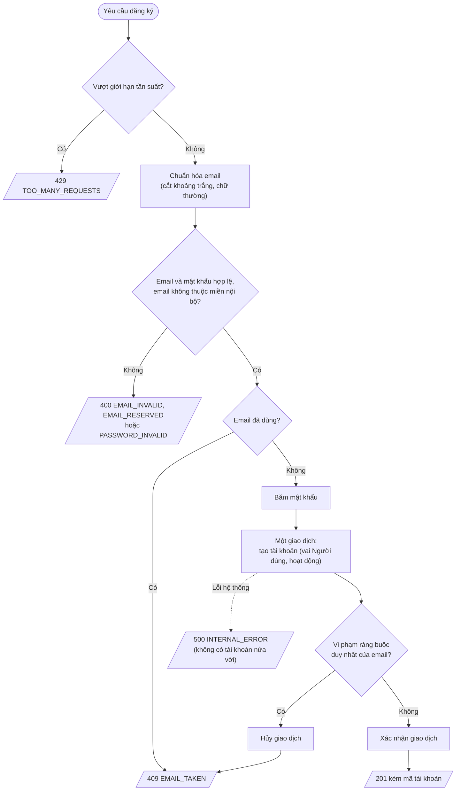

# Feature 01: Đăng ký

> **Trạng thái:** DRAFT thiết kế · **Chặng:** C0 · **Loại:** Nghiệp vụ
>
> **Nguồn:** CAP-ATH-01, CAP-ATH-05 · **Kiểm chứng bằng:** S2, S4; INV-ATH-01, 02, 04, 06, 07, 09
>
> **Cùng thư mục:** `tech.md` (giải pháp kỹ thuật), `nfr.md` (đáp ứng NFR), `deferred.md` (phần hoãn), `plan.md` (kế hoạch).

## 1. Mục tiêu và phạm vi

Khách vãng lai tạo được tài khoản đăng nhập bằng email và mật khẩu. Tài khoản luôn có vai Người dùng, đang hoạt động ngay.

Trong phạm vi: nhận email và mật khẩu, kiểm tra, tạo tài khoản.

Ngoài phạm vi: tên hiển thị (Định danh), xác minh email, gửi thư, tự đăng nhập sau khi đăng ký.

## 2. Đầu vào và đầu ra

| | Nội dung |
|---|---|
| Vào | `email`, `password`. Không có trường vai: nếu người gọi gửi kèm thì bị bỏ qua. |
| Ra khi thành công | Mã tài khoản. Người dùng chưa đăng nhập; giao diện chuyển sang màn đăng nhập |
| Ra khi lỗi | Mã lỗi và thông điệp rõ lý do (mục 4) |

## 3. Luồng chính

1. **Giới hạn tần suất** theo địa chỉ mạng của người gọi, do **cổng truy cập** thực hiện trước khi yêu cầu vào dịch vụ (feature 06).
   Vượt giới hạn thì trả 429, dừng.
2. **Chuẩn hóa email:** cắt khoảng trắng đầu cuối, chuyển chữ thường. Không gộp bí danh (`+nhãn`, dấu chấm), vì "một email một tài khoản" tính trên địa chỉ người dùng đã gõ sau chuẩn hóa.
3. **Kiểm đầu vào:** định dạng email, độ dài email, độ hợp lệ của mật khẩu; email không thuộc miền nội bộ. Sai thì trả 400 kèm mã lý do, dừng.
4. **Kiểm email chưa dùng** (để báo sớm). Đã dùng thì trả 409, dừng.
5. **Băm mật khẩu** một lần.
6. **Một giao dịch:** tạo tài khoản (vai Người dùng, trạng thái hoạt động).
   - Nếu ràng buộc duy nhất của email vi phạm (có yêu cầu khác vừa tạo xong) thì hủy giao dịch, trả 409.
7. **Trả 201** kèm mã tài khoản.

Bước 4 chỉ để báo sớm; ràng buộc duy nhất ở bước 6 mới là chốt cuối (INV-ATH-01, INV-ATH-04).

## 4. Đường không suôn sẻ

| Tình huống                          | Kết quả                               | Mã lỗi              | INV            |
|-------------------------------------|---------------------------------------|---------------------|----------------|
| Vượt giới hạn tần suất (do cổng)    | 429 kèm thời gian chờ                 | `TOO_MANY_REQUESTS` |                |
| Email sai định dạng hoặc quá dài    | 400                                   | `EMAIL_INVALID`     |                |
| Email thuộc miền nội bộ             | 400                                   | `EMAIL_RESERVED`    | INV-ATH-07     |
| Mật khẩu không hợp lệ               | 400 kèm điều kiện chưa đạt            | `PASSWORD_INVALID`  |                |
| Email đã dùng (kể cả khác chữ hoa)  | 409                                   | `EMAIL_TAKEN`       | INV-ATH-01     |
| Hai yêu cầu cùng email đến cùng lúc | Một thành công (201), một 409         | `EMAIL_TAKEN`       | INV-ATH-01, 04 |
| Yêu cầu gửi kèm vai quản trị        | Bỏ qua trường vai; tạo vai Người dùng |                     | INV-ATH-06     |
| Lỗi hệ thống khi lưu                | 500, không có tài khoản nửa vời       | `INTERNAL_ERROR`    |                |

Chấp nhận: 409 cho biết email đã có tài khoản. Người dùng cần biết để chuyển sang đăng nhập.
Gửi lặp (bấm hai lần, mạng chậm): không dùng khóa yêu cầu; ràng buộc email duy nhất bảo đảm chỉ một tài khoản, yêu cầu thừa
nhận 409 (`tech.md` T4). Giao diện đã khóa nút khi đang gửi.

## 5. Trạng thái sau khi xong

- Có đúng một tài khoản: vai Người dùng, trạng thái hoạt động, mật khẩu ở dạng băm, email dạng chuẩn hóa.
- Không có phiên nào được tạo.

## 6. Test cần có (viết từ kịch bản và bất biến, trước khi viết mã)

Cột "Mức" cho biết test thuộc bước nào của kế hoạch: **Miền** (bước 4–5), **Use case** (bước 6), **Lưu trữ** (bước 8),
**API** (bước 9), **Đồng thời** (bước 10). Cột "Chứng minh" trỏ về kịch bản chặng (S), bất biến
(INV-ATH), luật ở `analysis.md`, hoặc quyết định ở `tech.md` và yêu cầu ở `nfr.md`.

| #     | Kịch bản test                                                                                                                                                              | Mức       | Chứng minh               |
|-------|----------------------------------------------------------------------------------------------------------------------------------------------------------------------------|-----------|--------------------------|
| KT-01 | Đăng ký hợp lệ ra đúng một tài khoản vai Người dùng, trạng thái hoạt động, mật khẩu đã băm                                                                                 | Use case  | S4, INV-ATH-02, 06       |
| KT-02 | Yêu cầu đăng ký gửi kèm vai quản trị vẫn ra vai Người dùng                                                                                                                 | API       | S4, INV-ATH-06           |
| KT-03 | Email đã dùng bị từ chối với 409 `EMAIL_TAKEN`, cả khi khác chữ hoa thường                                                                                                 | Use case  | S2, INV-ATH-01           |
| KT-04 | Email được chuẩn hóa trước khi kiểm và lưu (khoảng trắng đầu cuối, chữ hoa); giá trị lưu là chữ thường                                                                     | Miền      | INV-ATH-01               |
| KT-05 | Email thuộc miền nội bộ (kể cả viết hoa) bị 400 `EMAIL_RESERVED`; email có tên miền chỉ giống một phần miền nội bộ không bị chặn nhầm                                      | Miền      | S2, INV-ATH-07           |
| KT-06 | Email sai định dạng hoặc dài quá 254 ký tự bị 400 `EMAIL_INVALID`                                                                                                          | Miền      | `analysis.md` 4.1        |
| KT-07 | Mật khẩu ngắn hơn 8 hoặc dài hơn 64 ký tự, thiếu chữ cái hoặc thiếu chữ số, hoặc có ký tự ngoài `A-Za-z0-9@$` (dấu cách, tab, emoji, chữ có dấu) bị 400 `PASSWORD_INVALID` | Miền      | `analysis.md` 4.1        |
| KT-08 | Mật khẩu đúng 8 ký tự và đúng 64 ký tự hợp lệ; `@` và `$` được chấp nhận                                                                                                   | Miền      | `analysis.md` 4.1        |
| KT-09 | Mỗi lỗi 400, 409, 429 trả khung lỗi có `code` chữ ổn định và `message` tiếng Việt nêu lý do                                                                                | API       | S2, `tech.md` T9         |
| KT-10 | Event `UserAccountRegistered` do aggregate ghi nhận chỉ mang mã tài khoản, email chuẩn hóa, vai; không mang mật khẩu hay tên                                               | Use case  | INV-ATH-02, `service.md` |
| KT-11 | Tài khoản lưu rồi đọc lại giữ nguyên email, vai, trạng thái; cột mật khẩu chỉ chứa chuỗi băm, không chứa mật khẩu; mô hình không có hành vi đổi vai                        | Lưu trữ   | INV-ATH-02, 09           |
| KT-12 | Cơ sở dữ liệu từ chối hai dòng cùng email chuẩn hóa                                                                                                                        | Lưu trữ   | INV-ATH-01               |
| KT-13 | 100 yêu cầu song song cùng email: đúng một thành công (201), còn lại 409; lặp 100 lần vẫn đúng                                                                             | Đồng thời | S2, INV-ATH-01, 04       |

Giới hạn tần suất (bước 1 của luồng) do cổng thực hiện nên được kiểm ở feature 06, không có kịch bản ở đây.

Nửa còn lại của INV-ATH-07 (tài khoản vai nội bộ phải có email nội bộ) và việc đăng nhập bằng Quản trị có sẵn kiểm ở
feature 04.
